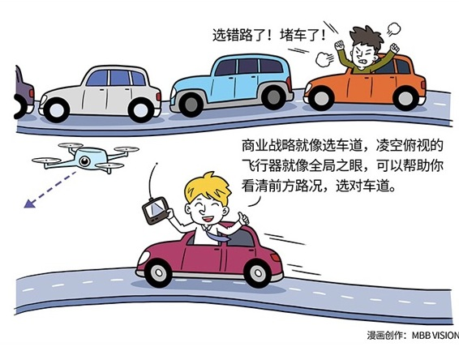

# 158｜冻死在那个不存在的冬天

> 有人拜访子贡，问：一年有几季？子贡说，春夏秋冬，四季。那人说，错，只有春夏秋三季。两人争论不下，去问孔子。孔子观察来人后，说，是的，只有三季。来人满意离开。子贡不解。孔子说，来人一身绿衣，分明是田间蚱蜢。蚱蜢春生、秋亡，一生只有春、夏、秋三季，哪里见过冬天。在他的思维里，完全没有“冬天”这个概念，你和他争论三天三夜，都不会有结果的。

这个孔子说的田间蚱蜢，后来被称为“三季人”，也就是没有全局之眼的人。今天，就我们来聊聊这个极其重要的思考能力：全局之眼。

### 概念：全局之眼

什么叫全局之眼？这世界上的所有东西，都是被规律作用着，以一种叫做“系统”的方式存在着。要素，是系统中你看得见的东西；关系，是系统中你看不见的、要素之间相互作用的规律。看到要素，还要看到要素之间的关系，更要看到这些关系背后的规律，就叫做“全局之眼”。

### 案例

> 不少企业家知道，旺铺很重要。可是旺铺为什么这么重要？是因为更好的地段带来了更多的人流。所以，人流，其实才是“旺”和“铺”这两个要素之间的关系，是这关系背后的规律。如果理解了这一点，就可以把这个规律推演到整个系统中，哪里人流多，哪里就会旺。于是，早期的PC电商，后来的移动电商/微商，后来的社群经济，现在的网红，未来的移动直播、虚拟现实（VR），就一下子都理解了。理解了关系，和关系背后的规律，你不但能在复杂的系统中理解现在，甚至可以一定程度上预测未来。所有的战略，都是站在未来看今天。

朋友开车送我去佛山，说：你看，战略就像选车道，选错了道，就算你开宝马，也只能眼睁睁被吉利超过。说得真好。我回答：所以你要有全局之眼，升到半空，看清楚前面路况，再回到车里选对车道，这样就算被大车挡路，你也知道下面终会快起来，不焦虑。战略，就像选车道，比你开什么车，谁来开，更重要。可是，选中正确的车道的前提，是你要有凌空俯视的全局之眼。

### 运用：如何建立全局之眼

如何才能拥有全局之眼呢？

第一，关联之眼。

事物之间，都不是孤立存在的，它们相互作用着，这种相互作用，叫做关联性。

拥有全局之眼，首先要练习用关联之眼看清事物。比如，“旺”和“铺”之间是什么关系？平台和产品之间是什么关系？引爆点和网络效应之间是什么关系？企业文化和人性之间是什么关系？个体理性与群体感性之间是什么关系？等等。

第二，整体之眼。

要素，加上若干要素之间的关联，构成了系统，并形成“输入、黑盒、输出”三个物体。这个黑盒内部，用你理解、或者不理解的方式精密运作着。

拥有全局之眼，还要练习用整体之眼看透黑盒。比如，货币政策会如何刺激本国经济？人员结构扁平化会如何刺激员工的积极性？引入风险投资会如何刺激公司的创新意识？价格策略会如何影响消费者购买冲动？等等。

第三，动态之眼。

一个系统的要素，和要素之间的关联，不是恒久不变的。一旦把“时间”加进来，就更好玩了。

拥有全局之眼，更要练习用动态之眼看穿时间。比如，五年之后的人类的生活方式是怎样的？今天最强大的公司还会强大多久？你今天看到的结果是今天的行为导致的吗？你学习今天的苹果还是三十年前的微软？短期的利益是长期的成功的成本吗？等等。

在商业环境变化不快的时候，思维容易懒惰，在一些人的脑海中，复杂、多维的“系统论”，会退化为简单、单向的“因果论”：你只要做好这个，就可以得到那个。甚至在一些人的脑海中，“因果论”会进一步退化为“经验论”：人家就是这么做的，成功了，我也要这么做。再甚至，对一些连思考都不思考的人，“经验论”会继续退化为“乱拳论”，我什么都不信，我只相信我通过尝试、犯错得来的教训，乱拳打死师傅。

乱拳论，会让你死在不必要的地方；经验论，会让小马不敢过河；因果论，会让你忽视世界的复杂性。越是在高速变化的世界，经验失效，万物归本，越是要训练系统性思维，拥有全局之眼。

### 小结：认识全局之眼

在商业环境巨变的今天，要懂得关联地、整体地、动态地看问题。当你拥有关联的（二维），整体的（三维），动态的（四维）看待事物的能力，你就拥有真正的全局之眼，可以站在未来看今天。