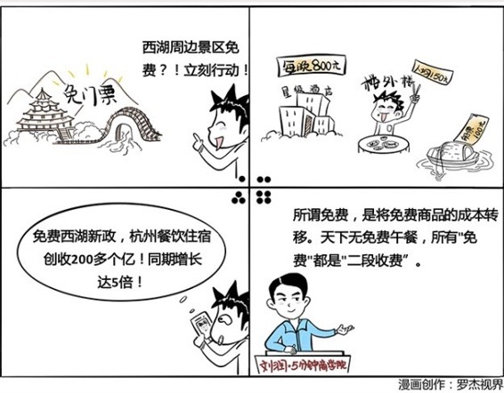

# 015｜所有的免费，都是“二段收费”

### 概念：免费

免费经济学，最早是克里斯·安德森提出的。他是写《长尾理论》这本书的作者，他的另一本书《免费》，同样撼动了整个互联网业。雷军把这两本书，称为互联网的理论基础。

在克里斯看来，免费，是指将免费商品的成本进行转移，比如转移到另一个商品，或者后续服务上。免费的真正精髓，其实是一个“二段收费”：

第一段，是某些企业先用钱，购买了你的注意力，你的朋友圈关系，你未来的需求等等。

第二段，你再拿着这些钱，去购买“免费”的产品。

这也是为什么很多人一提起免费，就会说：羊毛出在猪身上，让狗买单。

### 案例

> 以前的游戏，基本都是按盒来卖的，一盒游戏288元。但是，当时因为付款形式、交易方式、知识产权环境等原因的影响，靠卖盒装游戏赚钱，实在是太难了。

> 后来，盛大公司做了一款游戏，叫做《传奇》，游戏免费，改为卖点卡，玩1小时游戏，两毛九分钱。这并不高。但是你架不住这款游戏据说同时平均在线有100万人，算下来人均成本只有4分钱。也就是说，一小时一人净利润两毛五分钱，1天24小时，100万人同时在线，盛大就能从这款游戏上每天赚600万。陈天桥一度成为中国首富。

> 后来，巨人公司也做了个游戏，叫《征途》，游戏免费，时间也免费。那怎么赚钱呢？如果你游戏中打不过那些玩的时间久的人，你可以买游戏道具，比如屠龙刀、软猬甲等等。

### 运用：场景

场景1：交叉补贴

如果你想得到的，是用户以后持续的重复购买，那你就可以把这个产品的基座免费。比如免费剃须刀架、免费租用专业打印机。这些所谓的免费，只是：1）你用钱购买了他以后买耗材的可能；2）他再用钱买了你的刀架、你的打印机。

场景2：先免后收

如果你想得到的，是用户对于高端产品的购买需求，那你就可以把低端版本免费。

比如视频网站基本服务免费，但你想同步收看《太阳的后裔》，请付费；大部分云服务基础服务免费，但你的东西不够放了？更大的空间，请付费；教育版的软件免费，但等你长大了、毕业了，请付费。阅读片段免费，阅读全文收费。带广告免费，去广告收费。低质量MP3免费，高质量MP3收费。网络内容免费，打印出来收费。注册免费，加V收费。

这些所谓的免费，只是：1）你用钱购买了他以后买你高端产品的可能；2）他再用钱买了你的基础视频服务、基础云服务、没钱的时候的免费服务。

场景3：三方市场

如果你想得到的，是用户的注意力、行为习惯、人际关系，那你就可以把你对他的一部分产品免费。比如你把微信公号的文章免费，再在公号上做广告向第三方收费。俱乐部，对女士免费，向男士收费；博物馆，对孩子免费，向父母收费。

这些所谓的免费，只是：1）你让第三方，用钱购买了他的注意力，他的人际关系；2）他再用钱买了公号上的文章、女士的俱乐部门票、小孩子的博物馆门票。

小结：如何运用？

免费，就是将免费商品的成本进行转移。天下没有免费的午餐。所有的“免费”，都是“二段收费”。

应该怎么实践免费的商业模式呢？记住三点：

1、交叉补贴。

2、先免后收。

3、三方市场。