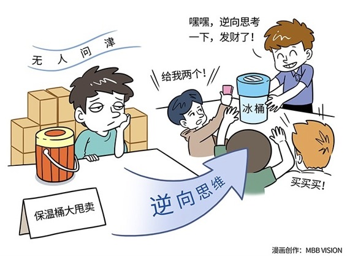

# 159｜电吹风的反面，是吸尘器

你们知道胶卷相机的原理吗？把胶卷放入相机，并卡在相机齿轮上，合上后盖开始拍照。拍一张，自动转动齿轮，收起这段胶卷，抽出一段新胶卷。全部拍完后，自动把所有胶卷反向卷回到胶卷盒，打开相机后盖，取出胶卷。

上大学时，我选修过一门“发明”课。老师在第一节课上，问了我们一个问题：胶卷相机有个重大设计缺陷，你如果不小心打开相机后盖，所有拍过的照片，就会全部曝光。好的，聪明的同学们，请你来改进这款产品，你会怎么做？

### 概念：逆向思维

欢迎回来。我们当时炸锅了。有同学说，在相机后盖上，加一个锁，没拍完不让打开；有同学说，在收纳拍过胶卷的地方，也放一个胶卷盒，从胶卷盒到胶卷盒；有同学说，在相机盖里面，再加一个盖，双重保护，防止误操作。

老师说：你们听听这个老太太是怎么设计的。把胶卷放入相机，自动先把空白胶卷，从胶卷盒里全部卷出来，然后拍一张，再反向收回到胶卷盒里一张，直到全部拍完。这样，万一相机后盖被打开了，曝光的仅仅是空白胶卷。

这位老太太把她的这个设计申请了专利，最后卖给了柯达公司，获得了70万美元的专利费。

你可以想象吗？我当时五雷轰顶。这个方法难吗？一点都不难，甚至几乎完全没有改变相机的设计，而仅仅是改变了齿轮马达的方向。老太太用的这种威力极其强大的思维工具，叫做：逆向思维。

> 什么叫逆向思维？逆向思维是指从事物的反面去思考问题的思维方法。这种方法常常使问题获得创造性的解决。在商业的世界中到处都是依靠逆向思维，获得成功的人。

### 运用：如何训练逆向思维

那怎样才能获得逆向思维呢？其实这并不复杂，我们只是缺乏训练。今天，我与你分享六种常用的逆向思维方法。

第一，结构逆向。

那位老太太，其实就是运用了“结构逆向”的思维方式。通过反转齿轮马达这么一个小动作，解决了大问题。

再比如说，手机都是正向显示的。如果把画面反转过来呢？这样你把手机放在汽车仪表盘上，导航软件的画面反射到前挡风玻璃上，就成了正面，你不必低头看手机了。

第二、功能逆向。

比如保温瓶的功能是保热。你从这个功能“逆向思维”一下，它是不是可以保冷呢？于是就有了冰桶。

空调的目的是制冷。那它能不能同时制热呢？我们知道空调制冷的原理，是通过把热从房间交换到室外去的方法制冷。于是有些机构，就把空调交换出去的热量，输出到厨房，用于制热，变成家用热水系统。

第三，状态逆向。

比如，人走楼梯，是人动楼梯不动。能不能把这个状态反过来？人不动，楼梯动呢？于是就有了自动扶梯。

工人锯木头，是木头不动，锯子动。能不能把这个状态反过来？锯子不动，木头动呢？于是就有了台式电锯。

第四，原理逆向。

电动吹风机的原理，是用电制造空气的流动，方向是吹向物体。能不能逆向利用这个原理呢？空气还是流动，但是方向相反呢？于是就有了电动吸尘器。

电动机的原理，是用电产生磁场，然后磁场移动物体。那能不能反过来利用这个原理，让移动产生磁场，磁场产生电呢？于是就有了发电机。

第五，序位逆向。

序位逆向，就是顺序和位置逆向。

比如火箭都是往天上打的。那能不能反过来，往地里打呢？前苏联研究了一种钻井火箭，能穿透岩石、冻土，重量更轻，能耗更低。

在动物园，是把动物关在笼子里，人走动观看。能不能把这个状态反过来呢？人关在笼子里，动物满地走呢？于是就有了开车游览的野生动物园。

第六，方法逆向。

有一场奇特的赛马比赛，比谁的马更慢。参赛的两匹马几乎止步不前，天黑了，才往前走半步。可以换一个方法吗？让两个骑手换骑对方的马？瞬间，他们就完成了比赛。

你听完逆向思维的介绍，是不是也有脑洞大开的感觉呢？创新，有时候不是突如其来的天才想法，而是正确的思维方法的必然结果。你不是缺乏创新，你只是缺乏创新的思维工具。

### 小结：认识逆向思维

逆向思维法是指从事物的反面去思考问题的思维方法。这种方法常常使问题获得创造性的解决。商业界，尤其需要逆向思维的能力和训练。

今天我与大家分享了六个训练的方法：结构逆向、功能逆向、状态逆向、原理逆向、序位逆向、和方法逆向。这六种不是全部啊，其实没有全部的逆向思维清单，只要你愿意想，也许无穷无尽。