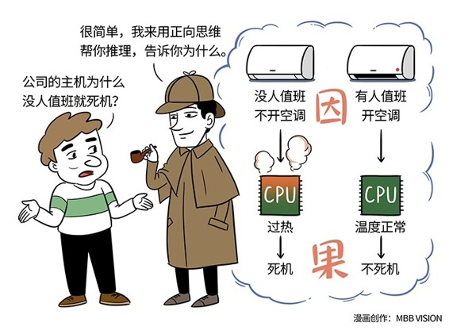

# 160｜做一个“因果逻辑收集者”

“那除了逆向思维外，是不是也有一种能力与之对应，叫做正向思维呢？”

“你说对了。是的。”

“那正向思维应该不复杂吧？逆向思维我不擅长，正向思维我应该还不差吧？”

“哦，你真的这么认为吗？”

#### 概念：正向思维

我先问你一个问题。你觉得侦探最需要逆向思维能力，还是正向思维能力？好。你把这个问题放在脑海中，然后开始听我讲个小故事。

> 有位微软工程师接到了客户电话，说他的服务器每到深夜就会宕机，问怎么回事。工程师查了各种报告，找不到原因。于是他建议：你能不能找个人在机房值夜班，观察到底发生了什么。客户居然……答应了。

> 结果你猜怎么着：服务器居然没宕机！大家很高兴，以为没事了。可第二天没值班，服务器又宕机了。试了几次，只要有人在就没事；没人在，就宕机。

难道这是薛定谔的量子服务器吗？一观察，就没事；不观察，就宕机？好，听到这里，你可以暂停一下语音，思考一分钟：这是为什么？

> 欢迎回来。后来工程师终于发现，问题的根本原因是“空调”！这个客户的机房平常不开空调。但有人值班守夜的时候，因为太热，他就会打开空调。不开空调，机器的CPU过热就会出问题；打开空调，系统就会安然无恙。

我听完这个故事，叹为观止。

什么是正向思维？正向思维，就是从因到果的思维，从已知预测未知的能力。踢一脚足球，我预测它就会飞掉；按下开关，我预测灯就会关掉。擅长正向思维的人，都是“因果逻辑收集者”，平常在大脑中收集、整理、存放了大量的因果逻辑，以备随时调用。

而在这个案例中，有四个首尾呼应的因果逻辑：1）人不在，关空调；2）关空调，温度高；3）温度高，CPU过热；4）CPU过热，就宕机。这四个中间，只要有一个因果逻辑缺失了，比如你从来没有意识到，这世界上居然会有人为了省电，人不在就关掉机房的空调，缺了这一环正向思维，那你这辈子也解决不了这个问题。

破案，看上去像是在进行“一个”逆向思维，由果到因，但其实在侦探脑海中，快速发生着“成千上万个”正向思维，无数的由因到果。这些因果逻辑的数量和质量，直接决定着你的破案能力。

### 运用：如何训练正向思维？

#### 第一，做一个“因果逻辑收集者”。

看到用户越多，微信粘性越大，就收集一个叫做“网络效应”的因果逻辑，放在大脑的商业区；看到有人愿意买1000万的车，却不愿买50元的矿泉水，就收集一个叫“心理账户”的因果逻辑，放在人性区；看到太多管理错位的问题，就收集一个叫做“责权利心法”的因果逻辑，放在管理区 ……

#### 第二，多读侦探小说，多读科幻小说。

收集了大量“因果逻辑”后，如何调用他们？调用这些因果逻辑，有两个办法：归因，和预测。正向思维往过去用，就是归因；正向思维往未来用，就是预测。要训练归因和预测的能力，你可以多读侦探小说，多读科幻小说。

读侦探小说，可以训练你的归因能力。福尔摩斯第一次见到华生时说：“你从阿富汗来？”华生大吃一惊：“你怎么知道？”

福尔摩斯是这么回答的：“由于长久以来的习惯，一系列的思索飞也似地掠过我的脑际，因此在我得出结论时，竟未觉察得出结论所经的步骤。但是，这中间是有着一定的步骤的。”福尔摩斯说的这个“步骤”，就是“归因”。

读科幻小说，可以训练你的预测能力。在电影《星际穿越》里，最后人类生活在的那个滚筒空间站，就是编剧基于“离心运动产生重力”这个因果逻辑，对未来的有科学依据的想象。这个有依据的想象，就是“预测”。

### 小结：认识正向思维

正向思维，就是从因到果的思维，从已知预测未知的能力。他是基于在大脑中收集、整理、存放的大量的“因果逻辑”，而具有的一种推理能力。正向思维往过去用，可以用来归因；正向思维往未来用，可以用来预测。

怎么训练这种能力呢？第一，做一个“因果逻辑收集者”；第二，多读侦探小说，多读科幻小说。