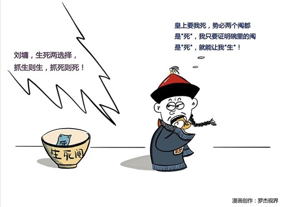

# 163丨生存，还是毁灭，没有中间状态

你有没有说过下面这些话：“我认为降价是不对的，这会带来品牌价值受损，我认为不降价也是不对的，毕竟眼前的销售压力很大。” …… 或者“我不认为创业期需要KPI，当然我也不是说，创业期就不需要KPI”。

> 每次听到这样的话，我又想拉他们拉去坐牢了。忍住，忍住。这些自以为充满“辩证智慧”的话，其实都是“骑墙”，做这个不可以，不做这个也不可以，这种“模棱两不可”的态度，违反了逻辑三大基本定律之三“排中律”。

### 概念：排中律

什么叫排中律？就是两个自相矛盾的观点，一定有一个是对的，没有“都不对”这种中间状态。你可以不表态，但如果你表态了，就不能说“嗯，其实吧，两个我都不同意”。

什么叫“自相矛盾的观点”？“你是男的”，和“你不是男的”，这就是两个自相矛盾的观点，没有“都不对”的中间状态。

好，下面请听题：这句话有逻辑问题吗？

你的项目，不能说成功了，也不能说没有成功。

这句话，有逻辑问题。它要不然违反了“同一律”，要不然违反了“排中律”。

如果这句话前后两次说的“成功”，内涵和外延是一样的，是同一个概念，那么这句话就违反了“排中律”，不存在“成功”和“没有成功”之外的中间状态。

如果你说，不对不对，我两次说的成功，其实含义不太一样，是从不同角度定义的成功，那你就违反了“同一律”，在同一句表述中，偷换了“成功”这个概念，有意、或者无意地制造逻辑混乱。

那这句话应该怎么说呢？你可以这么表达：

> 如果用“有没有赚钱”来定义成功，我认为你的项目不能说成功了，因为公司在这个项目上亏了钱；但如果用“有没有成长”来定义成功，也不能说没有成功，因为大家获得了宝贵的经验和教训。

“排中律”很大的价值，是识别，和揭穿那些骑墙者，提高思辨的能力，沟通的效率。但这还不是“排中律”最大的价值。排中律最大的价值，是延伸出了一种名震四海的推理方法：反证法。

### 延伸：反证法

什么叫反证法？

根据“排中律”，既然两个自相矛盾的观点，一定有一个是对的，没有“都不对”这种中间状态，那我只要证明这两个观点中，有一个是错的，不就等于证明了另一个是对的了吗？这就是反证法，“排中律”最知名的运用。

> 刘墉因为直言进谏，触怒龙颜。乾隆皇帝当堂做了两个“纸阄”，名曰“生死阄”，一个上面写着“生”，一个写着“死”。其实刘墉知道，乾隆在这两张上，写的都是“死”字。刘墉不管抽到那一张，都会被处死。怎么办？怎么办？

> 刘墉突然想起来，“排中律”里面讲过“反证法”，只要证明自己没有抽到的那张是“死”，就等于证明了自己抽到的这张是“生”啊！于是他灵机一动，上前抽出一张“纸阄”，然后一口吞下去。现场所有人都傻眼了，大家只能通过刘墉没有抽到的那张，来反证刘墉抽到的这张是什么。那张打开果然是“死”，基于“排中律”，乾隆皇帝只好赦免了刘墉。

哇，原来反证法还能救命？那我应该怎么学好、用好反证法呢？

### 运用：反证法三个必不可少的步骤

一个逻辑严谨的反证法，有三个必不可少的步骤：反设，归谬，存真。

比如我常说“成功企业转型，获得二次成功，是小概率事件”。这个观点，很难用三五句话证明，那我们来试试反证法。

第一、反设。我们反过来假设这个观点不成立，也就是“成功企业转型，获得二次成功，是大概率事件”。

第二、归谬。那么，管仲、商鞅、陶朱公，这些曾经成功的企业，就会大概率基业长青活到今天，商业世界中，应该是“管仲控股”，“商鞅集团”，“陶朱公科技”的天下，哪还有你们什么事。

第三，存真。所以“成功企业转型，获得二次成功，是小概率事件”。

### 小结：认识反证法

排中律，说得学术一点，就是指在同一个思维过程中，两个自相矛盾的思想不能都假，必有一真。翻译成普通话，就是：生存，还是毁灭，这是一个没有中间状态的问题。

排中律，可以用于识别，和揭穿那些“模棱两不可”的骑墙者，提高思辨的能力，沟通的效率。但更有名的用法，是它的儿子：反证法。用“反设、归谬、存真”的方法，在两个自相矛盾的观点中，通过证明一个观点错的，来证明另一个观点对。

我们讲完了逻辑的三大基本定律：同一律，矛盾律，和排中律，你有什么感觉吗？有的同学可能会感觉：啊，要想做到逻辑缜密，看来真的好难啊！是的。没有经过训练的人，是很难做到逻辑严谨的。但这恰恰显示出，逻辑严谨的难能可贵之处。