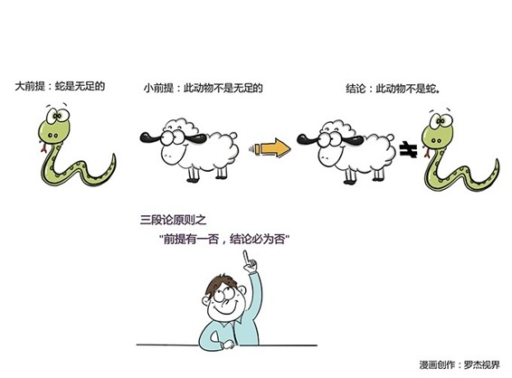

# 164丨一眼识别诡辩的五个方法

今天的内容，需要你拿出纸和笔，然后坐下来，全神贯注地听。你可以暂停一分钟，去准备一下。

准备好了吗？好，我们开始。请听下面这段“逻辑”：

> 你说甲生疮。甲是中国人，你就是说中国人生疮了。既然中国人生疮，你是中国人，就是你也生疮了。你既然也生疮，你就和甲一样。而你只说甲生疮，则竟无自知之明，你的话还有什么价值？倘若你没有生疮，是说诳也。卖国贼是说诳的，所以你是卖国贼。我骂卖国贼，所以我是爱国者。爱国者的话是最有价值的，所以我的话是不错的，我的话既然不错，你就是卖国贼无疑了！

听完之后什么感觉？是不是倒抽了一口了凉气：这是从哪里来的“神逻辑”啊？

这段“神逻辑”，是大约100年前，鲁迅在一篇文章《论辩的灵魂》里讽刺当时很多人的论辩逻辑的。

可100年过去了，我们今天在互联网上，依然可以看到大量几乎一样的言论：

> 我是爱国的，所以我去砸日本车；既然我是爱国的，而你阻止我砸，所以你是卖国的；卖国是不对的，而你是卖国的，所以你的观点是不对的；你的观点是不对的，而我的观点和你不同，所以更加证明了我的观点是正确的。

听完什么感觉，是不是想拉他去坐牢？我们之所以这100年没有大的长进，是因为一直缺乏真正的“推理”训练。今天我们就来聊聊，鲁迅这段文字中大量使用的，一种最基本的推理形式：三段论。

### 概念：三段论

什么是三段论？简单来说，这是一种，“大前提，小前提，结论”式的推理，其基本逻辑是：如果一类对象的全部都是什么，那么，它的部分也必然是什么；如果一类对象的全部都不是什么，那么，它的部分也必然不是什么。

比如著名的“苏格拉底三段论”：

大前提：所有的人都是要死的；小前提：苏格拉底是人；结论：所以苏格拉底是要死的。

很简单吧？确实简单。但为什么鲁迅这段文字里的三段论，听上去全是谬论呢？因为一个逻辑严谨的三段论，有五项基本原则。今天，我们就来讲讲帮你“一眼识别诡辩”的这五项基本原则。下面，请全神贯注：

### 运用：三段论的五项基本原则

第一，四项错误。

一个三段论中，只能有三个不同的概念。有四个，就一定错了。

还记得这个三段论吗？

人已经存在几百万年了；而你没有存在几百万年；所以你不是人。

这个三段论中，看上去有三个概念“人，几百万年，你”，但因为前后两个“人”违反了“同一律”，是不同的，所以其实一共出现了四个概念“人类，几百万年，你，人体”。

以后你听到这样的三段论，可以直接回答：四项错误，然后扬长而去，留他一个人在风中飘摇。

第二、中项两不周延。

什么叫中项？“所有人都是要死的，苏格拉底是人”，这里的“人”就是中项，用来联系大前提和小前提。

那什么叫周延？“所有中国人”指全部，是周延的概念；“一部分中国人”，是不周延的概念。

认真听这个三段论：

一部分中国人很有钱，北京人是一部分中国人，所以北京人很有钱。

“一部分中国人”是联系大前提、小前提的中项，但是不周延，所以犯了“中项两不周延”的逻辑错误。北京人是一部分中国人，但不一定是有钱的那一部分中国人。

“中项两不周延”还有其他形式，有兴趣的同学，可以在留言区与大家分享。

第三、大项扩大，小项扩大。

红薯是高产作物，红薯是杂粮，所以杂粮是高产作物。

一听就不对。可是为什么？

这句话的小前提其实是：红薯是“一种”杂粮。结论其实是：“所有”杂粮是高产作物。小前提是“一种”，结论是“所有”，就是“小项扩大”。

运动员需要锻炼身体，我不是运动员，所以我不需要锻炼身体。

显然也不对。可是为什么？

这句话的大前提其实是：运动员是“部分”需要锻炼身体的人。结论其实是：我不在“全体”需要锻炼身体的人之中。大前提是“部分”，结论是“全体”，就是“大项扩大”。

第四，前提都为否，结论不必然。

韩国不是大陆国家，韩国不是热带国家，所以，……。

你应该脱口而出：别“所以”了。大前提、小前提都是否定句，是“所以”不出必然的结论的。不信你可以慢慢试。

第五，前提有一否，结论必为否。

人非草木，哲学家是人，哲学家非草木。

再比如：

蛇是无足的，此动物不是无足的，所以，此动物不是蛇。

这两句话是对的。或者大前提，或者小前提是否定句，且只有一否，所以结论一定为否定句形式。

怎么样，头晕了吗？不用着急，慢慢来。想要成为商业世界的洞察者，就要多花时间，刻意训练严谨的推理能力。

其实三段论五项基本原则还有两项推论，我就不介绍了，以免大家觉得太烧脑。有兴趣的可以去百度。

### 小结：认识三段论

三段论简单来说，这是一种，“大前提，小前提，结论”式的推理。想要“一眼识别诡辩”，需要掌握三段论的五项基本原则： 四项错误；中项两不周延；大项扩大，小项扩大；前提都为否，结论不必然；前提有一否，结论必为否。