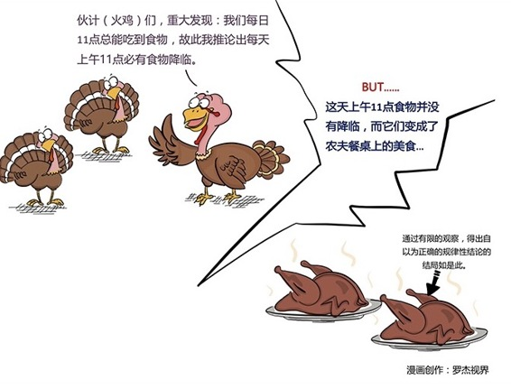

# 165丨几乎所有的知识，都始于归纳法

> 讲了四天的逻辑，你有什么感觉？很烧脑是吗？逻辑学，和经济学、管理学、心理学等等不同。那些都是“认知”。而逻辑学，是获得这些“认知”的方法。逻辑学比所有这些学科都要底层，是一门硬知识。所以，你发现没有，智商测试，不会考你的经济学、管理学、心理学知识，但它会考你的逻辑思维能力。

如果说一个人的智商是未经打磨的钻石，那么逻辑思维训练，就是打磨、切割这颗钻胚，让其最终成为一枚锋利无比、璀璨夺目的金刚钻，再来切割经济学、管理学、心理学等等一切坚硬的认知。

所以，今天，我继续给大家讲“逻辑”这门硬知识的最后一课：归纳法。

### 概念：归纳法

你们有没有听过这个故事：

> 农场里有群火鸡，农场主每天中午十一点来喂食。火鸡中有位科学家观察了近一年无例外后宣布发现了宇宙一个伟大定律：“每天上午十一点，会有食物降临。”感恩节早晨，它向火鸡们公布了这个定律，但这天上午十一点食物没有降临，农场主将它们捉去杀掉，把它们变成了食物。

这是《三体》里的一个故事。但这个故事最早是由著名的英国哲学家伯特兰·罗素提出的，被称为“罗素的火鸡”，用来讽刺归纳主义者：通过有限的观察，得出自以为正确的规律性结论。

那么，到底什么是归纳法，归纳法真的是伪科学吗？

> 昨天我们讲到的“三段论”，是“演绎法”的最基本形式。演绎法，是从一般，推出特殊的方法。所有的猫都喜欢吃鱼，你家养的是猫，所以它也喜欢吃鱼。

你可能会说：嗯，有道理。无可辩驳。

> 那归纳法呢？归纳法是从特殊，推出一般的方法。中国的天鹅是白色的，美国的天鹅是白色的，我见过的天鹅全是白色的，所以，所有的天鹅都是白色的。

你可能会说：哦，这就不一定了吧？

恭喜你，你是对的。归纳法的输出，不是“定律”，而是“猜想”。你可以说：我猜想，所有的天鹅都是白色的。

比如，著名的“哥德巴赫猜想”。哥德巴赫从无数的实例中“归纳”出一个猜想：任一大于2的偶数都可写成两个质数之和。将近300年后的今天，据说计算机已经验证了4x10^30以内的所有偶数，都符合猜想，但因未经“演绎法”证明，所以它还是猜想。

归纳法从现象提炼出猜想，演绎法把猜想证明为定律。

如果归纳法只能得出不确定的猜想，而不是确定的定律，那它是不是没有什么用呢？恰恰相反，归纳法的作用超乎想象。

牛顿，从无数次试验中，归纳出了“牛顿三大定律”；经济学家们，从人们的交易现象中，归纳出了“供需理论”。我们几乎所有的知识，都始于用归纳法建立的猜想，和再用“演绎法”严谨的证明。可以说，没有归纳法，就没有演绎法；没有猜想，就没有证明。

### 运用：归纳逻辑“穆勒五法”

那么，我应该如何训练自己“归纳法”的能力呢？今天，我要给你介绍训练归纳法著名的“穆勒五法”。

第一、求同法。

某农场10万只火鸡吃发霉花生，得癌症死亡。吃这种花生的羊、猫、鸽子、大白鼠、鱼和雪貂，后来都得癌症死了。于是人们通过求同法归纳：吃了发霉的花生，可能是癌症的原因。

后来，化验证明，发霉花生含有黄曲霉素，而黄曲霉素是致癌物质。科学家通过演绎法，证明了这个猜想。

这就是“求同法”。

第二、求异法。

5个中国人和外国人远洋航行。途中，外国人全得了坏血病，奄奄一息，就中国人没事。大家用求异法发现，和外国人不同，中国人喜欢喝茶，于是归纳出了“喝茶抵御坏血病”的猜想。

这就是“求异法”。

第三，并用法。

某些地方高发甲状腺病。医疗队去了几个病区，用“求同法”发现，虽然各地情况大不相同，但有一点是相同的：居民食物和水中缺碘。他们又去了不流行甲状腺病的地区，发现他们不缺碘。医疗队用求同法、求异法，归纳出一个猜想：缺碘是甲状腺病的病因。

这就是“并用法”。

第四，共变法。

你夜观天象，发现产品越稀缺（也就是供小于求），价格越高；产品越充沛（也就是供大于求），价格越低。他们之间，共同变化。于是经济学家归纳出了“供需关系”的理论猜想。

这就是“共变法”。

第五、剩余法。

简孙和罗克耶尔研究太阳光谱时发现一条红线、青绿线、蓝线和黄线，前三者是氢的光谱，第四种未知。于是他们用剩余法归纳：一定存在一种新物质。后来证实，这种新物质叫氦。

这就是剩余法。

### 小结：认识归纳法

归纳法是一种从特殊，推出一般的方法。归纳法从现象提炼出猜想，演绎法把猜想证明为定律。我们几乎所有的知识，都始于归纳法。但是，我们必须对猜想之外的可能性，也就是黑天鹅，永远心怀敬畏。

那怎样训练归纳法思维呢？穆勒五法：求同法、求异法、并用法、共变法、和剩余法。

每一件事情背后，都有其商业逻辑。祝愿你通过5天的逻辑课，开启了逻辑思维能力的提升之路。