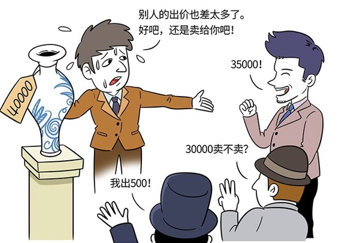

# 166丨自己先开价，还是让对方先开价？

在商业世界中，交易双方掌握着并不对称的信息，为了获得最大的个体利益，或者最大的整体利益，我们常常必须通过“谈判”，来达成双赢、或者妥协的共识。这一周，我们就来讲讲这种信息不对称、利益不一致情况下的特殊沟通能力：谈判能力。

> 你看中一件清朝古董，特别喜欢。但是卖家标价特别高。这是一种典型的“信息不对称”，你不知道他的底价是多少；你们也“利益不一致”，你希望越便宜越好，他希望相反。这时候，你怎么办？

求他吗？哭穷吗？他会指指旁边一个唐朝古董，贵20倍。很明显，他在运用的“价格锚点”策略，让你感觉其实这个并不贵；他会说古董是投资品，越来越值钱，比买车这种到手就减值一半的消费，划算多了。很明显，他在运用第1课讲的“心理账户”策略，试图把古董从你消费的心理账户，挪到投资账户里。

怎么办？怎么办？别急，你可以试试运用“定位调整偏见”。

## 概念：定位调整偏见

社会心理学家曾作过一个试验：

> 在召集会议时先让人们自由选择位子，之后到室外休息片刻，再进入室内入座，这样5-6次，发现大多数人都选择了他们第一次坐过的位子。

> 大家被自己的心理的“锚”，定在那个位子上了。一旦“锚定”了，后面的各种讨论、决策，都很容易受到这个“锚”的影响。

回到最开始的案例。那我怎么才能便宜地买到那个古董呢？

> 法国文豪大仲马，有过一模一样的遭遇。他也看中一件古董，卖家也标价很贵。他怎么做的呢？

> 他找了两个朋友先后到店里去，假装要买古董。第一个朋友开了一个不可思议的低价，卖家说：“你疯了吧？滚！”。过了一会儿，第二个朋友也进去了，开了一个差不多的低价，卖家疯了，说：“这也太低了，你高一些吧。”

> 这时，卖家的定价，已经被从高处强行拉下来，摁在一个很低的“位子”上了。然后大仲马出场了。他进门，在第二个朋友的价格上，加了一些钱，买下了古董。

把谈判战场，直接定位到对方的底线，然后在此定位附近小范围拉锯，这种通过定位效应，获得对自己有利谈判结果的方法，就叫做：定位调整偏见。对方只能在定位附近波动，但很难调整定位本身。

## 运用：运用“定位调整偏见”的三个原则

### 第一，争取先开价。

很多人在谈判时喜欢问：你觉得多少钱合适？你的底线20万，你希望对方出个30万，然后自己窃喜着答应了。

这种情况，在真正的谈判中几乎不会发生。你让对方先开价，就是给对方使用“定位调整偏见”的机会。他可能会报5万，把谈判战场定位到你的底线以下。

所以谈判时，应该争取先开价。

### 第二，越极端越好。

大仲马用的就是极端报价策略，把谈判“锚”定在了低价区间。

反过来，卖家也一样。非常高的价格就是“锚”，一是稳定住了自己的赢利空间，二是为顾客创造出虚幻的“折扣”和“优惠”，让顾客为自己争取到的低价产生成就感。

但是，在商业谈判中，极端“报价”有时可以超越“价格”，用在一些其他“等价条件”上，比如工作范围，项目工期，品质标准等。你可以试着在“等价条件”上，提出“无理要求”。

价格我们先放一边，但这个项目，我希望能在30天内完成。

对方一口鲜血，这是一个计划半年的项目啊。其实你真正在乎的是价格。然后，你在项目工期，工作范围，品质标准上的一点点艰难地让步，都可以让对方用别的条件买回去。比如：

我可以降低一些质量标准，从6-sigma，降为5-sigma，但是我需要在预算里扣除质量准备金。

### 第三，留还价余地。

当然，你也要避免一种情况：你开了一个看似毫无诚意的价格，别人一怒之下，拂袖而去，或者冲过来把你打一顿。

所以，你开价之前要提醒、或者暗示对方，你开的这个价格还是有商量余地的。对方知道即便你的价格很荒唐，也会在他心中锚定，影响下面的谈判。

### 小结：认识定位调整偏见

定位调整偏见，是一种谈判技巧。利用先入为主的定位效应，把价格谈判、或者条件谈判，直接锚定在对方的底线附近，然后拉锯，它是一种在信息不对称、利益不一致的谈判中，争取自己最大利益的方法。

具体有三个步骤：第一，争取先开价；第二，越极端越好；第三，留还价余地。

美国前国务卿基辛格说：

> 开价的技巧，在于你可以提出一个极端到令人难以接受的开价点，你越漫天要价，那么对方越是有可能把你“真正”的要价看作是让步。