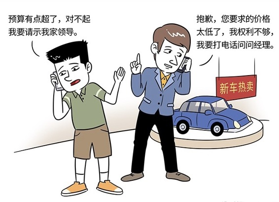

# 167｜你的这个要求，我要请示一下

> 刚学完驾照，你决定买一辆车。冲进4S店，看了很多，也和销售聊了很久，终于定下来型号、配置。然后，你们就开始了讨价还价。汽车销售，都是经过谈判培训的，你也不甘示弱。一上来，就用“定位调整偏见”，开了一个极低的价格，打算在对方的底线附近打拉锯战。销售也处变不惊，不断用各种赠送，换取价格的提升。最后，大家眼看终于要在一个价格点上，差不多达成一致了，你也比较满意了。这时，你应该怎么办？

一拍桌子说：大家都是爽快人，那就签约吧。还是说：再送我一个钥匙扣，我就立马提车？

都不是。你可以对销售说：你真是个厉害的销售，我被你说服了。那就这样定了吧。你再等我打个电话，我向我们家董事长最终请示一下。

啊？我们家的家规是“他负责赚钱，我负责花钱”，他是CEO，我是董事长，可以全权决定，不需要向他请示吧？

其实，这无关你们家的组织架构图，而只是一种谈判技巧，叫做：权力有限策略。

## 概念：权力有限策略

> 什么叫“权力有限策略”？权力有限策略，就是告诉对方，我后面还有一个“没有露面的人”，他是最终的决策者。虽然他给了我足够大的谈判权力，但如果谈判条件超出了我的权限，我还是需要向他请示。

回到最开始的案例。你打个电话给你家那位，随便问一句：午饭吃过了吗？他说：吃过了。然后再问：晚饭回来吃吗？他说：回来。然后你就可以挂电话了，愁眉不展的对销售说：我家领导觉得太贵了，他让我再多看看别家，你给我留个电话吧，我再找你 ……

这时候，销售通常会心里吐血，然后说：你等等，我也打个电话给我的领导，看看是不是能再送你一些加油卡 ……

这就是权力有限策略。一句：“对不起啊，虽然我理解你的立场，但是你的要求实在是太过分了，我没有权力答应你”，会成为一个外表柔软、内心坚定的“拒绝”，让对方大伤脑筋。受限的谈判权力，才会有真正的力量，比全权谈判者，更处于有利的状态。

## 运用：权力有限策略的四种限制方法

那我应该怎么来利用这种“权力有限策略”呢？你可以试试在四个方面，主动限制自己的谈判权力：金额，条件，程序，法律。

### 第一，金额的限制。

最开始的买车案例，就是典型“金额的限制”：我家领导觉得太贵了。这也是最常用的“权力有限策略”。他给谈判设定了一个最低目标，比如“成交价格最多不能超过每件100元”，并用“对不起，我要和领导商量一下”作为盾牌，保护这个目标。

那如果，对方说“你能做主吗？”不能做主，不要和我谈，怎么办呢？

很多人喜欢在名片上印“董事长 & CEO”，这虽然看上去很牛，但也会让你在谈判的时候，失去退路。你可以试着在名片上印“创始合伙人”，它同样可以让你有谈判的资格，但遇到艰难的问题时，你可以有余地和对方说：“对不起啊，这个问题很重大，我必须尊重我的几个合伙人的意见，请稍等，我去打个电话”。

### 第二，条件的限制。

条件的限制，更加容易使用“权力有限策略”，你可以大方地说：金额可以谈，但“服务费用占开发费用的15%”的这个条件不能谈，谁来都不能谈，这是我们一贯的原则，因为它有关项目最终质量。如果要打破这个原则，我们只能回去开会讨论了。

相对于金额，条件的限制，更容易被对方理解和接受。

### 第三，程序的限制。

“我可以原则上答应你，但所有新产品上线，都要运营部门签字同意。我把我们刚刚谈完的参数指标整理一下，请运营部门今晚加班看一下，明天给你最终答复。”

这就是用程序的限制，获得回转余地。

### 第四，法律的限制。

“我们必须要在中国合法经营。刚才的条款，我全部同意，但还有一些合规性的担心。合规部门那些同事，整天给我们找麻烦，很难搞，你懂的。我请他们在不改变条件的前提下，再看一遍条款。”

合规、财务、法务等部门，常常为公司背黑锅。但是，却可以成为“权力有限策略”中非常重要的“不露面的人”。好好感谢他们吧。

## 小结：认识权力有限策略

权力有限策略，就是通过设定一个真实，甚至虚构的“不露面的人”，限制自己谈判的权力，从而给予自己在关键问题上，外表柔软，内心坚定地说“不”的能力，让对方大伤脑筋，做出最大可能的让步。

运用“权力有限策略”有四种方法：第一，金额的限制；第二，条件的限制；第三，程序的限制；第四，法律的限制。