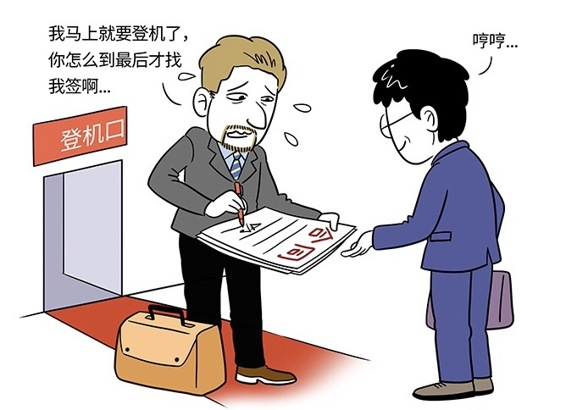

# 168｜女生为什么会逼婚？

听完“定位调整偏见”和“权力有限策略”之后，你有没有一种胆战心惊的感觉？是不是甚至有些心疼那个4S店的汽车销售？别急，那一轮谈判其实还没结束。你至少还有一招没用，那就是：谈判期限策略。

> 4S店的销售对你说：“我帮你申请了，领导同意特批1万元的加油卡。千万别告诉别人，这真是从来没有过的优惠啊！”

这时你应该怎么做？答应吗？还是说：嗯，我想了想，还是贵，你再便宜2万吧。

千万不要这么说，那太没有诚意了。每一个阶段性的谈判成果，你都要承认，绝不能没有理由地推倒重来，否则立刻失去谈下去的基础。

> 你可以说：“太好了。我现在就付定金。全款什么时候付？啊？今天？我们公司月底发工资，我先付定金，全款下个月1号给你，行不行？就差4、5天。”

这并不是一个过分的要求，月底谁有这么多钱。但你会发现，销售的脸立刻就变色了。

为什么？因为他心中对这笔订单，有个“谈判期限”。

## 概念：谈判期限策略

我们讲过，很多公司激励销售的方式，是“工资+奖金”。奖金都有个计算期限，大多公司按照月度、或季度计算、发放奖金。所以，每个月底销售都拼了，每个年底销售都疯了。同一个订单，月底成交，和4、5天后月头成交，奖金的差别是巨大的。所有的销售，都有一个周期性的“谈判期限”。

这时，4S店的销售很可能会对你说：姐，我这个月底冲业绩，你就当帮我一个忙，今天付款吧。你只要稍微做出一些为难的样子，他可能会再送你一些贴膜，脚垫，熏香，倒车雷达。

这，就是“谈判期限策略”，充分利用“时间”对双方的不对等价值，获得谈判优势。

听到这里，你是不是更心疼那个销售了呢？反正，我学完谈判之后，非常心疼那些没学过的。

## 运用：谈判期限策略的两个方法

有些同学会一边心疼，一边问：那么，我怎么才能用好这个“谈判期限策略”呢？其实很简单。记住两个方法：战略延迟和最终期限。

#### 第一，战略延迟。

这个汽车的买家，用的就是“战略延迟”法。如果时间拖得越久，对方越不利，你就可以用“战略延迟”法，直到对方迫于时间压力，必须尽快达成一致时，你就获得了谈判的优势地位。

德国代表团去日本进行为期四天的访问谈判。当日本人了解到，德国人已经买了周五回国的机票后，就对德国代表团说：“这是你们第一次到日本吧？请一定给我们机会，带贵客们好好参观一下日本，以尽地主之谊。”日本人的热情，让德国人势不可挡，一天、两天、三天都在旅游观光，非常充实。

第四天终于坐下来了。日方搬出了堆积如山的资料，请德方仔细查看。德方还来不及看完所有资料，签约时间就到了。德国代表团这时很难受。如果不签，这么高规格、大规模的代表团来到日本，却空手而回，没法交代。他们只好在基本利益保证的前提下，忽略了很多细节，匆忙签订了协议。

日本人充分利用了“谈判期限策略”，获得巨大的谈判优势。

谈判之前，你可以充分了解对方的“谈判期限”，它们可能是：对方国家的节假日，比如圣诞节；公司的现金流，决定下一轮融资的最晚时间；对方锁死的发布会日期，软件平台上线日期等。

#### 第二、最后期限。

如果时间的延迟，对自己更不利，你可以反向使用“谈判期限策略”，设定“最后期限”。

好，我们同意降低10%的价格，但前提是，你们有足够的诚意，今天就能签约。如果今天不能签，这个基于你们诚意的让步，我们只能收回。

这就是“最后期限”：把时间的压力，放到对方身上。

艾柯卡是美国汽车界的巨头，他接手克莱斯勒这个烂摊子的时候，决定把工人的工资，从20美元一小时，降到17美元。工会当然拒绝接受，并列举了无数理由。公司运行已经非常艰难，但谈判一直没有结果。艾柯卡某天晚上10点，最后对工会代表说：

我希望你们能做出最后的决定，如果不同意17美元的工资，我明天早上只能宣布公司破产。给你们8个小时的时间考虑。

工人们听到破产的最后期限后，连夜开会，综合工资水平、经济环境、公司情况，最终接受了艾柯卡的条件。

艾柯卡使用的，就是“最后期限”法。

#### 小结：认识谈判期限策略

谈判期限策略，就是充分利用“时间”对双方的不对等价值，获得谈判优势。如果延长谈判时间，对自己有利，就用“战略延迟”法；如果延长谈判时间，对对方有利，就利用“最后期限”法，倒转优劣势。