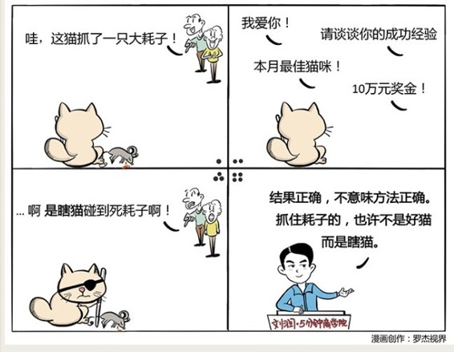

# 016｜抓住老鼠的就是好猫？

这周，我们来谈一谈：行为经济学。

> 经典经济学有两个基本假设：

#### 1、信息总体是对称的，也就是说你知道的，我大概也会知道。

#### 2、人总体是理性的，我们总是能够做出对自己最有利的那个选择。

行为经济学的研究却告诉我们：其实人在很多的情况之下，并不真的那么理性。

> 016｜抓住老鼠的就是好猫？

### 概念：结果偏见

我们看到一个人获得了成功，就会立刻认为他过去所有的行为都是那么地有道理，可成功者自认为的那个经验，也很有可能是他没有获得更大成功的绊脚石。

### 案例

销售团队月底发奖金。平常自由散漫的销售A，业绩特别好。平常打法凌厉、很有章法的销售B，业绩很不好。业绩奖金当然发A，但最佳员工奖，你会发给谁？

如果只看结果，那么应该发给A。但是你调查后发现，A的做法很危险，只有20%的成功率，B的做法很严谨，有80%的成功率。

> 正确做法：克制自己的结果偏见，给经验可供推广的B发最佳员工奖。

原因：不能不管黑猫白猫，抓住老鼠的就是好猫。要分清楚哪些是努力，哪些是运气。因为瞎猫也会碰着死耗子，而瞎猫一辈子能碰到几次死耗子呢？

### 运用：如何避免结果偏见？

#### 第一、在归纳法之后，加上演绎法。

从结果中推导出原因的过程叫做归纳法，但得到原因后，一定要再推演一下，看这个原因能不能真的推出正确的结果。比如很多人说，谷歌的成功是因为招了最优秀的人，在你接受这个原因之前，试着推推看，在谷歌刚创立、并不被看好的时候，真的会有那么多优秀的员工加盟谷歌吗？

#### 第二、用3个问题来武装自己：

这个结果，真的有一个人为可控的原因存在吗？

这个分享的人，真的知道那个人为可控的原因是什么吗？

他引以为豪的，会不会恰恰是这个宝玉上的瑕疵呢？

小结：避免结果偏见的两个方法

归纳之后再演绎。

学前3问。

> 共同学习的第16天，期待你的进步。