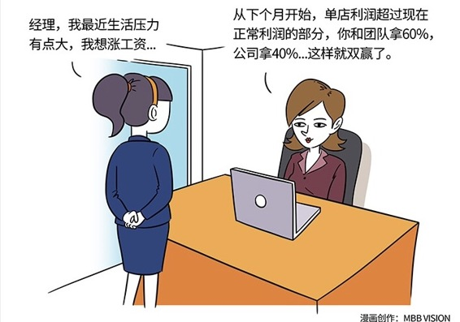

# 170｜我多拿一元，你就必须少拿一元吗？

> 听完定位调整偏见，权力有限策略，谈判期限策略，和出其不意策略后，你有什么感觉？是不是觉得谈判真是心惊肉跳，以后能不谈判就不谈判？还是跃跃欲试，觉得自己已经成为了谈判高手呢？

其实到现在为止，我们讲的四个谈判策略，都属于谈判的两大流派“零和谈判”和“双赢谈判”中的零和谈判派。

这世界上，有很多谈判确实是零和谈判，比如房产出售，商品买卖等等，你多拿一元，对方就必须少拿一元。我们讲述的四个策略，都是教你，如何在零和谈判中，获得对自己最大的利益。

但是还有一种谈判流派，他们相信在更多别的场景中，你多拿一元，不是必然以他少拿一元为代价的，比如战略合作谈判，投资条款谈判等等。这种目的是双赢，而不是必须我多你少的谈判，就叫做：双赢谈判。

## 概念：双赢谈判

> 你开服装连锁店。某店长做得还不错，但是你知道，她对自己的薪水并不满意。终于有一天，她约你来谈了，说生活压力大，提出要加薪50%。

你觉得：第一，不能随便给任何一个主动提出加薪的店长加薪，否则大家会认为“会哭的孩子有奶吃”，然后纷纷效仿；第二，如果答应了这个要求，本来就处于盈亏平衡点附近的这家单店，就可能面临亏损风险。

> 这时你应该怎么和她谈判？运用定位调整偏见，先把涨薪幅度压到5%，然后一点一点加到8%？还是运用权力有限策略，说这件事我决定不了，公司流程就是这么定的？还是用谈判期限策略，说我们都再想想，然后培养一个助手，减小她的谈判筹码？还是运用出其不意策略，对她说，我调查过了，你的生活压力根本不大？

都不对。企业和员工之间，本质上是一种追求双赢的合伙关系，你们不应该把彼此置于“零和谈判”的关系中。如果内部博弈就可以获得单方面收益，那么不管你们今天谈出什么结果，过几天，她还会再来谈，永无止境。你们之间必须建立一种“双赢谈判”的关系。

你可以对她说：每家单店的经营，最终都是要看利润。有钱赚，大家都可以多分。现在你负责的店，每月利润稳定在大约2万元左右。你如果涨50%的薪水，它就几乎立刻亏损了。你看这样，我们把2万当成正常利润，从下个月开始，单店利润超过2万正常利润的部分，你和团队拿60%，公司拿40%。那60%，由你来分配。这样好不好？

你立刻就会想起了，我们在前面课程讲到的“双赢思维”，和“激励相容”。是的，这就是“双赢谈判”：除了我要多拿的第一选项，和你要多拿的第二选项，谈判双方共同寻求，我们都要多拿的“第三选项”。

### 运用：双赢谈判的两个基本思路

那么，怎样才能尽可能和对方达成双赢谈判呢？

#### 第一，做大增量。

双赢谈判的目的，不是分蛋糕，而是做大蛋糕，是在不损害他人的前提下，改善自己的，或者彼此共同的利益。这种整体更加获益的状态，又叫“帕累托最优”。

回到最开始的案例，你和店长谈的“第三选项”，超额奖金，就是通过做大增量的方法，寻求“帕累托最优”。

双赢谈判的本质，是不断寻找“帕累托最优”。

#### 第二，互补存量。

在谈判中寻找双赢，也就是“帕累托最优”，还有一种方式：互补存量

#### 小结：认识双赢谈判

双赢谈判就是，这世界上并不是所有的谈判，最终都是你必须少拿一元，以使得我多拿一元的零和谈判。在很多场合，存在不损害他人的前提下，改善自己的、或者彼此的利益的双赢谈判。这样的谈判结果，又称“帕累托最优”，让双方的整体福利最大化。

具体的做法有：

第一，做大增量；第二，互补存量。