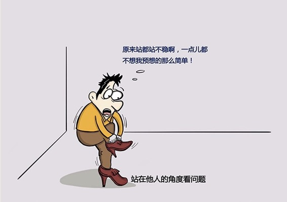

# 171丨同理心，千般能力的共同心法

> 这一周，我要来与你聊一聊，在商业世界中进行个人修炼，极其重要的一种能力：情感能力，也就是我们常说的“情商”。

我们常听人说，那个人智商很高，但是情商不高。或者说，比智商更重要的，是情商。这些说法正确吗？这些说法听上去有些道理，但其实都不准确。

首先我们要理解，什么是智商？智商通常是指观察力、记忆力、想象力、创造力、分析判断能力、思维能力、应变能力、推理能力等等。我用一句话来总结：

> 智商，就是你理解规律、运用规律的能力。

把智商持之以恒地用在数学领域，你就成了数学家；把智商持之以恒地用在物理领域，你就成了物理学家；把智商持之以恒地用在与人打交道上，你就拥有了所谓的“情商”，成为情感专家。

情商，和智商并不对立。相反，情商，是智商的一个结果。但同时决定这个“结果”的，还有持之以恒地“训练”。也就是说：

> 智商 x 情感训练 = 情商。

只有正确地理解了情商，才能提高情商。之所以存在“情商很低的数学家”，是因为他们更喜欢把智商用在训练数学能力上，而不是训练情感能力上。智商的高低，决定了情商的天花板。但是很多人在情感训练上的努力程度之低，根本还轮不到拼智商。

那怎么样才能训练情商呢？我将与大家分享5个我称之为“元能力”的训练：同理心、自我认知、自我控制、自我激励、人际关系处理。今天，我们从“同理心”开始。

### 概念：同理心

什么叫同理心？还记得我们在137课讲“知彼解己”时说到的“移情聆听”（Empathic Listening）吗？这个“移情（Empathy）”，你能不能从别人的感情出发、站在别人的角度看待问题，就是所谓的“同理心”。

同理心之所以被称为“元能力”，是因为很多能力，都是从这个“元能力”上演化出来的，比如管理能力，比如职业化能力，比如演讲能力，比如销售能力等等。

在第15周“激发善意”篇章，我们讲了5天的如何激励员工。激励员工的元能力，还是“同理心”。你要从他的情感出发、站在他的角度去想，他需要的到底是什么，而不是我可以给的是什么。训练了“同理心”，你不但可以管理下属，你还可以管理你的平级、你的老板，甚至还可以管理外部。

在第30周“职业素养”篇章，我们讲的所有职业化能力，你上车坐什么位置，进电梯会不会大声喧哗，走路的时候会不会靠右，是不是守时，是不是尊重别人的观点，其实都是你有没有从别人的感情出发、站在别人的角度思考问题。

在第36周“演讲能力”的第176课“认知台阶”中，我会讲到，高超的演讲，最重要的不是你在讲，而是在帮助他去听。你要从他的感情出发、站在他的角度，顺着他的“听”的逻辑来“讲”，这样他接受你的观点，就会变得容易很多。

在整个商业篇，我们讲的比如“销售能力”也是一样。人们都不喜欢被卖东西，他们只喜欢买东西。你要从他的感情出发、站在他的角度，思考他遇到了什么样的困境？他出现了什么样的需求？他需要什么样的工具？他为什么要买你的产品？

这一切，都是源自于同一种“元能力”：同理心。

### 运用：训练“同理心”的两个方法

讲了这么多。那我怎样才能训练“同理心”这种元能力，把自己的情商提升到智商所允许的上限呢？

我今天教大家两个简单的训练办法。

#### 第一个办法：指路。

你的某位朋友开车来你家聚会，找不到路了。他没有导航，于是只好给你打电话：我应该怎么开啊？

很多人会说：你开到一个卖包子的小店，然后右转就到了。这是非常缺乏“同理心”的指路方式。如果你从他的感情出发、站在他的角度想，他找到那个包子店，可能和找到你家一样困难。

你应该怎么做呢？你可以问他现在可以看见什么，然后从你的记忆中匹配位置感，然后告诉他往前开400米，过两个小路口，右转就到了。

经常练习指路，会非常有效地训练你的同理心。

### 第二个办法：杀人游戏。

杀人游戏，不是真的杀人，而是一个角色扮演游戏。抽签获得自己的身份：杀手，警察，或者平民后，不公开身份，仅仅通过语言的沟通，猜测谁是杀手。

这个游戏的规则，在网上可以找到详细的版本。我就不再详述了。这是一个非常好的训练从别人的感情出发、站在别人的角度思考，用同理心做判断的游戏。总体表现出超常判断力的，都是同理心很强的人。

### 小结：认识同理心

什么是“情商”？情商 = 智商 x 情感训练。智商也许是天生的，情商是可以后天训练的。情商有五个基础的元能力：同理心、自我认知、自我控制、自我激励、人际关系处理。

那什么是“同理心”？就是从别人的感情出发、站在别人的角度思考，将心比心的能力。

怎么训练？销售、管理、演讲、职业化中都可以训练。除此之外，教大家两个小方法：练习指路，玩杀人游戏。