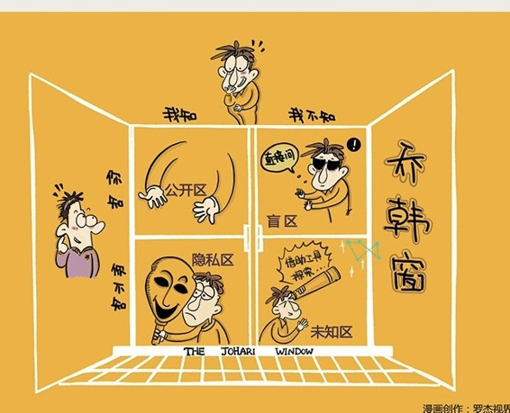
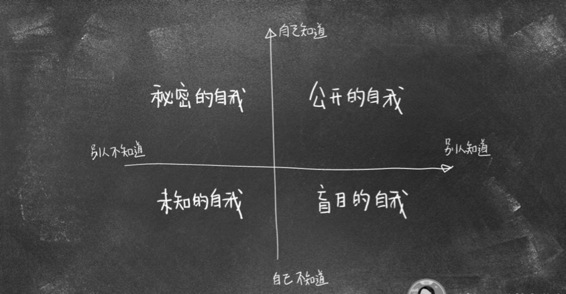

# 172丨不偏不倚的自我认知

> 提高自己的情感能力，必须认识到人与人之间，有一种无关“优劣”的“不同”。而在全世界60多亿人中，你最需要认知到一个人的“不同”，那个人就是你自己。这就是我们说的：自我认知。

### 概念：自我认知

我曾经一直以为自己是个外向的人，到处演讲，给人咨询。但当我参加一个自助酒会时，我发现有些人拿着一杯香槟，优雅地走来走去，碰见谁都能聊两句，谈笑风生，甚至呼朋唤友。而我呢？捧着一杯82年的可乐，静静地站在某个角落，就那么看着，却谁也不想搭理。我觉得这样是不对的，但始终无法改变自己。

直到后来有一次，我参加了一项专业测评，才终于知道：啊？！我居然原来是个内向的人。

> 每个人的能量来源不同。有些人的能量来自安静的思考，有些人的能量来自热闹的社交。而我呢？我从独处中，可以获取源源不断的能量，所有热闹的场合，对我都是巨大的消耗。我在演讲中那些看似外向的行为，其实都是源自于后天的训练，而不是先天的性格。

当我有了这样的自我认知之后，彻底释然了。我学会了如何调节自己。每次演讲结束、与人长谈之后，我都会给自己留一些时间，静静地独处，恢复心理能量。甚至有些时候，我学会了“放过”自己：这样的场合，我就不去了吧，谢谢你的邀请。

> 老子在《道德经》中说：“知人者智，自知者明。”希腊哲学家苏格拉底说要“认识你自己”。不偏不倚的自我认知，是如此重要。

那怎样才能获得这样的认知呢？

### 运用：乔韩窗口理论的四个自我

美国心理学家乔（Joseph）和韩瑞（Harrington）对于“自我认知”进行了多年的研究，提出了著名的：乔韩窗口理论。

乔韩窗口理论认为，每个人的自我，根据我自己知不知道，别人知不知道，可以分为四个部分：盲目的自我，秘密的自我，公开的自我，和未知的自我。

第一，盲目的自我。

别人知道，你却不知道的自己。

啊？不可能吧？谁能比我自己了解我自己？还真会有。听完今天的课，你可以试一试在朋友圈做个调查：朋友们，请用三个关键字评价我。。

调查，尤其是匿名调查，可以帮助你认知：盲目的自我。

### 第二，秘密的自我。

别人不知道，你却知道的自己。

很多人喜欢选择性埋藏，或者否定这部分的自我。那怎么把它挖出来呢？

在纸上，用10分钟写下20句“我有……不为人知的一面”，想到什么写什么。写完后，藏好，用三天的时间对照观察自己的言行。

三天后，删掉20句中最不像的10句，换10句不重复的。三天后，再换10句。再过三天后，挑出前5。

这就是你“秘密的自我”。

### 第三，公开的自我。

别人知道，你也知道的自己。

比如，我长得比较瘦；他长得比较帅；李雷逻辑思维能力特别棒；韩梅梅口才特别好，等等。

但是，有时你以为秘密的自我，其实是公开的自我。比如，有同学觉得自己“闷骚”。你和你兄弟，或者闺蜜说说看。他（她）可能会哈哈大笑：“闷”这个字，我真没看出来。

### 第四，未知的自我。

别人不知道，你也不知道的自己。

了解这部分的自我，可以借助一些专业测评工具。

有多少人知道自己的智商是多少？不要在网上随便找题，去专门的机构测一下。

我一直以为自己智商挺高的。后来我真去测了一次，非常沮丧。我知道，我只能靠颜值了。然后我又照了照镜子，决定，还是靠勤奋吧。

有多少人知道自己的性格的？不要在网上随便找题，也去专门的机构测一下，比如MBTI。

关于自我认知，还要提醒大家两点：自我认知的刻度性，动态性。

你问100个人，你勤奋吗？估计90个人会说自己穷得只剩勤奋了。勤奋这个东西，是有刻度的。6点起床的，可能比8点起床的勤奋；4点起床的，可能比6点起床的勤奋。你要基于比较，得出自我认知。

你说，我真不擅长演讲。但是随着练习，你就会讲得越来越好。这些自我认知，是动态变化的。

遇到困难时，很多人说：做自己。一帆风顺时，很多人说：做最好的自己。这个做自己，是现实的自我；做最好的自己，是理想的自我。不要高估自己的能力，不要低估自己的潜力。

### 小结：认识自我认知

自我认知是一种极其重要的情感能力，在认知世界、认知他人之前，我们要清晰地、不偏不倚地认知自己的物质自我、社会自我、精神自我。

怎么做呢？可以借用乔韩窗口理论，用调查的方式，了解盲目的自我；用反省的方式，了解秘密的自我；用测评的方式，了解未知的自我。