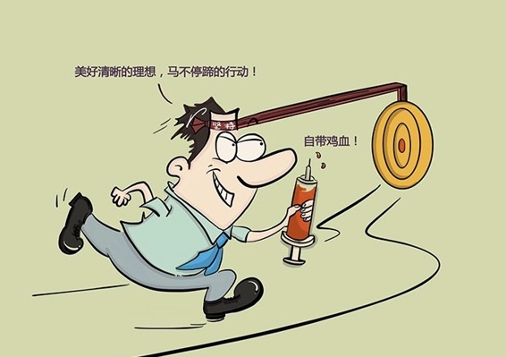

# 174｜真正优秀的人，都自带鸡血

前段时间，据说是董明珠董小姐说的一段话，突然火遍了朋友圈：

> 要让上级哄着你做事的，请回到你妈妈身边去，长大了再来面对这个世界！这个世界的现实太残忍，你想过得更好，意味着你要加倍努力奋斗，而不是抱怨！这个不适合我，那个我不想做，这个我做不来，最终结果是我们输给了自己！

这句话所要求的，其实是一种极其重要的情感能力：自我激励。

## 概念：自我激励

> 什么叫“自我激励”？自我激励是指，个体具有不需要外界的奖励、或者惩罚作为激励手段，能为设定的目标自我努力工作的一种心理特征。翻译成普通话，就是：自带鸡血。

如果你是一名员工，你说“我不行”，你老板可能会说“你行的，你再试一试”。可如果你是老板本人呢？你说“我不行”，谁来对你说“你行的，你再试一试”呢？没人会来激励你，你必须掏出针管，自己注射两升鸡血。

在商业世界中，几乎所有成功人士，都拥有一项共同的情商特质：自我激励。

### 运用：自我激励的两个要素

自我激励的第一要素是：理想。

我非常喜欢一句话：激情，是燃烧的理想（Passion is the flash of vision）。你到底有多想要？当你有了一个无比渴望的理想，轻轻地点燃它，就会燃烧出熊熊的激情。

自我激励的第二要素是：坚持。

很多人说，生活已经如此艰苦，何必再去自找苦吃？那是因为你不知道到底什么叫“艰苦”。去走走戈壁，去骑骑青海湖，去爬爬乞力马扎罗，在商业世界中再遇到什么困难，你都能用坚持，来激励自己跨越。

一个人不懈的行动，是用理想拉动，用坚持推动。理想和坚持，是自我激励真正的精髓。

关于情商，我们连续讲了三期：自我认知，自我控制，自我激励。你发现没有？情商，其实不仅仅是“左右逢源、八面玲珑”的处世技巧，

> 情商更重要的是：认识自己，控制自己，激励自己。

### 小结：认识自我激励

自我激励是指，个体具有不需要外界的奖励、或者惩罚作为激励手段，能为设定的目标自我努力工作的一种心理特征。俗称：自带鸡血。

怎么才能自我激励，其实很简单：用理想拉动，用坚持推动。

有时间，和我一起去走走戈壁，爬爬山吧。