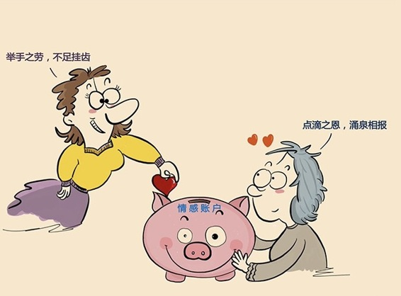

# 175｜你的情感账户余额不足，请充值

> 星期一的早上，你忙得不可开交，突然一个八百年都说不上一句话的朋友，给你发了一条微信。你打开一看：我参加了XXX公司的集齐100个赞换牙刷的活动。请到我的朋友圈，给第一条点赞！你看了气不打一处来。我忙到早上牙都没来得及刷，你让我帮你点赞抢牙刷？我送你一打牙刷，求你别来烦我了好嘛？

你这么大的火气，是因为你不近人情，薄情寡义吗？因为牙刷太便宜，换电饭煲你就点了吗？都不是。你这么大火气，是因为你的这位“打双引号”的“朋友”情商太低，他在你的“情感账户”里已经没有余额，却还想取款。

## 概念：人际关系处理

什么是情感账户？情感账户，是人际关系的一种比喻，这个账户里存的是信任，价值，情感。情商中所谓的“人际关系处理”，本质上就是在情感账户里存款和取款的行为。

### 案例

> 2014年，著名财经作家吴晓波写了一篇文章：《只有廖厂长例外》。25年前，吴晓波还在复旦读书时，发起了一个到中国南部考查的计划。但作为穷学生，他能筹措到的盘缠捉襟见肘。这件事被素昧平生的湖南某企业家廖厂长知道了，廖厂长决定无偿资助吴晓波7000元。7000元在当时，不是一笔小钱。吴晓波前去感谢，发现他其实并不非常富有，就更感激了，问有什么可以回报的。廖厂长说：不需要什么回报。报告出来后，寄给我一份就好。

你可以想象，廖厂长在这个叫吴晓波的穷小子的“情感账户”里，存入了多大的一笔巨款。

廖厂长的故事，让我想起了一位美国老太。这位老太的前人，200年前在瑞士银行存了100美元。200年后，老太去该银行美国分行取款，瑞士总行行长飞到美国，给老太兑现50万美元，并奖励了她100万美元。行长说：“钱存在我们银行，只要地球在，你的钱就在。”

> 廖厂长，和这位美国老太的故事告诉我们，随手存款，最后必将增值。

回到最开始的案例。为一些蝇头小利，打扰别人的工作和休息，这种“求赞”不但不是存款，更是一种无节制的取款行为。这时，如果你在别人的情感账户里余额不足，当然就会招人反感。

> 所以，你必须把每一次人际交往，都看成是在他人情感账户内存款的一个机会。

#### 运用：向情感账户存款的三个建议

#### 第一，养成随手存款的好习惯。

你千万不要听说廖厂长的故事后，冲过去找到吴晓波，说：吴老师，我这里也有7000块 …… 情感账户的维系，是长期的。

你可以学习扎克伯格，试着每天给你的员工写一张感谢卡，让你的员工，知道你对他们的感激；你可以在每次客户的项目交付后，感谢每一个提供过帮助的客户的员工；你可以在犯了错误后，勇敢地承认错误；你可以主动在会议结束时，发一份报告给全体与会人员，省去大家总结时间；你可以在同事沮丧时，陪他在茶水间喝杯咖啡；你可以在新员工惶恐焦虑时，给他一些建议，然后拍拍他的后背，说加油；你可以翻看朋友圈时，增加一些点赞数；你可以在朋友遇到困难时，主动问，是不是有什么我可以帮忙的……

同时，你也不要给了别人帮助后，心里总想着，哈哈，他欠我钱了，他欠我钱了。最好的情感账户关系是：你觉得“举手之劳，不足挂齿”，他觉得“点滴之恩，涌泉相报”；最坏的情感账户关系是：你觉得“我的举手之劳，他应该涌泉相报”，他觉得“他的点滴之恩，我应该不足挂齿”。

#### 第二，警惕无意识的取款行为。

不要群发私信求赞，不要群发私信给孩子拉票，不要群发你的文章求转发，不要私信推销你的产品，不要未经同意把你朋友拉入大群。

你要去北京旅行，别抓个北京的朋友就问：“我要到北京了，帮我定个房吧。”别人又不是你的秘书，住在北京，招你惹你了啊？住北京就要帮你订房啊？人家不忙啊？你先问问自己，你和这个朋友熟不熟。就算熟，你真的打算这么挥霍你的情感账户吗？能百度解决的事情，绝不麻烦人。

#### 第三，允许别人给你帮助。

当然，你也要允许别人往你的情感账户存钱。只帮别人，不允许别人帮自己，一心想着“零存整取”，以后找他帮个大忙，是很难有朋友的。允许别人帮你，有时甚至会加深你们之间的感情。

对于别人的帮忙，你要回报每一个善意。出国回来，给帮过你的朋友带个小礼物；朋友转发你的文章，你留言感谢；给你好的建议，你要发个红包，金额不用太大，一个吉祥数字就好，表示感谢……

#### 小结：认识情感账户

情感账户，是人际关系的一种比喻，这个账户里存的是信任，价值，情感。所谓的人际关系处理，本质上就是在情感账户里的存款、取款行为。你必须把每一次人际交往，都看成是在他人情感账户内存款的一个机会。

怎么提高你在每个朋友那里的情感账户的存款？第一，养成随手存款的好习惯；第二，警惕无意识的取款行为；第三，允许别人给你帮助。