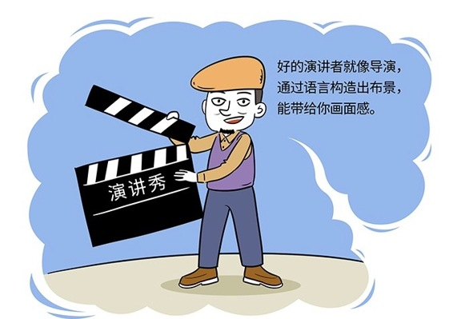

# 177｜用画面感，增加语言的带宽

> 有一辆宾利轿车很贵，售价888万。你在演讲中，希望让大家知道这辆车真的很贵，很贵很贵，你会怎么说？真贵？非常贵？真是太贵太贵了？反正我是买不起？这些表达，都没有办法让大家对于这个“贵”有一个感性的认识。够在上海买一套房子了？相当于40人的年薪？这个表达好一些，已经可以让大家有些感性的认识了。但还是不够。我比较喜欢这个表达：

_**这辆车到底有多贵？一个农民，从商纣王还没有出生的时候就开始工作，不吃不喝一直干到社会主义初级阶段，也许才能买得起一辆这样的轿车。**_

这种表达，会让听众经过小思考、小探索，自己产生“贵”的感觉，而不是你用一个字，告诉他“贵”这个结论。这种豁然开朗的感觉，甚至会让听众产生“哇哦”这样情不自禁的惊呼，来自于你刻意营造的“画面感”。

## 概念：画面感

#### 什么是画面感？

演讲，是通过语言传递信息的能力。但是，语言其实并不是最有效的传递信息的工具。语言传递的信息量，小于声音；声音传递的信息量，小于画面。

> 所以，听众从一场演讲中获得的信息，通常只有7％来自于语言，38％来自于语调与声音，而其余55％则来自于肢体语言，来自于他们眼睛看到的画面。

啊？也就是说，我花最多时间准备的文字讲稿，其实是一场演讲中，最没价值的东西啊？是的。因为人们喜欢看，而不是听你读。

那怎么办呢？试着让听众用眼睛看到你的语言中的布景，让他们用眼睛来听演讲。这就是所谓的画面感。

> “一个农民，从商纣王还没有出生的时候就开始工作，不吃不喝一直干到社会主义初级阶段”，一段5秒钟的短片，就这样在很多人的脑海中浮现，让人印象深刻。

画面感，可以极大地增加语言的带宽，把复杂的情绪，编码在简单的文字中，传递给听众。

### 运用：构造画面感的几个小技巧

那怎样才能构造画面感，然后用画面感，增加语言的带宽呢？我教大家几个小技巧。

#### 第一、具体到细节。

画面感来自于具体的、甚至细节的布景。有道具，尤其是越具体、越细节的道具，越有画面感。

比如你想说“大家现在用微信的时间真长”，充满画面感的说法是“你们有多少人像我一样，早上起床之后，先刷朋友圈 …… （停顿一下）…… 再刷牙？”有床、有牙刷，有一个具体的场景。

再比如你想说“我希望黑人和白人获得平等”，充满画面感的说法是“我梦想有一天，在佐治亚的红山上，昔日奴隶的儿子将能够和昔日奴隶主的儿子坐在一起，共叙兄弟情谊。”佐治亚的红山，是关键的细节道具。

#### 第二、善于用类比。

把一个抽象的东西，用一个具象的东西做类比；把一个不熟悉的东西，用一个熟悉的东西做类比，很容易产生“画面感”。类比的关键，是善用“相当于”这个连词。

> 比如，你想说大家不熟悉的巴以战争，你应该拿一个熟悉的东西做对比。充满画面感的说法是“巴以之争，站在阿拉伯人角度，就‘相当于’日本占领了中国东三省，然后说归还山东半岛换取和平，中国人死也不答应；站在犹太人角度，就‘相当于’明朝旧部反清复明，说你们满族霸占了我们汉族的土地，今天我们该拿回来了。”

> 再比如，你提到大家不熟悉的跨国公司头衔，可以说“Corporate VP，就是集团副总裁，‘相当于’中国的正部级、中央委员。当然，投资公司里的VP概念完全不一样，可能只相当于正处级、副局级”。

#### 第三，点睛用排比。

排比句，可以给画面感增加冲击力。一个演讲中，在关键时刻使用2～3次排比句，可以给大家极其深刻的印象。

> 比如：我梦想有一天，在佐治亚的红山上，昔日奴隶的儿子将能够和昔日奴隶主的儿子坐在一起，共叙兄弟情谊。我梦想有一天，甚至连密西西比州这个正义匿迹、压迫成风、如同沙漠般的地方，也将变成自由和正义的绿洲。我梦想有一天，我的四个孩子将在一个不是以他们的肤色，而是以他们的品格优劣来评判他们的国度里生活。

排比句是大菜，就像红烧肘子，要用，但是也不能多用。否则听众会觉得口味太重。

#### 小结：认识画面感

画面感，就是通过语言构造布景，让听众用眼睛来听演讲的能力。画面感，可以极大地增加语言的带宽，把复杂的情绪，编码在简单的文字中，传递给听众。

> 怎么增强演讲中语言的画面感？几个小技巧：具体到细节，善于用类比，点睛用排比。

* * *

欢迎把文章分享给你看重的朋友，让朋友们也能第一时间感受到你的收获。