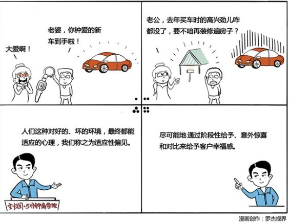

# 017｜为什么我们会喜新厌旧？

### 概念：适应性偏见

适应性偏见，就是人们对好的、坏的环境，最终都能适应的强大的行为心理。

一个人对任何一件事，有了之后就会习惯。好东西久了，也会习惯，坏东西久了，也会习惯。正如西汉的刘向所说：入兰芷之室，久而不闻其香，入鲍鱼之肆，久而不闻其臭。听上去很高大上啊，其实这就是我们常说的“习以为常”。

### 案例

> 你有一个员工，最近几个月表现非常出色，给公司创造了不小的利润。而且他的工作方法，也非常值得向其他员工推荐。你要奖励这个员工，是给他涨工资呢？还是给他发奖金呢？

> 如果你选择给他涨工资，几个月之后他就会适应涨工资所带来的新的消费方式。到时候，涨工资的激励作用，就会完全消失。

> 正确的做法，应该是为突出的业绩发奖金。工资是用来支付给责任的，责任越大，工资越高。涨工资，是因为承担了更大的责任。发奖金，才应该用来奖励突出的业绩。

### 运用：一个心法、三个方法

一个心法：打破别人和自己的适应性。

三个方法：

1、延长幸福感。拿到年终奖之后，不要选择一次性把购物车里的东西都买了，而是一件一件的买，买完一件，充分享受，直到适应之后，再买第二件，这样会更有幸福感的。

2、意外幸福感。年底要给员工发红包，如果把红包直接加到工资里面，员工会因为已经有每月都发工资的“适应性”，而对红包一点感觉都没有。所以，更好的做法应该是，拿一个真正的红包送过去，并说上一些祝福和肯定的话语，这样员工的感知会更大。

3、对比幸福感。比如360安全软件，一开机，你的开机速度打败了全国92%的电脑。自豪啊。腾讯的会员等级制度、勋章制度，是为了让更忠诚的用户，产生对比的幸福感。这种因为对比而产生的幸福感，动态波动，永远不会被“适应”。

小结：如何运用呢？

1、通过阶段性给予的方式，延长客户的幸福感；

2、不断提供变化的刺激，给客户意外的幸福感；

3、善用相互比较，让用户获得对比带来的幸福感。

听完这一期，也许你终于为“喜新厌旧”，找到理论了