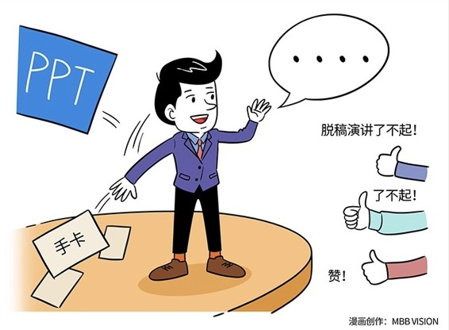

# 179｜现场组织语言能力，是你的厨艺

> 有个老和尚看到小和尚聪明又稳当，就决定让小和尚学习剃头。小和尚学得很快，但是他有个小小的“坏习惯”，每次练习完后，就会习惯性地把剃刀随手插在冬瓜上。结果……

这个世界上，有些看似不足挂齿的“好习惯”，一旦养成，受益终生。也有些看似无伤大雅的“坏习惯”，一旦养成，祸害终生。那么“演讲”中，有没有这样的坏习惯呢？

### 概念：脱稿演讲

> 你有没有听过这样的演讲？演讲者缓缓上台，从西装口袋掏出几页讲稿，然后开始读：尊敬的领导，尊敬的来宾，尊敬的女士们、先生们 …… 他就这么一直低着头念稿，完全不顾台下的听众们，听众们或者百无聊赖地发呆，或者低头玩手机、早已神游万里之外。

“朗诵式演讲”，是演讲中最典型的“坏习惯”之一，因为它不仅让现场听众感觉索然无趣，更重要的是，一旦成为习惯，它会让演讲者失去真正的演讲能力：“现场组织语言”的能力。

朗诵式演讲者，如果被邀请做即时演讲，他可能会说：“没想到今天会让我上来讲，没做什么准备。那就讲两点吧。第一点是：balabala，第二点是：balabala。”讲完这一点后，发现自己还有东西想讲，就说：“这是第一点。下面来说说第二点”。强迫症当时就崩溃了：这不是第三点吗？然后他就不断的第二点，第二点。

> 朗诵和演讲，最大的区别是什么？朗诵，本质上就是把演讲中，“现场组织语言”的工作提前完成了。这就像航空公司提前做好的飞机餐，起飞后给你加热一下拿上来。不管他们怎么吹嘘，都可能甚至比不上你们家门口的小馆子，最便宜的那盘酸辣土豆丝。

### 运用：如何改掉“朗诵式演讲”的坏习惯

#### 第一，用PPT，代替讲稿。

用PPT代替文字讲稿，可以让你专注于演讲逻辑，而不是具体的文字。逻辑和素材，可以提前准备；文字，必须现场组织。这就像菜谱和原材料，可以提前准备；但是菜，必须现炒现吃。“现场组织语言”的能力，就是你的厨艺。

有了逻辑和素材，如果你还是怕自己现场会忘了细节，可以把更多的提示，写在PPT每页的“备注”里，然后用“演讲者视图”双屏显示，这样听众只能看PPT，但你还可以看到备注提示。

#### 第二，用手卡，代替PPT。

任何一场优秀的演讲，都来自于精心的准备：逻辑，素材，和大量的练习。

经过大量的练习，各种案例你用不同的方法讲述几十遍了，各种数字你已经了掌于胸、随口就来了，各种逻辑关系颠来倒去、花式讲述，你也不会错乱了，这时候，你就可以尝试一种更高级的演讲工具了：手卡。

手卡，是主持人常用的一种提词工具。你可以在这些小卡片上，写好你演讲的核心逻辑，关键数据，主要案例，重磅金句，备用附录等等，再按演讲顺序放好，然后就可以上台演讲了。

用PPT演讲，你不能一边讲，一边删掉PPT、增加PPT，或者调整PPT顺序。但手卡可以。手卡是往真正的脱稿演讲，迈进的一大步。

手卡有很多形态。美国总统常用的“电子提词器”，就是一种特殊的手卡。你听过马云的演讲吗？你有没有注意过，马云手上常常拿着一个酒店的信纸夹板？这也是一种特殊的手卡。

#### 第三，用脱稿，代替手卡。

脱稿演讲，是不是就是“背诵”呢？

> 背诵式演讲，是比朗诵式演讲更坏的习惯。朗诵式演讲，你至少不用担心说错，所以还心有余力关心自己的语调。而背诵式演讲，你几乎所有的心力，都在回忆。你把演讲变成了记忆比赛。它可以帮你应付一两场演讲，但会阻止你成为真正优秀的演讲者。

永远，永远不要背稿。当你需要背的时候，恰恰说明你准备的还不充分。脱稿演讲，是在充分练习基础上，把PPT，或者手卡上的核心逻辑，写在心里面。当你手卡越来越少的时候，你离脱稿就越来越近了。

别用朗读和背诵掩盖“现场组织语言”能力的不足，不要怕出丑。所有前期的出丑，都是为了后期的优秀。慢慢练习吧，从读稿，到PPT；从PPT，到手卡；从手卡，到脱稿。

#### 小结：认识脱稿演讲

训练演讲能力，需要改掉一个坏习惯：朗读式演讲，不管是朗读讲稿，还是朗读PPT。朗读的本质，是把“现场组织语言”的工作提前完成了。好吃的饭菜，一定是现做的。最好吃的饭菜，从出锅到上桌，甚至不能超过30秒。

那怎么一步步做到脱稿呢？练习，练习，练习，从读稿到PPT；从PPT到手卡；从手卡到脱稿。脱稿，不是背诵，是胸有成竹的现场创作。