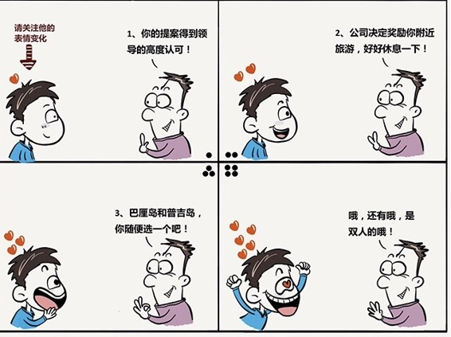

# 181丨我有一个好消息，一个坏消息，你先听哪一个？

> 从今天开始，我们将进入为期一周的“沟通能力”。如果说演讲，是一个人，影响一群人的能力；沟通，就是一个人，影响一个人的能力。演讲需要关注群体心理，沟通更需要关注个体心理。

## 概念：快乐痛苦四原则

“我有一个好消息，还有一个坏消息，你想先听哪一个？”很多人都会说：“嗯 …… 那就先听坏消息吧。”可是，为什么？

还记得我们在第4课讲的“损失厌恶”吗？捡到100元的快乐，无法弥补丢掉100元的痛苦。也就是说，坏消息的杀伤力，天生就比好消息大。

那怎么办呢？试试先说坏消息，再说好消息。

还记得我们在第84课讲的“近因效应”吗？最后的印象最强烈，甚至能冲淡之前的各种印象。把好消息放在后面说，会因为“近因效应”的放大效果，对冲掉一部分前面天生强烈的坏消息。这样你的感觉，就不会那么差了，甚至有可能会开心地离开。

> 简单的一句话：“我有一个好消息，还有一个坏消息，你想先听哪一个”，这背后都有复杂的“个体沟通心理”的因素。今天，我们就来聊聊基于“损失厌恶”和“近因效应”这些“个体沟通心理”，一个有趣的沟通策略：“快乐痛苦四原则”。

## 运用：快乐痛苦四原则的沟通方法

#### 第一，多个好消息要分开发布。

你是一次捡到10元，走两步又捡到20元，走两步又捡到50元开心，还是一次捡到80元开心？多数人是分开捡更开心。

所以，你告诉你的员工一个好消息，你应该这么说：“李雷，告诉你一个天大的好消息。你的提案得到了公司领导高度认可，他们对你赞不绝口……”

李雷：哇，真的啊！然后你说：“……领导说，一定要给予物质奖励，所以，我们决定公司出钱，让你去附近旅行，好好休息一下……”

李雷：啊！居然还有奖励！你接着又说：“…… 巴厘岛，普吉岛你自己选吧。”

李雷：天啊，巴厘岛，普吉岛也叫附近啊？你拍拍李雷的肩膀说：“好好干，继续加油。”然后就走了。

走到一半，你要突然折回来，记住这是关键，到了乔布斯著名的“one more thing”时刻了。你说：“哦，对了，one more thing，是双人的哦。”

李雷这时候，估计已经幸福晕了。

对比一下，如果你说：“公司决定奖励你两张东南亚往返机票、和三晚酒店，感谢你的努力工作”，李雷的反应，会有差别吗？

这就是“多个好消息要分开发布”。

#### 第二，多个坏消息要一起发布。

作为一个房产中介，你应该如何向客户介绍一套房子？你应该说：“这套房子不朝南，结构有些不方正，你看过道都是浪费的，小区绿化不错，但是物业费比较高，还有就是周边社区还不是很成熟……”

啊？我这么说还卖什么房子啊？这些是客户迟早要问到的。既然他最后一定会问到，你就一开始集中把缺点说完，一棒子打死，早死早超生。然后从现在开始，所有的讨论，都会给房子加分。

如你挤牙膏一样，客户问到朝向，你说：哦，朝向是不太好。他心里咯噔一下。客户问到周边，你再说：哦，周边还不大成熟。他心里又咯噔一下。就这样咯噔、咯噔、咯噔，四五次之后，在他心中，这套房子就会简直一无是处。

沟通时，多个坏消息要一起发布，会明显减轻对方的痛感。

#### 第三，一个大的坏消息和一个小的好消息，分别发布。

项目做失败了，怎么和老板沟通？“老板，项目失败了，我愿意代表团队承担责任。但整个团队吸取了深刻地教训，至少知道了哪些是死路，这都是非常宝贵的财富。”

在A项目上赔了1000万，在B项目上赚了100万。不要说：“总的来说，我们赔了900万。”你要分开说：“很遗憾，我们在A项目上赔了1000万，但是我们在B上面赚回了100万！”

这就是一个大的坏消息，和一个小的好消息，要分别发布。记住，还要先说坏的，再说好的。没有好的，使劲找一找，总有好的。

#### 第四，一个大的好消息和一个小的坏消息，一起发布。

反过来说，在A项目上赚了1000万，在B项目上赔了100万。不要说：“很遗憾，我们在A项目上赚了1000万，但是我们在B上面赔了100万！”你要一起说：“总的来说，我们赚了900万。”

这就是一个大的好消息和一个小的坏消息，要一起发布。瑕不掩瑜，别让小的坏消息，破坏了大家的心情。

## 小结：认识快乐痛苦四原则

沟通，又是一门有关心理的学问。今天我们说了基于“损失厌恶”和“近因效应”这些“个体沟通心理”，一个有趣的沟通策略：“快乐痛苦四原则”。

简单来说就是：好消息要分开说，坏消息要一起说，小好大坏分开说，大好小坏一起说。你记住了吗？