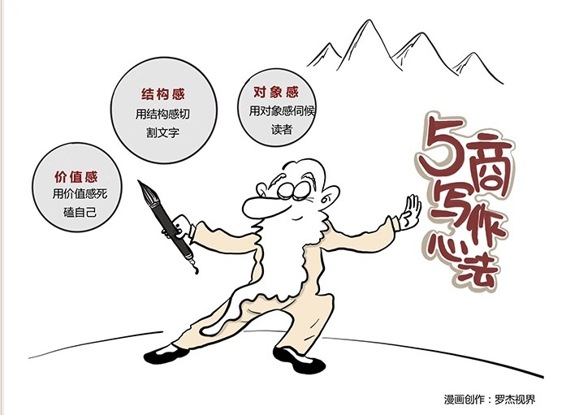

# 182｜如何写出一篇好的专栏文章？

> 今天我想和你聊聊，和演讲几乎同等重要的一种跨层级的、大功率的、穿透人心的“广播式沟通”工具：写作。写作这么重要？是的。演讲，是一种同步的、情感丰富的沟通工具；写作，是一种异步的、无损传播的沟通工具。演讲在现场时影响更深；写作在时空上影响更远。这两种神功，两种大规模杀伤性武器，都是你施展影响力最重要的载体。

哦？那应该怎么练习“写作”呢？写作作为一种武功，门派林立。

写作能力的三大心法：价值感、结构感、和对象感。

## 运用：5商派的三大心法

#### 第一，价值感。

我把专栏文章分为三类：WHAT（是什么），WHY（为什么），HOW（怎么做）。

写WHAT类专栏相对最容易，解释概念：沉没成本“是什么”；写WHY类专栏要难不少，联系动机：我“为什么”要理解沉没成本； 写HOW类专栏相对最难，实际应用：到底“怎么做” ，我才能利用沉没成本，并因此获益。

WHY，比WHAT有价值感；HOW，比WHY有价值感。写作之前，你要想清楚，你打算让你的读者，带着WHAT离开，还是带着WHY离开，还是带着HOW离开。你是不是真的打算付出数倍的努力，死磕自己，提供最难的HOW的价值。

#### 第二，结构感。

一个不克制自己表达欲的人，写不好专栏。为什么？因为写作的内核，是关注对方怎么看，而不是自己怎么写。优秀的文章，是读者的盛宴，而不是表达欲的满足。愿意压制自己“痛快淋漓式的表达”，用“结构感”这把手术刀，把文字切割到让对方 “醍醐灌顶式的理解” ，才是好的写作者。

> 举例

第一步，场景导入。我几乎不会用刘备、奥巴马开场，因为离你太远，我会这么开场：最近工作越来越吃力，想退却，但孩子在读学费高昂的国际学校；你的衣服已经很便宜了，可客户就是说贵不肯买。发生在你最身边的事，最容易有“代入感”，这就是“场景导入”，为了请求你给我30秒，继续读下去。

第二步，打破认知。在这个场景下，应该怎么办？这么办吗？不对；那么办吗？也不对。都不对，都不对。这就是“打破认知”，让读者产生强烈的好奇：哦？那到底怎样才是对的呢？你可能会慷慨地再赐我2分钟：小刘，你说说看。

第三步，核心逻辑。终于要讲核心逻辑了，但是，不能光讲道理，读者不爱听。要用一个极具说服力的大案例，带出逻辑。我会开始讲二战的时候，盟军和德军的故事，最后提炼：这就是“幸存者偏见”。这2分钟，一定要寓教于乐，伺候读者，让你龙颜大悦：太享受了，而且太对了。朕再给你2分钟，你接着说。

第四步，举一反三。不知不觉，我们已经把WHY，和WHAT讲完了，下面就是最难，但是最有用的HOW了。我应该如何避免幸存者偏见呢？一二三；我应该如何利用幸存者偏见呢？一二三。读者，这时候就可以带着巨大的价值离开了 …… 但是，还没完。

第五步，回顾总结。你听了5分钟，太辛苦了，我再用30秒，帮您回顾总结一下要点吧？请恩准。然后，我努力把所有关键点，用一两句话说清楚，重新强化概念，提炼金句，帮助你把概念，存在你大脑中最合适的地方。

做个挂钟是不够的。把挂钟的结构塞进怀表里，才是对读者的尊重。

#### 第三，对象感。

写作相对于演讲，损失了现场感。为了还原现场感、传递情绪，写作者有个重要的心法：对象感。你想象自己不是在对着电脑，而是在与每一个具体的“你”，面对面交谈。

## 怎么做？

你有没有注意过我们的用词？比如：“你有没有遇到过这样的问题”，“我想请问你”，“你和你的下属李雷”。是的，我会克制用“大家”这个词，而是尽量用“你”，营造对象感。

除了用“你”之外，用词还需要适当口语化。比如“好了，今天我们就讲到这里”。这个“好了”，就是口语化表达。会让“你”觉得，我是在和你交谈，而不是对着镜子演讲。

这就是对象感。想象一下演员，对着镜头却想象自己对着观众。一个道理。

### 小结：认识5商派写作心法

今天谈写作，不是为了成为文学巨匠，而是为了准确传递信息，并获得最大的接受度。但即便作为一种商业沟通的工具，写作依然有8万4千个门派，我与你分享的三大心法：价值感、结构感、对象感。 用价值感死磕自己，用结构感切割文字，用对象感伺候读者，才是好的写作者。