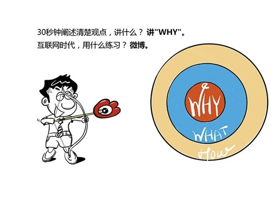

# 183｜大WHY，小WHAT，和一带而过的HOW

> 你去拜访客户，刚进电梯，发现客户公司的总经理站在你旁边。你主动和他打招呼：张总好，我是XX公司的小李，又见面了。他礼貌性地回了一句：你好啊，今天你来做什么啊？

你怎么回答这个问题？你说：张总，我来找销售部的王总。张总：哦。然后，大家沉默了30秒，电梯到了。

你知道吗 …… 你真是个败家子！你可能浪费了这几个月来最重要的30秒。为什么？你一会儿见到销售部王总，和他沟通了2个小时，王总还是会花30秒给张总汇报。而你现在有30秒，可以直接向张总汇报，你却把它浪费掉了。

#### 那你应该怎么做呢？

> 你应该充分利用这30秒有策略地沟通，让张总在你说完后忍不住说：“你刚才说的东西有点意思，我给你十分钟，来我办公室坐坐。”

## 概念：电梯测验

这就是麦肯锡著名的“电梯测验”：在乘电梯的30秒内，清晰准确地向对方讲明白你的观点。

> 电梯测验，是一种极具价值的沟通训练，不仅是因为对方的时间总是有限，更重要的是，它也在测试，你是否真的理解自己在做的事情，能想得非常明白，讲得极其清楚。风险投资机构CTR的罗杰·布瓦斯韦特说：“在进行商业汇报时，尤其就我本人而言，如果不能通过电梯测试，就不应与任何人讨论。”

那你到底应该怎么说呢？回到最开始的案例。也许你可以说：

> “张总，我来向销售部王总汇报我们的一项研究。我们通过数据分析发现，如果按购买者的7个标签分类来重组销售漏斗，6个月之内，销售业绩最多可以提高50%。我们已经把这些标签，更新到我们新版本的CRM系统中了。我把3个用新系统提升销售转化率的经验整理了一下，来向王总汇报。”

你猜你说完这段话，张总有没有更大的可能性会说：“嗯 …… 来我办公室坐坐。”

> 有人认为，30秒的时间太短，所谓“电梯测验”，都是客户、投资人你们这些“甲方”强人所难的说辞。但其实，30秒一点都不短。一条好的电视广告，必须只用15秒，就要让使消费者产生强烈的购买欲望。而30秒，都够放两条广告了。有人之所以觉得30秒短，是因为没有理解，这30秒，我们到底应该沟通什么。

我们到底应该沟通什么呢？其实就是一个字：WHY。

#### 运用：“WHY”这张王牌

> 一个结构化的沟通，我们无外乎就是在讲三件事：WHY，WHAT，和HOW。

我们在第182课讲，专栏写作的秘诀，是努力回答“HOW”（怎么做）的问题；那么，电梯测验的秘诀，就是用30秒努力回答“WHY”（为什么）的问题：

> 给我一个极其充分的理由，让我愿意再多给你10分钟，详细聊聊WHAT和HOW。

再回到最开始的案例：6个月之内销售提高50%，这是一个大大的WHY；购买新版的CRM是一个小小的WHAT；3个提升销售转化率的经验，就是一带而过，但如果你有10分钟，咱们可以再接着聊的HOW。

#### 我再举个例子。

投资人常说：请你用一句话，讲清楚你的商业模式。

很多创业者就怒了，我没日没夜干了两年多，你觉得一句话可以讲清楚吗？

别急。试试打出“WHY”这张王牌。

“摩根大通每年购买十几万小时的文书律师服务，审核贷款合同。我们的人工智能律师进化了3年多，拥有了和律师一样的判断力，并把十几万小时审核时间缩短到几秒。如果能推广到全球的银行，将节省不可估量的费用，我们也必将从中获得巨大收益。”

> 把十几万小时的文书律师服务时间，缩短到几秒，这是一个大大的WHY；我们的人工智能律师，是一个小小的WHAT；进化了3年，就是一带而过，如果你有10分钟，我们可以接着聊的HOW。

那我应该怎么练习这种高超的沟通能力呢？其实，互联网给了我们一个比坐电梯更好的练习“电梯测验”的手段：发微博。

普通人语速大约每分钟160～180个字，主持人大约250～300个字。而一条微博140个字，如果读出来，差不多正好30秒。试着经常发微博，用140个字讲清楚“大WHY，小WHAT，和一带而过的HOW”吧。

## 小结：认识电梯测验

电梯测验，就是在乘电梯的30秒内，清晰准确地向对方讲明白你的观点。它是一种极具价值的沟通训练，不仅因为对方的时间总是有限，它也在测试你是否真的理解自己在做的事。

那如何通过电梯测验，用30秒表述你的观点呢？用一个大大的WHY，加一个小小的WHAT，和一个一带而过的HOW，让对方说出：“你刚才说的东西有点意思，我给你十分钟，来我办公室坐坐。”互联网时代，训练电梯测验最好的方法，不是坐电梯，而是发微博。