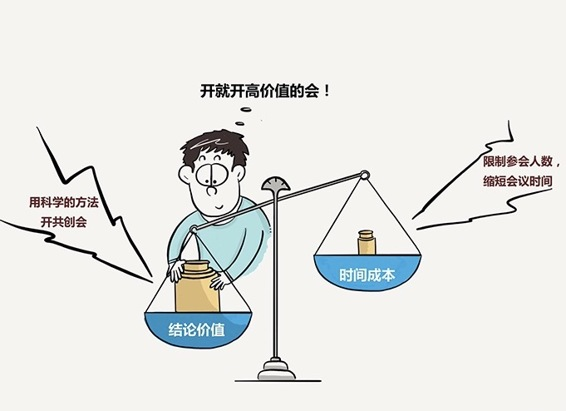

# 184｜开会，是一个用时间换结论的商业模式

> 到底什么叫“开会”？开员工大会，叫开会吗？一群人头脑风暴叫开会吗？向领导汇报工作，叫开会吗？销售团队每天早上的晨会，叫开会吗？大领导组织的部门协调会，叫开会吗？你和员工定期的1:1沟通，叫开会吗？

在所有的沟通工具中，演讲和写作，简直是自带光环，可“开会”的名声却非常不好。为什么会这样？网上有非常多的“如何开会”指南，但为什么你“听了很多关于开会的道理，却依然开不好一个会”呢？

> 每当遇到方法论层面的困惑，我们的习惯，就是带你回到这件事的底层逻辑，寻求“第一性原理”，理解到底什么叫开会（WHAT），为什么要开会（WHY），然后，再去思考怎么才能开好会（HOW）。

## 概念：如何开会

到底什么叫开会？开会，本质上是一个商业模式，和一切商业活动一样，是一个有投入、有产出的经济学游戏。开会的投入，是所有与会者的时间成本；开会的产出，是一组结论，比如说所有人的共识，或者与会者的共创。 开会，是一个用时间，换结论的商业模式。

那为什么要开会？为了赚钱！用有效的会议，创造出比时间成本，更大的结论价值。会议价值 = 结论价值 – 时间成本。

理解了这个“WHAT”，到底什么是开会，和“WHY”为什么要开会之后，那这个“HOW”，怎么开会，就变得自然而然了：增加结论价值，减小时间成本。下面，我来详细的与你分享。

### 运用：高价值会议的两个方式

#### 第一， 增加结论价值。

#### 开会的第一个结论价值，是共识。

领导想统一所有人的思想，这叫员工大会；几个部门在一起各自报告进展，这叫通气会；每天早上沟通当天价格政策，这叫晨会。这些会议都是为了达成共识。

> 增加“共识会”结论价值的方法是：能不开就不开。开会是一个成本极高的同步沟通方式。试试看，能不能用异步沟通方式，比如邮件、短信、微信等方式，达成共识？如果可以，用异步沟通，取代开会。

#### 开会的第二个结论价值，是共创。

一起研究客户方案应该怎么做，这叫研讨会；公司高管闭门几天讨论明年规划，这叫战略会；技术部、市场部激烈碰撞，发散思考下个产品应该长啥样，这叫头脑风暴会。这些会议都是为了促成共创。

增加“共创会”结论价值的办法是：用专业的方法开会，比如六顶思考帽，比如KT法，比如罗伯特议事规则，而不是大家往那里一坐，开聊吧。我已经介绍过六顶思考帽，以后会在第四季度工具篇，再讲讲KT法和罗伯特议事规则。

> 此外，不管是共识会，还是共创会，有一个共同的原则：跟进。

会议之前，要充分准备达成结论的资料；会议之中，以达成结论为导向专注议题、分配时间；会议之后，发出3W会议纪要：WHO do WHAT by WHEN，谁在什么时间之前完成什么事。

## 第二， 减小时间成本。

> 会议时间成本 = 每人时间成本 x 参会人数 x 会议时间。

假如，你公司员工的时间成本大约是100元每小时。你找20人开了一个2小时的会，那这个会议的时间成本就是：100元 x 20人 x 2小时 = 4000元。

如果，你卖一只手机的利润是40元，那你要多卖100只手机，才能赚到足够的钱，开得起这次会。

很可怕。但更可怕的是，公司每花1分钱，都需要财务部签字；但随便谁召集一个小会，4000元就花出去了，都没人心疼。美国人每天要开1100万次会议，每年会议的时间成本，高达370亿美元，都不需要财务部门签字。

#### 那怎么减小时间成本呢？

限制参会人数。Facebook有一条会议规则：开会时只能定一张比萨饼；苹果拒绝无关者参会；谷歌说，会议人数不要超过8个。这其实都是通过限制参会人数的方法，减小时间成本。

缩短会议时间。亚马逊的会议，文档资料先读完，不在会上宣讲；柳传志说，联想会议不准迟到，谁迟到谁罚站1分钟；王健林开会讲话，误差不超过5分钟。这其实都是通过缩短会议时间的方法，减小时间成本。

除此之外，还有一些办法，比如给会议室定价，只允许站着开会，开远程会议，在微信群里开会等等，都是减小时间成本的好办法。

## 小结：认识如何开会

开会重要吗？开会虽然名声不好，但在“脑电波沟通术”发明前，依然是一种必不可少的沟通工具。开会，本质上是一个用时间换结论的商业模式。你之所以不喜欢开会，是因为在这个商业模式中，你常常亏得血本无归。

> 那应该怎么做呢？ 第一，增加结论价值：尽量少开共识会，用科学的方法开共创会；第二，减小时间成本：限制参会人数，缩短会议时间。