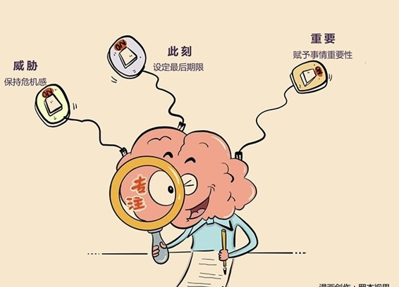

# 191｜藏在“威胁、此刻、重要”后的大猩猩

> 美国心理学家丹尼尔·西蒙斯（Daniel Simons）做过一个著名的实验。在一段30秒的视频里，6个人在不断地走动、换位，同时传2只篮球，受试者被要求观察，视频里的人一共传了多少次球。

（备注：对视频感兴趣的话，你可以点击美国心理学家丹尼尔·西蒙斯的网站链接：http://www.dansimons.com/videos.html，也可以在优酷上搜索“选择性注意”，寻找相关视频。）

正确答案是15次。受试者中有人答对了，有人答错了。但这不是重点，重点是：这段视频中，你注意到什么奇怪的东西吗？再看一遍：一只大猩猩从屏幕右边，大摇大摆走到屏幕中间，对着镜头猛锤自己胸部，再大摇大摆走出屏幕左边。

重看视频时，很多受试者都大吃一惊。实验结果显示，50%的受试者完全没注意到，这只在自己眼皮底下大摇大摆的庞然大物。太可怕了！为什么会这样？丹尼尔把这个现象，叫做“选择性注意”，也就是我们常说的“专注”。

## 概念：领导力：专

专注，是一种通过放弃关注大部分的事，只“选择性注意”少部分的事，从而提高其成功率的能力，它被很多人认为是领导力的重要组成部分。

> 在个人篇的最后一周，我想与你聊聊领导力，那就从“专注”开始吧。

这个世界上，信息的总量无限，而感官的带宽有限，大脑的容量有限，所以一般人不可能“感知”和“存储”你在“整个时间”轴上接触到的“全部空间”。你的感官必须有选择地感知，大脑也必须有选择地存储。

那到底是谁在负责选择，选择的标准又是什么呢？

> 脑科学家和心理学家研究发现，负责这种选择的是大脑中的一套信息筛选机制：网状激活系统（reticular activating system），这套系统会选择性注意三类事情：威胁，此刻，重要。

威胁，就是有人在你眼前挥手，你会本能地眨眼睛；此刻，就是苹果掉下来，你会瞬间就看过去；重要，就是一看到美女，你会立刻变为绅士。

“威胁，此刻，重要”，当这三类事出现时，你的注意力就会快速集合，变得非常专注，甚至对其他事视而不见。

回到最开始的案例。当你告诉自己“数清楚传球次数”很“重要”时，就相当于把“数球”这件事，加入了“专注白名单”，你大脑中的“网状激活系统”会把注意力优先用于感知、存储有助于数球的信息，并因为感知带宽限制、存储容量限制，让你甚至不得不忽视掉一只大猩猩。这套学名“网状激活系统”，别称“选择性注意”，俗称“专注”的机制，在过去几百万年中，帮助着人类，把有限的注意力分配在正确的事情上。

## 运用：专注白名单的三个选项

那我到底应该怎么做，才能更加专注于正确的事，提升自己的领导力呢？很简单，把这件事放入这张叫做“威胁，此刻，重要”的“专注白名单”中。

#### 第一，威胁。

在过去，人类面临各种生存威胁。一只狮子走过来，你会撒腿就跑；就算没看到狮子，你看到别人突然在跑，你也会撒腿就跑，然后一边跑一边问：哎，你跑什么呀？

这就是“威胁”的力量。比尔·盖茨说“我们离破产永远只有18个月”，聪明的企业家不会消灭最后一个竞争对手，都是希望借助威胁的力量，让自己或者组织，专注于一路狂奔。没有伞的孩子，才会努力奔跑。

#### 第二，此刻。

你是不是常常有一种，明天就要考试，今天学习效率最高的感觉呢？项目最后期限的前一周，你是不是完成了比前几个月都多的工作呢？这就对了。人们总是对迫在眉睫的事情，充满焦虑，并投入最多的注意力。

这就是“此刻”的力量。我们怎么利用这种焦虑，从而变得专注呢？使用“最后期限法”吧。给你认为正确的事情，设定一个“做不到就去死”的最后期限，把它变成“此刻”的事情，激发专注。最后期限，是第一生产力。

#### 第三，重要。

再回到最开始的案例。为什么你居然没看见那只大猩猩？是因为“数清楚传球次数”这件事，在当时的你心中，已经重要到了可以忽视一切。这并不奇怪，当一个人、一件事在你心中无比重要时，你是不是也常常忘乎所以？

这就是“重要”的力量。怎么做呢？赋予事情重大的意义吧。这件事如果做成了，我就向她求婚！

## 小结：认识领导力：专

人的大脑中有一套“网状激活系统”，会选择性注意“威胁、此刻、重要”这张“专注白名单”中的事。

善用这个机制，可以帮助我们专注于正确的事。第一，利用威胁，因为没有伞的孩子，才会努力奔跑；第二，利用此刻，让最后期限，成为第一生产力；第三，利用重要，赋予事情重大的意义。