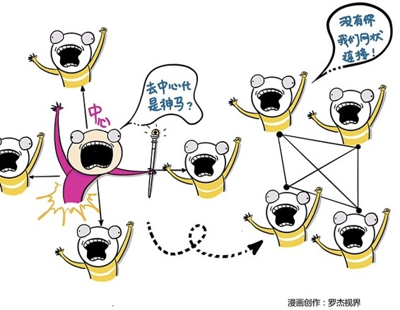

# 251｜去中心化：商业的世界，必须要有一个中心吗？

踏着250个“前人的思考”，你已经走上很多“我们的阶梯”，站在无数智者的肩膀上，重新审视商业世界。从这周开始，我们终于要登高而望，把眼光从“前人”移开，去感知正在生成的“未来”。

> 今天，我就从一个最近火得不行的商业概念开始：去中心化。

### 概念：去中心化

什么叫“去中心化”？我举个例子。

今天因为食物、水、空气的质量，癌症发病率提高了。怎么办呢？你可以去买大病保险，获得金融保障。可除了买保险，还有什么别的获得保障的办法吗？

假如我们建立一个互助社，有3万会员，你只要做出承诺“万一这3万会员中有人不幸得了癌症，我就给他捐10元钱”，你就是会员了。从你做出承诺的那天起，经过一年“观察期”，你就可以拥有“被捐助”的资格。为什么要一年“观察期”？这是为了避免有些投机者，只想接受捐助，不想捐助别人，等得了癌症，再承诺帮助别人。

一年后，所有人都过了观察期。这时候，一个人很不幸得了癌症。我请每个人直接给他捐10元钱。你们直接把钱捐给这个不幸的人。

这时候我问你，你会不会捐这10元钱？我相信大部分人都是会捐的。一是因为你有爱心，二是因为如果你不捐，我就会拿掉你“被捐助”的资格。你说我不是不捐，我是忘了，我想再加入。可以，请再等一年“观察期”。

所以我相信，大部分会员，都是会捐这10元钱的。3万人，每人10元，就是30万。这位同学拿着30万去治病了，再次进入等待下一个被捐助者的状态。

> 你想想，从金融的角度看，这是什么？这就是保险。保险的本质，就是把小概率事件的高风险，在一群人身上平摊掉。在过去，这件事情因为组织效率的原因，特别困难。于是就出现了一个“中心化”的组织：保险公司。咱们谁也不平摊了，你们都交钱给我，遇到问题，我赔给你。

但是，这么大的保险公司要保持运转，必然要吃掉一部分保费，只能把剩下的部分，赔付给不幸者。那能剩下多少呢？很多保险公司最终能赔给大家的，也就是“赔付率”可能不到用户缴纳保费的50%。

再回来看看“互助社”，30万，一分钱都没有损耗，全都到了需要帮助的人身上。它的赔付率，是100%。“互助社”为什么能做到100%？是因为它充分利用互联网的连接效率，去掉了一切中间环节，实现了“去中心化”。

> 当然，我们并没有真的做“互助社”。我举这个例子，是为了帮大家理解，互联网带来连接，连接带来的“去中心化”趋势。

### 延伸：“区块链”和“比特币”

谈到去中心化，就不能不谈大名鼎鼎的“区块链”和“比特币”了。

很多人听到“区块链”就头疼。很多人认为区块链是金融科技。我去给很多银行、保险、基金、证券公司讲课，不少金融从业者对区块链也是一头雾水。不过大家别怕，今天我不是来讲金融科技，也不是来讲密码学、算法，更不是来讲高等数学的。对大部分人，你只需要理解，区块链对商业世界的本质价值是：去中心化。比特币，就是基于区块链技术上的，“去中心化”的“货币”。

以后别人问你，什么叫区块链，告诉他一句话：区块链，就是一种分布式记账技术。他再问你，什么叫“分布式”记账技术，你可以说：过去，我们有多少钱这件事，是存在银行账户，这个“中心化”的数据库里的。区块链，就是把你有多少钱这件事，通过互联网记录在了无数独立的电脑上，并通过密码学让它变得不可被篡改，从而让“中心”消失了，提高了效率，甚至降低了“中心”想骗你钱的道德风险。

那什么是比特币呢？今天的货币是由各国央行，也就是一个“中心化”机构来发行的。比特币，就是基于区块链技术的货币，是一个没有央行的货币系统，虽然它并不被大多数国家认可为货币。

> 最后，你可以加上一句：不管是区块链，还是比特币，其本质都是：去中心化。说完后，像个未来学家一样，充满憧憬地望向远方，留他一个人在现实中一脸迷茫。

### 小结：认识“去中心化”

什么是“去中心化”？在连接效率不高的时代，中心化的“星状结构”，是组织资源的最有效结构，但到了连接效率突飞猛进的互联网时代，去中心化的“网状结构”，逐渐变得更加高效。

越来越多的商业模式，都建立在去中心化的架构基础，甚至是哲学基础上，比如区块链，比如比特币。