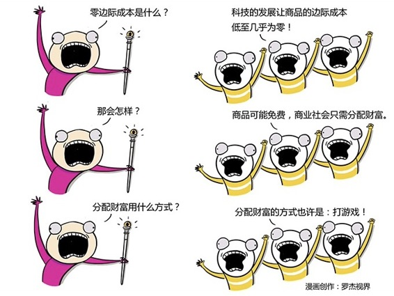

# 252｜零边际成本社会：未来会不会所有商品都免费？

### 概念：零边际成本社会

什么叫“零边际成本社会”？在第13课我们讲过什么叫“边际成本”。边际成本，就是每多生产，或者每多卖一件产品，所带来的总成本的增加。

比如，你是个歌手，你到某个节目里唱了首歌。你唱这首歌的边际成本很高，因为你为此付出了一整天，加上出差、排练，可能要2～3天的时间。因此，你期待获得不菲的报酬。

后来，你把这首歌灌制成唱片，没想到大卖了1万张。一首歌被1万人听到，但你并没有因此唱1万遍，你还是只唱了一遍。多一个人听到这首歌，对你来说，所带来的总成本增加，只是一张塑料唱片的制造成本。听到你同样的歌声，每个听众付的钱大大降低。

再后来，你干脆把这首歌放在互联网上供大家下载，连塑料唱片都不要了，导致边际成本直接降到几乎为零。你的歌瞬间被100万人下载、收听。这时，因为几乎完全没有成本，听众只需付极少的钱。

从现场唱歌，到灌制唱片，到网络下载，听众听你唱歌的“边际成本”越来越低，商品的价格，也因此越来越便宜。

其实，整个工业革命，就是一个降低“边际成本”的革命。机器人技术、流水线管理，都是降低边际成本的努力。设备、机器人不断取代人的体力劳动，导致商品越来越便宜，人类财富爆发式增长。

> 那么，未来呢？打开脑洞想一想，照此发展，会不会越来越多、甚至整个人类生产的所有产品的边际成本，全都降为零，因此我们进入一个“零边际成本社会”呢？所有产品的边际成本为零了，那会不会所有产品都因此免费了呢？所有商品都免费了，那我们一直期待的“各尽所能，各取所需”的物质极大丰富的时代，会不会就华丽地来临，而商品经济，就恶狠狠地消失了呢？

有同学可能会张大了嘴：这脑洞开得 …… 简直比我的嘴还大啊，推荐过一本书《第三次工业革命》，它的作者杰里米·里夫金专门写过一本书，就叫做《零边际成本社会》，描述这个他推测的未来。

有的同学还是不敢相信，说：体力劳动，可以被机器取代，因此边际成本降低，商品越来越便宜；但是脑力劳动，应该无法被取代吧？人类用脑力劳动创造商品的边际成本，就是时间成本，这应该不会便宜到免费吧？

今年7月8日，著名畅销书《人类简史》和《未来简史》的作者尤瓦尔·赫拉利来到中国。我有幸和他同台演讲。他说，体力劳动已经被机器取代，大家觉得还有脑力，于是所有人转型做白领。但现在，人工智能出现了，脑力劳动可能也要被取代了。

举个例子。美国摩根大通银行过去每年购买30万小时的律师服务，帮助他们审核贷款合同，降低风险。但是，最近他们开始使用一家叫做“COIN”公司的人工智能律师服务，以前律师要花30万小时审完的合同，人工智能几秒钟就审完了，而且对风险把握得更准确。也就是说，最典型的靠脑力劳动创造价值的律师，也要被取代了。

当体力劳动和脑力劳动，都被取代，物质极大丰富的零边际成本社会，说不定真的会到来。到时，人类无需工作，你工作也是添乱，效率太低。你只管消费就好。

### 运用：脑洞大开的网络游戏

如果那一天真的正在到来，那我们应该如何应对呢？

我们将被逼再次重新理解商业的本质。人类的劳动有两个作用：创造财富和分配财富。如果以后人类不需要通过劳动创造财富了，那财富该如何分配呢？按需分配吗？圣雄甘地说过：“地球可以满足每个人的需要，但不能满足他们的贪婪之心”。再多的财富，在贪婪、攀比之下，都是不够分的。分配财富，可能是那时商业社会存在的第一目的。

怎么分呢？继续脑洞大开，那时的人类社会，可能会创造出一种计算机模拟的“虚拟劳动”，大家在电脑里创造虚拟财富，通过竞争获得“积分”，然后根据“积分”高低，分配实际财富。你可以给这个“虚拟财富”起个名字：网络游戏。那时候，主宰人类财富分配的，可能是：王者荣耀。

### 小结：认识零边际成本社会

零边际成本社会，就是随着科技的发展，商品的边际成本越来越低，最终几乎为零。

这可能导致所有商品都将免费，商业社会的基本功能，从创造财富和分配财富，变为只需要分配财富。而分配财富的方式也许会是：打游戏。