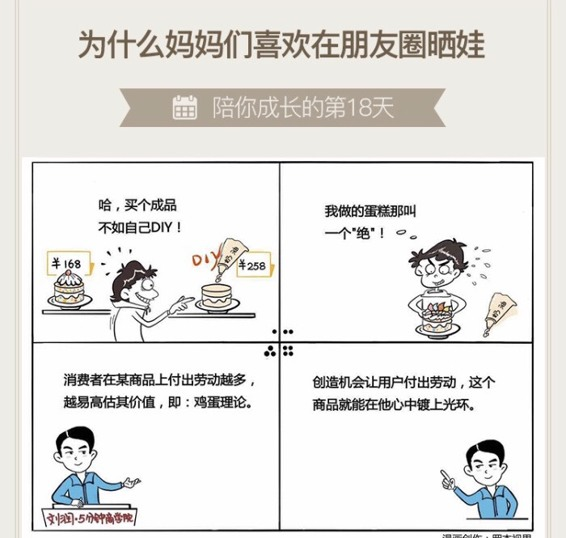

# 018｜为什么妈妈们喜欢在朋友圈晒娃？

概念：鸡蛋理论

鸡蛋理论，是源于消费者的一种行为特征：我们对于一个物品付出的劳动或者情感越多，就越容易高估该物品的价值。

为什么会这样？美国行为经济学家丹·艾瑞里认为，我们对某一事物付出的努力不仅给事物本身带来了变化，也改变了自己对这一事物的评价，付出的劳动越多，产生的依恋越深。

这种现象，同样也出现在宜家的身上。人们热衷于购买宜家的半成品家具，回家自己组装。鸡蛋理论，也被很多人称为：宜家效应。

案例

上世纪50年代，某家食品公司发现，他们的蛋糕粉一直卖不好。研发人员对配方不停改进，用户就是不买帐。这问题难倒了食品公司。

最终，美国心理学家欧内斯特发现，蛋糕粉的滞销，真正原因是，这种预制蛋糕粉的配方配得太齐了，家庭主妇们损失了“亲手做的”那种感觉。

于是欧内斯特提出：把蛋糕粉里的蛋黄去掉？这个想法被称作“鸡蛋理论”。虽然这为烘培增加了难度，但家庭主妇们觉得，这样做出来的蛋糕，才算是我“亲手做的”嘛。蛋糕粉的销量获得了快速增长。

后来，一位叫桑德拉的美国大婶，根据鸡蛋理论，提出了一个“70/30法则”。就是说，如果你使用70%的成品（比如蛋糕粉）和30%的个人添加物（比如鸡蛋），你就能用最少的劳动，把工业化的“食品”变成个性化的“美食”。

运用：两个方法

第一、让用户有参与感。

小米就是一个经典的案例，让早期用户参与它的手机操作系统MIUI的功能和体验设计，获得一批忠实的种子用户，成为扩散的起点。

另一个案例是苹果的iPad。苹果公司提供一项免费的服务：激光镌刻。消费者可以自己构思和创作一段文字，苹果公司快速进行激光镌刻后发货，增加消费者的参与感。

第二、让用户付出劳动。

浙江有一个烘焙零售业的民企老板，开了几百家连锁店。他的门店里面，有着一张巨大的操作台，一排椅子。这个老板说，顾客可在这里动手，自己制作蛋糕，然后再花钱，买走自己做的作品。据说这项DIY业务的毛利颇高，比门店卖成品蛋糕更高。

其实，如果你没有操作间，最简单的方法，就是在蛋糕里放一卷奶油，让他们可以自己在蛋糕上，写上“生日快乐”四个字。

小结：如何运用呢？

鸡蛋理论，或者宜家效应，是指人们的一种行为特征，对投入越多的劳动或者情感的物品，就越容易高估它的价值。

运用这套理论的最简单方法，就是：

第一、让用户参与感，投票，选择，搭配啊等等。

第二、让用户付出劳动，留30%的工作给用户自己做，这个商品就能在他心中镀上光环。