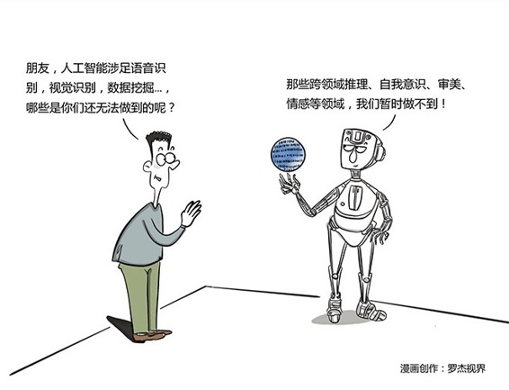

# 253｜人工智能：你的工作，会被人工智能取代吗？

昨天我们顺带谈到了一个最近不能更火的话题：人工智能。一说人工智能，大家第一个问题就是：人工智能到底会不会毁灭人类？在今天的课程中，我们将 …… “不”回答这个问题。我们今天只讨论，这个让人惊喜也让人惊恐的人工智能，到底将如何影响商业世界。

### 概念：人工智能

> 今天我们提起人工智能，大概是指四件事：语音识别，视觉识别，数据挖掘和机器学习。

语音识别，很多人都见识过了，科大讯飞的语音输入法，可以每分钟输入400个汉字，准确率极高，几乎完全可以取代速记员。加上机器翻译，就可以取代同声传译。

视觉识别，今天也越来越普遍了。比如在240课“云服务”，我讲过用人脸识别将照片分类存放。其实，视觉识别远远不止能识别人脸。你输入“海边”，它还能找出所有海边的照片。无人驾驶技术，就严重依赖视觉识别。

数据挖掘，就是从已有数据中提取出模型。大家最常举的例子是，通过数据挖掘，沃尔玛找到了啤酒和尿片销量的正相关性，把这两样商品放在一起，提高了销量。

机器学习，这个就厉害了。人工智能如此火爆，大部分功劳要归它。AlphaGo在2016年下赢李世石，2017年下赢柯洁，就要归功于它每天自我对弈100万盘，神速进步的“机器学习”能力。很多人害怕，这样进化下去，会不会哪天，人工智能的智商会超越人类？网上流传这样一段描述，文艺，而令人毛骨悚然：

人类唯一战胜阿尔法狗的那个寒夜，疲惫的李世石早早睡下。世界在慌乱中恢复矜持，以为不过是一场虚惊。然而在长夜中，阿尔法狗又和自己下了一百万盘棋。是的，一百万盘。第二天太阳升起，阿尔法狗已变成完全不同的存在，可李世石依旧是李世石。从此之后，人类再无机会。

> 李开复老师在他的书《人工智能》中说，有这样担忧的同学，过于乐观地认为科技永远会指数型发展，而忽视了必将遇到的重大瓶颈。与其担忧人类是否会被灭绝，不如担忧我们的工作会不会被取代，以及如何在别人忧心忡忡时，抓住商业机遇。

我非常认同这个观点。那么，哪些工作有可能被取代呢？或者反过来说，我们应该携人工智能，取代哪些人类做起来低效的事，从而创造巨大的商业机会呢？

### 运用：建议创业者关注几个领域

对于创业者，建议大家立刻开始关注几个领域，你会看到处处都是掘金的机遇；而对于保守者，你会看到屠城一般血洗的危机。

第一，金融。

2016年12月，高盛公司发布报告说，保守估计，到2025年，机器学习和人工智能将通过节省成本和带来新的盈利机会，创造大约每年340亿-430亿美元的价值。

金融分析师们还自我安慰说，在人工智能和人类一样聪明之前，金融业不会被攻陷。而美国一家叫Kensho的公司，已经开始利用人工智能，每天早上8:35，给高盛的雇员们，提供自动化的投资分析报告了。

当有些金融机构还要用户到柜台办各种繁琐手续时，蚂蚁金服已经开始利用人脸识别进行远程身份验证了。

当很多银行还在雇佣大量员工，疲于奔命地接听客户电话时，有些先行者，已经开始提供人工智能客服，大幅度降低成本了。

第二，医疗。

IBM开始利用其著名的人工智能系统Watson，辅助癌症研究。Watson一周时间，阅读了2500篇医学论文，并为300多位病人找到了医疗方法。此前的一群医生却束手无策。

人工智能，在X光片识别、准确诊断、个性化医疗、甚至手术上，都有巨大的发展空间。

第三，生活。

这个范围就广了。不久的将来，机器翻译会好到，你不再需要学习外语；人脸识别将能做到，瞬间识别几十万张人脸，大面积抓捕或者寻找走失儿童变得轻而易举；语音智能助手，能做出比你更懂你的决策。

李开复提出了一个“5秒钟原则”，他说：大部分人类需要思考5秒钟以下的事情，都可以由人工智能代劳。也许所有这些事情，都是未来巨大的商业机会。

讲到这里，也许你会担忧，什么都让人工智能干了，那我干什么呢？到底还有哪些是人工智能干不了的，我怕了你，我让我的孩子以后专门学这些，还不行吗？

> 那么，哪些事情，人工智能做不到呢？下面七个领域，人工智能在可预见的将来，很难超越。我们人类队，还可以暂时领先：1)跨领域推理；2)抽象能力；3)知其然，也知其所以然；4)常识；5)自我意识；6)审美；7)情感。

#### 小结：认识人工智能

今天，我们登高远眺，发现人工智能不在远方，早已兵临城下。它有四组大军：语音识别，视觉识别，数据挖掘和机器学习。

这些突飞猛进的技术，在金融，医疗以及生活的方方面面，给我们带来了巨大的不确定性。这些不确定性，是挑战，但也是商业的机遇。