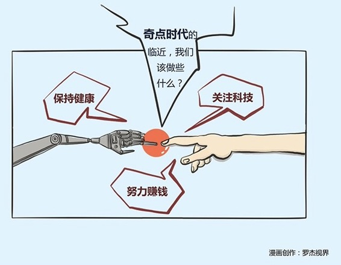

# 254｜奇点临近：据说2045年，“奇点”将要临近？

既然本周，是要帮助你脑洞大开，思考未来，那今天，我就努力帮大家看看，现今科学家们眼中人类最远的未来是什么样。谈“人类最远的未来”，就不得不提一个人：雷·库兹韦尔。这个最远的未来有多远呢？库兹韦尔说：大概就在28年后，也就是2045年。

> 库兹韦尔是谁？他可不是一个神棍。库兹韦尔是Google公司的工程总监，美国国家科技奖章获得者、世界上最重要的发明奖Lemelson-MIT获得者，被《Inc.》杂志称为“爱迪生的法定继承人”，被《福布斯》杂志称为“最终的思考机器”，拥有13项荣誉博士头衔。他的声音，不管多么耸人听闻，我们还是要坐下来仔细听听。

那么，库兹韦尔到底说了什么呢？

### 概念：奇点临近

我们昨天讲了人工智能。业界把人工智能按照先进程度，分为三种：弱人工智能，强人工智能，和超级人工智能。

你猜，下赢李世石和柯洁的AlphaGo，算是哪种？AlphaGo是弱人工智能。虽然你觉得它很强大，但它其实只能在特定领域、既定规则中，表现出强大的智能。你让他预测股市，就不行了。如果AlphaGo都算弱人工智能，那什么是强人工智能呢？强人工智能，不受领域、规则限制，只要是人能干的事情，它都能干。也就是说，强人工智能，才是真正的人工智能。那么超级人工智能呢？就是远远超越人类的智能。

科学家们其实对弱人工智能多强大，毫无争议。大家有争议的地方在于：强人工智能，到底会不会出现。

库兹韦尔，因此提出了著名的“奇点理论”（Singularity）。什么是奇点理论？简单来说，他认为，科技的发展是符合幂律分布的。前期发展缓慢，后面越来越快，直到爆发。

他举了很多例子。100年前，莱特兄弟发明了飞机，而今天人类都已经开始想移民火星了；70年前，人类发明了第一台计算机，占地四室一厅，每秒能计算5000次，而今天一只带在你手腕上的苹果手表，计算速度都比它快十几万倍。你也许明显感觉到，世界的变化越来越快。库兹韦尔说，别担心，变化还会更快。这个越来越快，最终到了一个爆发的极点，在数学上，就叫做“奇点”。他为此专门写了一本书，叫做《奇点临近》。

那么，库兹韦尔说的这个正在临近的“奇点”，到底什么时候会到来呢？他掐指一算，说：2045年。

为什么是2045年？因为库兹韦尔认为，以幂律式的加速度发展，2045年，强人工智能终会出现。人工智能花了几十年时间，终于达到了幼儿智力水平。然后，可怕的事情出现了，在到达这个节点一小时后，电脑立刻推导出了爱因斯坦的相对论；而在这之后一个半小时，这个强人工智能变成了超级人工智能，智能瞬间达到了普通人类的17万倍。这就是改变人类种族的“奇点”。

库兹韦尔把如此大的威胁，放在了离我们如此近的未来，“奇点理论”毫不意外地引起了轩然大波。

反对者认为，库兹韦尔犯了一个巨大的错误，就是认为科技总是可以加速发展，但事实上，技术发展有极限，到了一定程度就会停止。比如著名的摩尔定律：芯片的计算力每18个月翻一番，价格降一半。这个定律左右了科技界很多年，但最近也因为遇到物理极限，开始放缓。

库兹韦尔辩解说，你们这些愚蠢的人类，那是用老技术解决新问题，会有划时代的技术突破旧技术的瓶颈，跨越极限。你看，现在量子计算机不是出现了嘛。

库兹韦尔也有很多支持者。比如这个星球上最聪明的人史蒂芬·霍金，最有钱的人比尔·盖茨，和最酷的人伊隆·马斯克。

总之，今天的世界，最聪明的人们为了人类的未来，打得不可开交。

2045年，到底奇点会不会来临，到底人类会不会把自己的文明，拱手让给人工智能呢？对我们普通人来说，这实在是太远的话题。

### 运用：我们今天应该做些什么？

第一，保持健康。

库兹韦尔今年69岁，每天吃150颗药片，就是要保证自己能活到2045年，见证奇点来临，说不定以数字的方式永生。那我们呢？也要保持健康，活到2045年，看看他们到底谁对谁错。

第二，努力赚钱。

获得尽可能大的商业成功。这样，万一2045年人工智能真的统治了地球，你说不定还买得起伊隆·马斯克的船票，移民火星，逃离这个伤心地。

第三，关注科技。

商业模式为科技而生，过去因为环境变化不大，我们研究的都是相对竞争关系。今天，科技让生活方式发生翻天覆地的改变，商业人士一定要关注科技，才能抓住机遇。

### 小结：认识奇点临近

今天这个脑洞帮你开得有点大，我们谈到人类生存的问题，谈到了“奇点临近”。话题虽远，但当这么多顶级精英都在讨论这个问题时，也许你也应该至少开始了解，甚至关注。