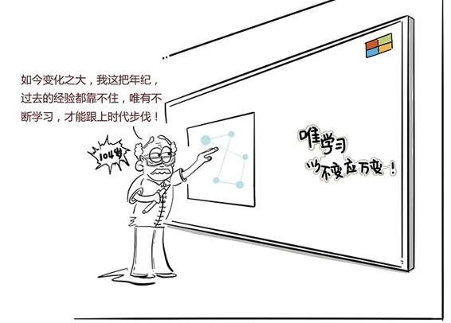

# 255｜基因技术：如果你能活120岁，你打算如何规划人生？

不知道你从昨天的惊魂未定中，回过神来没有。科技，尤其是人工智能，正在极大地改变世界。但是，我们在这场比拼中，就一定必败无疑吗？我们必须烧香祈祷，希望强人工智能带着善意降临吗？

同样是放眼未来，另一批科学家说：先别关注人工智能了，还是关注关注我们自身吧。活得好，活得久最重要，万一，万一人工智能没有来呢？

### 概念：基因技术

华大基因的创始人汪建先生说，未来是生命科学的未来。人类基因科技的“存、读、写”技术已经越来越发达。随着对出生缺陷的预防，肿瘤基因的治愈，人类的寿命将会越来越长。这一代人，活不到120岁，你都对不起你自己。少关注人工，多关注人生。

汪建博士的演讲简直太激励人了。我回去查了一些数据。根据加利福尼亚大学等机构的研究显示，从1840年开始，人类的寿命就在以每年多活三个月的速度递增。也就是，每十年人类就可以多活2～3岁。从2001年到2015年的15年间，人类的寿命增加超过了5岁。据此计算，一个2007年出生的00后，活到至少104岁的概率，会是50%。也就是，你现在随便生一对二胎，就有一个未来是百岁老人。

### 运用：关注以下几个趋势

听上去很让人鼓舞。可是，这对商业世界意味着什么呢？这意味着，也许在不久的将来，你必须从更大的格局，重新规划你的商业布局。你可能要关注以下几个趋势。

第一，人类的生命周期，越来越长。

我们过去的人生，基本分为三个阶段。从6岁到22岁的16年，是第一阶段，用来读书；从22岁到60岁的38年，是第二阶段，用来工作；从60岁到百年，是第三阶段，用来退休。今天中国人的平均寿命是76岁，也就是说平均退休16年。

16年读书，38年工作，16年退休。这就是“人生三段论”。但是，你想过没有，这样的人生三段论，是建立在平均寿命76岁的前提上的。如果以后人类的寿命变为120岁，那你60岁还退什么休啊？要退休60年，你工作38年赚的钱，养得起自己吗？

所以未来，一定不是60岁退休。那会是多少岁呢？北京已经开始试点延迟退休了。据说社科院有专家建议，未来每3年延迟退休1年。我今年40岁，照此计算，我要到30年后，也就是70岁才能退休，那一年是2047年，不知道那一年，人工智能占领地球没有。就算没占领，70岁退休，就意味着我工作48年，退休50年，也未必养得起自己啊。

所以未来，人生很可能不是“三段论”。《百岁人生》的作者琳达，和安德鲁说，未来，你很可能拥有的，是多段人生。读书一段时间，工作一段时间，再读书一段时间，再工作一段时间。

第二，产业的生命周期，越来越短。

第一次工业革命，以蒸汽机的发明为标志。但当蒸汽机被大规模使用，已经是40年后了。这40年，一个人完整的职业生涯从开始，走到结束，其实相当漫长。我们今天看教科书，觉得那是历史巨变，可是当时的人可能毫无感觉。

但是今天，产业变革的速度越来越快。互联网这才20年，移动互联网这才5年，世界就已经天翻地覆。以后的变化，可能还会越来越快。

人类的生命周期，越来越长；产业的生命周期，越来越短。这将带来一个结果，我们这一代人，将成为第一批，在职业生涯中，不得不彻底变换行业的一代人；我们这一代人，将成为第一批，大学学的东西，注定某天将几乎毫无用处，必须重学的一代人。也就说，我们将经历几段完全不同的商业人生。

以后我再去大学演讲，下面可能坐着20岁的孩子，40岁的回炉者，还有60岁、80岁的第三、第四次回炉者。以后再也不会有20岁的同学站起来问我：我学什么专业，以后能找到稳定的工作呢？你看看旁边比你大60岁的同学就会知道，这个世界上，再也没有稳定的工作。唯有不断学习，才是唯一正确的策略。多段式人生，会让害怕改变或者不愿改变的人，无处可逃。

小结：认识基因技术

基因技术的发展，很大概率会让人类的寿命大幅度延长，生命科学家告诉我们，“百岁人生”也许比“人工智能”占领地球更加现实。

但是，人类的生命周期越来越长，产业的生命周期越来越短，这很可能导致我们的人生，从三段式，变为多段式。我们过去的知识和经验，必将几乎毫无价值，唯有不断学习，才是唯一正确的策略。