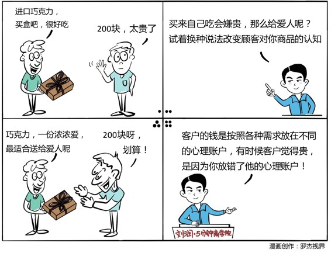

# 001丨让用户从最有钱的那个心理账户花钱

今天是《5分钟商学院》学习的第一周，一切关于商业的问题最终都是人的问题，所以我们学习的第一周打算先从人开始。本周，我们将专注于一个主题：消费心理学。

001丨神奇的心理账户

概念：心理账户

我们会把钱分门别类的存在不同的心理账户里面。比如说，生活必要的开支账户，家庭建设和个人发展账户，情感维系账户，享乐休闲账户等等。虽然这些账户都是在一个大账户之下，但其实各个子账户都是独立存在的。

案例：

听音乐会前，丢失了200块。

当丢失的是价值200块的公交卡时，大多数人会选择继续前往观看；当丢失的是打算用来购买音乐会门票的200块时，大多数人选择不去看了。

运用：场景

巧克力厂家：

宣传时，将几百块钱的巧克力，放到情感维系账户里面，会比放到生活必须开支账号里面，消费者更有可能购买。

装修公司：

如果你能让客户明白，你的装修方案会帮他省下4、5个平方米的面积，他就有可能会非常动心。因为他会觉得，你是帮他在买房的账户里面省了钱，而不是在装修的账户里面多花了钱。

小结：如何影响消费者

心理账户，就是每一个人其实把同样的钱在心里面，分门别类地存在了不同的账户里。

你要改变顾客对你商品的认知，让他从不愿意花钱的心理账户，转移到愿意为此付钱的那个心理账户里面去，这个时候，你就会发现，可能曾经很小气的客户变得非常大方起来。你的客户其实并不真的是小气，而是你的这个商品，并不在他愿意为此付费的那个心理账户里面。

你觉得《5分钟商学院》放在你心中的哪一个账户里面是最有价值的？

这是《5分钟商学院》陪你成长的第1天，期待你的进步。