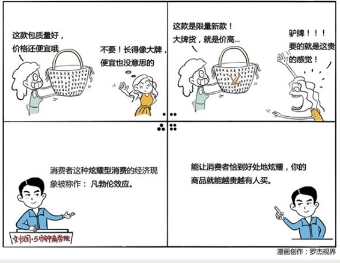

# 020｜不买最好，只买最贵

### 概念：凡勃伦效应

一百多年前，美国经济学家凡勃伦在其著作《有闲阶级论》提出炫耀性消费：消费者购买某些商品的目的，并不仅仅是为了获得直接的物质满足和享受，更大程度上是为了获得心理上的满足。这就出现了一种奇特的经济现象，即一些商品价格定得越高，就越能受到消费者的青睐。这种现象被称为：凡勃伦效应。

### 案例

假如，你是一家中高端服装连锁品牌的老板，经营很久，但衣服销量一直不温不火。为了销量和利润，你打算重新定位产品。你是会选择降价，用低价格带动高销量；还是会逆向涨价，多赚一点是一点呢？

也许你会说，这个价格都卖不好，再涨价，那不是更卖不出去吗？当然是降价了。

在“价量之秤”上，有一个神奇现象，在某些特殊情况下，商品越贵，反而卖得越好。这种现象叫做：凡勃伦效应。

你也许可以做个大胆、当然也有很大风险的尝试，把店铺重新装修，越奢华越好，给产品赋予一个神奇的品牌故事，在价格标签后面直接加两个零。也许，有一定可能性，会有意想不到的热卖效果。

### 运用：如何有效提高市场份额？

第一，贵不是目的，能炫耀才是。贵，但不能炫耀，是不会有人买的。所以，贵的东西，必须能做到让外人一看，就知道这东西贵。比如、LV的包，Burberry的围巾，有了这些经典的标志，别人才知道我买了大牌。

第二，穷人也有“炫耀需求”，这种需求有另外一个名字，叫作：装。装，是一种刚需，一种就算没有钱，也要展示自己优越感的强烈需求。比如，年底朋友圈很多人晒书单，但是，中国42%的成年人，一年其实都看不完一本书。你要怎么办？千万记住：帮助他装，不要揭穿。

第三，如果你是医生，你甚至还可以用这种“不买最好，只买最贵”的“凡勃伦效应”治病。曾有研究者对12名帕金森症患者进行实验，一针1500美元的“贵药”，比一针100美元的“便宜药”，改善情况要高9%-10%。但其实，这两种药都是生理盐水，都是安慰剂。人们喜欢“贵”的心理，居然能帮助治病。

### 小结：凡勃伦效应的本质

什么是凡勃伦效应？这是一种因为“炫耀性消费”心理导致的，东西越贵，越好卖的现象。

运用凡勃伦效应时要注意，贵不是目的，能让消费者恰到好处地炫耀，不露声色地装，是核心。你做到了这一点，商品就能越贵，越有人买。