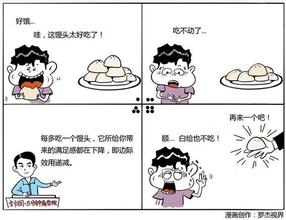

# 022｜为什么麦当劳的可乐免费续杯？

### 概念：边际效用

边际效用是指，你每多消费一件商品，它给你带来的额外的满足感。

200多年前，亚当·斯密提出著名的“为什么钻石比水贵”的“价值悖论”。水对人类的价值巨大，没有水，我们会死，没有钻石呢，又不会死人。亚当·斯密问：那为什么，水的价值比钻石大，但是钻石却比水贵呢？

边际效用理论解释说，那是因为我们用的水很多，最后一单位水带来的“边际效用”是微不足道的。相反，虽然钻石价值不如水大，但因为我们购买的钻石极少，所以，它的“边际效用”就非常大。

我们最终都是在为“边际效用”付费。所以，钻石价格高，水的价格低，是合理的。

### 案例1

> 在美国麦当劳，可乐是可以免费续杯的，无限量、无限次的续杯。为什么呢？因为美国的麦当劳，其实在赌你还没有喝多少，可乐对你的边际效用，就已经降为零了，这时候，给你喝，你都不喝了。

为什么在中国就不免费续杯呢？我猜，大概是因为美国人觉得可乐糖分太高，不健康，喝两杯边际效用就为零了，中国人可能要喝上四五杯吧。

#### 案例2

> 很多人可能都听过“七个馒头”的故事。你饥肠辘辘的时候，吃第一个馒头，会觉得非常非常满足，接着吃第二个，可能会觉得很不错，到第三、第四、第五个的时候，馒头给你带来的额外满足感，就大大下降了。到第七个，馒头已经不能带给你任何满足感了。如果让你吃十个馒头，很可能会吃撑到，也就是满足感为负了。

虽然这十个馒头的生产成本都一样，但给消费者带来的满足感，却完全不同。人对物品的欲望，会随着欲望的不断满足而递减。如果物品数量无限，欲望可以得到完全的满足，欲望强度就会递减到零，甚至为负。最后一个馒头能给你带来的额外满足感，就是边际效用。

### 运用：场景

场景1：电信公司的通信费用

如果你是电信公司，虽然每分钟的通话成本对你可能都是一样的，但你可以试试用“边际效用”的逻辑来定价。比如，对国际长途，通话的第一分钟，收10元钱，因为这一分钟的效用最大。第二分钟，1元钱。第三分钟开始，1毛钱。本来很多人为了省钱，说完最必要的话，就挂了。你现在可以向这“最必要”的话，收很贵的费用，向后面边际效用递减的“废话”，收便宜一点，并因此鼓励大家多聊一会儿，获得更多的收入。

场景2：第二件衣服给你便宜一点

如果你是卖衣服的，一个女孩子买了一件非常漂亮的衣服，1000元。你试试，如果她买第二件，只收800元。千万不要觉得，凭什么啊，分明进货价都一样，为什么要便宜啊。你要想，第二件衣服对这个女孩子的“边际效用”已经大大降低了。她可能已经不会为降低的“边际效用”再付出另外1000元了。第二件衣服的满足感，在她心中可能就只值800元。价格降低，利润降低，但是你做了一单，本来做不了的额外生意。

场景3：电影院的递减票价

如果你是开电影院的。一场电影100元。你试试，第一场，100元，第二场50元，第三场10元，第四场，免费请你看。你会发现，本来大部分人一天只看一场电影的，现在有可能看两三场。而免费的第四场，因为它带给观众的边际效用已经几乎为零，甚至为负，所以就算免费，真正留下来看的人，也会非常少。

### 小结：认识边际效用

边际效用就是指你每多消费一件商品，它给你带来的额外的满足感。这个额外的满足感，是不断下降的。欲望被充分满足后，边际效用为零，商品就会免费。