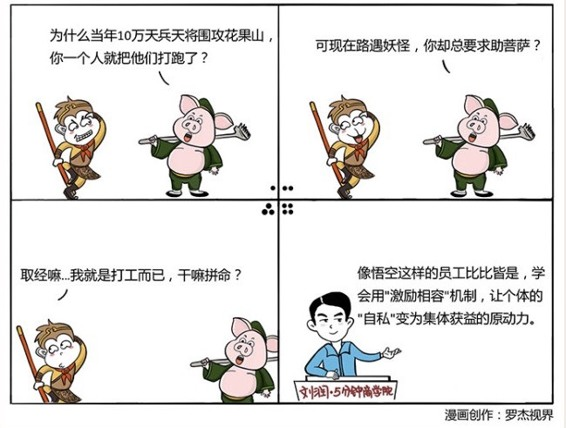

# 024｜自私是共同获益的原动力

#### 概念：代理两难

你拥有店面资产，是所有者，他拥有经营能力，是经营者。这种“委托－代理”的结构，在整个商业世界中，无处不在。比如民企，公司股东大会，委托董事会行使权利，董事会再委托管理层经营公司。再比如国企，全国人民委托人大管理资产，人大再委托政府投资获益，政府再投资国企委托管理层具体经营。

> 这种“委托-代理”机制有个重大的问题，委托人觉得收益主要是投资回报，代理人认为收益主要是劳动成果，都觉得被对方占了便宜，所以委托人不愿与代理人分享利润，代理人不愿意为委托人尽心尽力。这种现象又被称为“代理两难”。

比较著名的代理两难现象，叫做“棘轮效应”。比如，代理人呕心沥血经营，今年业绩特别好，最后的结果是，委托人会根据今年的业绩，调高明年业绩预期。这种业绩指标只涨不降，做得越好越找麻烦的现象，就像机械装置中的棘轮，朝一个方向转动，到位就被锁住，然后继续转动。代理人如果理性的话，他的最优选择是：想尽一切办法，降低委托人对业绩的预期，即便因此会损失市场的机会。

#### 案例

> 你开了一家服装店，苦心经营很久，生意不错，于是你打算开第二家。但是，两家店一个人管不过来，于是，你高薪请了一个很有经验的人，帮你打理原来的店，想自己能专心把第二家店做起来。

> 可是没想到，刚把店交给别人，业绩就迅速下滑，你赶快找他谈话。他和你滔滔不绝说了很多现实的困难，似乎确实很有道理，你也无法反驳。但总觉得哪里不对，明明你做的时候是很好的，他也确实很有经验。你很着急，不知道怎么办才好。

> 这时候，你可以让他买点股份。别送。如果不买，建议立刻考虑别人。让收益和风险共同激励他，而不是你的苦口婆心。

### 运用：如何解决“代理两难”？

我有个朋友，他在广州有家公司，做传统压缩机、泳池热泵等设备。为了企业发展，它成立了一家子公司，探索新业务。和那家服装店老板一样，他也面临“激励相容”的问题：怎么才能让子公司负责人的私利，和公司的公利真正一致呢？

他说，要用和总经理共担风险的方式。对一家初创公司来说，每天都是风险。如果“激励不相容”，总经理就会无视创业风险。那怎么办呢？总经理必须购买股份，成为股东。

公司注册资金1000万，请你从家里掏100万买这新公司10%的股份。那如果一个人很有才，但是没钱，我送给他股份可以吗？千万不能送，借钱都必须要买。因为如果送，总经理没做出任何承担风险的决定。

这一下子，员工就被分为两种，一种觉得，你让我干我就干，你不让我干我就不干，你让我掏钱干，我才不干呢。另一种觉得，我的贡献一直远大于我的收入，我早想分享整个公司的利润了。第二种人，更适合领导这个子公司。

最后，总经理买了10%，核心管理团队也要买15%，加一起25%。这时，母公司出500万，占50%。还有25%怎么办呢？还有25%，请母公司高管，每人至少投5万元，加一起250万。某高管会想，这关我什么事啊？不投可以吗？不投可以，立刻开除。子公司以后一定有机会用到母公司的资源。你不“激励相容”，你可能就不帮他，甚至使坏。必须投。于是，1000万齐了。

我问这个子公司的总经理，你当时为什么会答应？他说，因为我有信心。我原来在母公司年薪70万，掏了100万，成为子公司总经理后，要给自己开年薪了，因为对未来有信心，我给自己开了5万元的年薪。他所有的利益，都“自私”地和公司的长远利益完全一致了。这就是“激励相容”。

我这个朋友用这种办法分裂出7家子公司，每家都盈利。

### 小结：认识“激励相容”

为什么会出现代理两难，是因为“委托-代理”机制设计时，没有做到“激励相容”。

听上去很高大上，激励相容，其实就是指私利与公利的一致。每个人都有自私的一面，如果能有一种制度安排，你越自私，公司就越赚钱，这种制度，就是“激励相容”的制度。

激励相容，就是承认人性的自私，用正确的机制，让“自私”,而不是“集体主义精神”，成为大家共同获益的原动力。