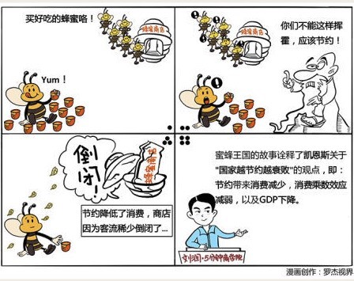

# 026｜居民越节约，国家越贫穷吗？

        今天开始，我们将进入宏观经济学的领域。这个领域，比我们前面讲的所有内容都要更抽象、更复杂，让人费解。在这个领域，有些是知识，有些只是观点，甚至有些只能说是推测和猜想。所以，你会发现宏观经济学的世界里，掐架的特别多，再厉害的大师，都会被骂得狗血淋头。有人把宏观经济学和微观经济学的关系，比作中医和西医，许小年甚至直截了当地说：宏观经济学，就是伪科学。

所以，这一周我们讲的东西，都只是观点，不代表真理，你一定要批判地听。

### 概念：节约悖论

节约悖论就是，对国家来说，越节约越穷，越消费越富。

为什么会出现节约悖论？

宏观经济学中有一个重要的概念：GDP。

GDP，它的中文名是：国内生产总值，是指在一个时间段内，一个国家生产的全部产品和服务的总价值。它被公认为是衡量国家经济状况和财富的最佳指标。

那怎么来计算这个“总价值”呢？所有的价值，最终都体现在买卖里面，通常计算GDP的方法，就是把四个买卖加一起：消费、政府采购、净出口、投资。

理解GDP的四个组成，就会理解为什么凯恩斯鼓励个人消费了。你不花钱，别人怎么赚钱；反过来说，别人不花钱，你怎么赚钱？

而且，消费还有一个：乘数效应。

比如，你花了100元，别人就赚了100元。他拿其中的50元也消费，50元投资扩大经营。50元消费，50元投资，再次变成GDP，又被别人赚走，他们又花掉，又被别人赚走，如此生生不息，GDP越滚越大，经济也会越来越欣欣向荣。

但是，如果你节约呢？砰，什么都没有了。

### 案例

> 著名经济学家凯恩斯，1936年在其著作《就业、利息和货币通论》里提到了一则寓言。有一窝蜜蜂原本十分繁荣兴隆，每只蜜蜂都整天大吃大喝。后来一个哲人教导它们说，不能挥霍浪费，应该节约。蜜蜂们觉得哲人的话很有道理，于是贯彻落实。但结果出乎预料，整个蜂群从此迅速衰败，一蹶不振了。

> 越节约，越衰败。凯恩斯认为，人类社会也是一样。

> 勤俭节约在很多国家都是传统美德。这对个人没问题，但对国家来说，节约意味着消费减少。你要知道，你的消费，就是别人的收入，那就同时意味着，企业收入减少。而企业收入减少，经营困难，企业就要削减产量，解雇工人。工人收入减少，甚至被解雇，就更不敢消费，进一步减少企业收入。然后再减产，再裁员。如此往复。所以，越节约，国家越穷，就会形成“贫困循环”。

### 辩论：正方 VS 反方

正方：凯恩斯认为，越节约，越衰败。

反方：居民不消费，把钱都用于储蓄，但储蓄的钱，也会被银行用贷款的方式，转移到企业手里，用于增加投资。投资也是GDP的一个部分，还顺便解决了就业。

正方：企业拿到再多投资，从事生产，但大家不是节约吗，没人买怎么办呢？

反方：没人买，那是因为你的产品，没有真正满足消费者的需求。你鼓励大家买不符合自己需求的东西，不管怎么刺激消费，扩大内需，都是徒劳无功的。

正方：那你说怎么办呢？

反方：要开发新的、好的新产品，用产能升级，满足消费升级。但是，开发新产品，产能升级，要有大量的投资支持，所以，必须有大量居民储蓄。从这个角度来讲，节约不但不会让国家变穷，反而还会促进经济增长。所以，从长远的观点看，它依然是一种值得提倡的美德。

正方：可是，从长远的观点来看，我们都死了吧。

到底谁是对的呢？这就是宏观经济学神奇的地方，这个问题，到今天为止，经济学家们，还在争吵中。

### 小结：认识几个基本概念

1\. GDP。GDP，就是国内生产总值，一个时间段内，一个国家所生产的所有产品和服务的总价值。它的计算方法通常是：消费，加政府采购，加净出口，加投资。

2\. 乘数效应。你的消费，都是别人的收入。他的收入，又会变成新的消费，或者投资，GDP因此会越滚越大，这就是乘数效应。