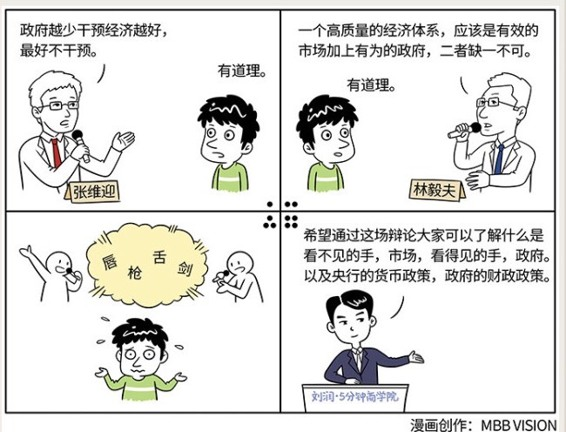

# 027｜张维迎和林毅夫在辩论什么？

### 概念：看不见的手(市场) VS 看得见的手(政府)

> 亚当·斯密认为，政府做好“巡夜警察”，防范暴力、偷盗、欺诈并保护履行合同和提供公共事业，就可以了。至于经济，有一只“看不见的手”，会利用人的自私性，趋利性，最终有效地配置资源。

> 凯恩斯认为，任由市场自我调节的代价是贫富差距悬殊，大量失业发生，社会不再安定。那只“看不见的手”很危险，需要国家调控这只“看得见的手”的控制，才能让经济走势不会脱离正轨，减少患“经济危机”这个癌症的风险。

经由

前段时间，中国经济学界有一场著名的辩论，同是北京大学出身的林毅夫，和张维迎隔空交战，引无数人围观。他们讨论的是宏观经济学，大部分围观的吃瓜群众估计都听不懂，就是觉得，高手过招，我们过瘾。

经济学界，是个很有趣的地方，经常辩论，但却总辨不出个结果。其实，林毅夫和张维迎已经辩论了近10年了，能有结果，早就有结果了。

今天，我就带你来看看，到底林毅夫和他的导师凯恩斯，张维迎和他的导师亚当·斯密，在辩论什么，并从中训练自己看待宏观经济的辩证思维。

其实，林毅夫和张维迎辩论了很多问题，今天，我们只讨论其中一个：政府应不应该干预市场。

### 辩论：政府应不应该干预市场？

正方：张维迎说，政府越少干预经济越好，最好不干预。

正方：经济学的开山鼻祖，亚当·斯密补充说：政府？你做好“巡夜警察”，防范暴力、偷盗、欺诈并保护履行合同和提供公共事业，就可以了。至于经济，别担心，有一只“看不见的手”，会利用人的自私性、趋利性，最终有效地配置资源。

反方：林毅夫说，你太天真了。我从来不反对市场，但一个高质量的经济体系，应该是有效的市场加上有为的政府，二者缺一不可。

反方：凯恩斯补充说，你们这些理想主义者，任由市场自我调节的代价是什么，你们知道吗？贫富差距悬殊，大量失业发生，社会不再安定，你们考虑过吗？那只“看不见的手”很危险，需要国家调控这只“看得见的手”的控制，才能让经济走势不会脱离正轨，减少患“经济危机”这个癌症的风险。

正方：张维迎说，对市场本身没有信心，就会把出现的很多问题归咎于市场本身。用政府这只看得见的手，去控制市场那只看不见的手，用哈耶克的话说，就是“致命的自负”。政府官员的优势并不在于能够更准确地判断未来，而在于能够按照规则，循规蹈矩地做好本职工作。

反方：凯恩斯忍不住发言了：谁说控制不了？我们有两大法宝：货币政策，财政政策。就靠这两招，我帮罗斯福政府带领美国走出了经济危机！你行吗？你行你上啊！

主持人插播：

货币政策，就是央行通过调节利息、存款准备金率等方法，调控货币的供应量。经济萎靡，释放货币，经济过热，收紧货币。

财政政策，就是经济萎靡，政府就自己买买买，并且减税，拉动经济，如果经济过热，就多收税，给经济降温。

反方：林毅夫补充说，其实企业家有时也挺坏的，也会利用各种理由寻租、绑架政府来谋利。2008年的次贷危机，就是华尔街的金融寡头，绑架美国政府的结果。所以，政府要给企业家的创新提供自由的环境，但是，政府也要提防被企业家绑架。

正方：张维迎赶紧站起来，你搞错了吧，次贷危机，就是有些人借钱买房子还不上钱。问题是，没能力买房，当初为什么银行会给他贷款？还不是因为美国政府过于自大，居然立法，要求银行必须贷款给没钱买房的低收入者，违反市场规律。恰恰是政府对金融和房地产市场的干预，造成了次贷危机。

小结：主持人又出来了

我觉得，我必须停在这里了。我现在开始相信，林毅夫和张维迎就算再辩论10年，也不会有结果的。我唯有希望，你，至少可以通过这场辩论，了解到底什么是看不见的手，市场，看得见的手，政府，以及什么是央行的货币政策，什么是政府的财政政策，并且体谅被经济学家包围的国家领导人。