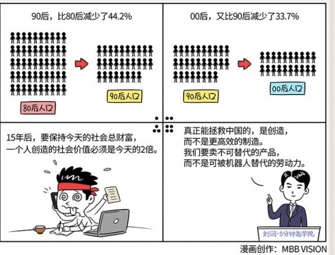

# 028｜4亿人不工作后，你打算怎么办？

### 概念：人口抚养比

> 人口抚养比，指的是一个国家非劳动的人口，占总人口的比率。今天，14亿人中有5亿人无法工作，人口抚养比是5/14，也就是35.7%。当9亿人无法工作时，人口抚养比将变为64.3%，几乎翻了一倍。

### 相关数据1：

原万科北京CEO兼董事长毛大庆，分享过一项有关于人口抚养比的研究数据：90后，比80后减少了44.2%；00后，又比90后减少了33.7%。

如果这组数字确切的话，给大家一个形象的概念，这意味着，如果80后的总人口是100人的话，那么90后就是56人，00后就是37人。

### 相关数据2：

携程的创始人梁建章也分享过一组数据，90后比80后下降了30～40%。另外还有些人的研究结论是：90后比80后少30.68%，00后比90后少19.39%。

看上去好一些，但这同样意味着，80后退休之时，补充进来的20后劳动力总数，很可能不足1/3。

### 未来，会怎么样？

中国最大的生育高峰是1966年到1973年。这段时间，中国出生了一共大约3.1亿的人口。如果60岁退休政策不改变的话，那意味着从2026年-2033年间，中国将会有3亿人，也就是今天中国人口的22%左右，将集体进入退休状态。今年是2016年，还有10年。

劳动人口的供给大大减少，退休人口急剧增加。这两项变化叠加在一起，就意味着大约15年后，中国将从一个9亿人工作，5亿人因为各种原因（未成年，已退休等）而无法工作的国家，变成一个5亿人在工作，而9亿人不能工作的国家。

今天，14亿人中5亿人无法工作，人口抚养比是5/14，也就是35.7%。当9亿人无法工作时，人口抚养比将变为64.3%，几乎翻了一倍。

15年后，当90后和00后成为社会主流时，要保持今天的社会总财富，平均生活水平，他们一个人创造的社会价值，必须是今天的2倍。

### 小结：我们该怎么办？

第一，试着推演一下，如果人力成本翻倍，但是商品价格不变，你的商业模式是否依然成立。如果发现本来赚钱的生意亏损了，或利润严重缩水，那么你可能需要拉响警钟了。你有大约5～10年的时间可以调整。

第二，调整的手段，可以是通过互联网、大数据、人工智能、机器人的方式，提升效率，减少对人工的依赖。科技，必须取代少掉的那4亿劳动人口。

第三，仅仅提高效率是不够的。比如，很多人相信机器人可以拯救中国制造。我个人是存疑的。过去，大家之所以把原材料大老远运到中国来加工，然后再运回去卖掉，是因为制造必须依赖人工，而中国人工又最便宜。但如果以后制造不需要人工了，那美国人、德国人可以用机器人在自己国家制造，为什么还要运到中国呢？真正能拯救中国的，是创造，而不是更高效的制造。我们要卖不可替代的产品，而不是可被机器人替代的劳动力。