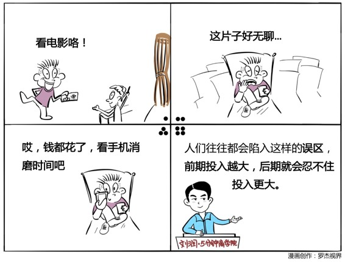

# 002丨不要为打翻的牛奶哭泣

概念：沉没成本

人们在决定是否做一件事情的时候，不仅仅是看这件事情未来对他是不是有好处，同时也会注意自己是不是在过去，已经在这件事情上面有过投入，这是一种非常有趣而顽固的非理性的心理，我们称之为叫做沉没成本，也叫做协和效应。

案例：

英法两国政府联合投资开发大型的超音速客机，叫做协和飞机。最终虽然研发成功，英法两国政府却为此蒙受了巨大的损失。

运用：场景

场景1：买衣服讨价还价

买衣服时，在店里反复挑选，反复试穿，不停地跟店员沟通。店员在你身上花费了大量的精力，为了不让这部分沉没成本损失掉，可能会给你更多的优惠。

场景2：跟客户收定金

很多商业机构，在客户稍微有一点购买欲时，就会想方设法收客户一点点定金，可能1万元的东西只收500块定金。当客户回到家里，购买的冲动消失，为了不损失500元的定金，很有可能就会购买你的商品。

场景3： 举办盛大婚礼

两个人结婚，举办隆重盛大的婚礼，投入了巨大的时间、精力、金钱等。婚后，如果闹别扭想要分手，很可能会觉得再办一次婚礼太麻烦，就不分手了。

小结：认识沉没成本

第一，我们要认清沉没成本其实没有好坏的区别，你可以把它叫做既定成本，或者是已经发生的花费。

第二，因为这种心态的顽固性，有目的性地制造对方的沉没成本，有利于提高交易的成功率。

但是，最后我们还是要反过来说，你如果真的能够克服这种沉没成本所带来的心理偏见，不被这种情绪所左右，将有可能做出更加理性的商业判断。

这是《5分钟商学院》陪你成长的第2天，期待你的进步。