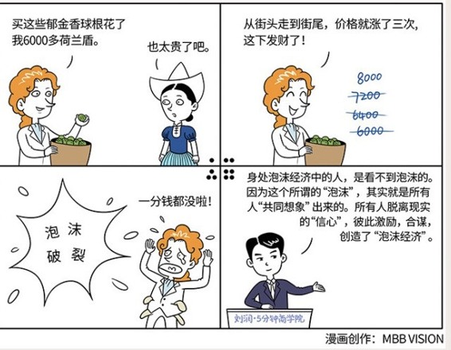

# 029｜用20年的积蓄，买几朵郁金香

概念：泡沫经济

泡沫经济，就是虚拟经济过度增长，最终脱离了实体经济的支撑，形成的虚假繁荣现象，最终，泡沫溃灭，导致社会震荡，甚至经济崩溃。

泡沫经济的三个阶段：

1、泡沫的形成阶段。当虚拟经济微胖的时候，主流经济学家认为这不是坏事。民众对未来发展有正向预期，会刺激实体经济发展，最终追上来填实泡沫。

2、泡沫的膨胀阶段。虽然此时资产价格已经严重超出其价值，但因为“群体想象”已经形成，而不断有人赚到钱，又继续强化这种“群体想象”，泡沫就越来越大。就算有人意识到了风险，也可能经不起诱惑，试图从泡沫中获益，成为推动膨胀的合谋。

3、泡沫的溃灭阶段。最后能接盘的人、资本始终是有限的。交易开始趋缓，价格开始停滞的时候，泡沫最终就会破灭。资产价格回归理性，大量的人破产。中间离场的人，赚的钱，都是来自没来得及抽身的人。

这种基于“群体想象”的泡沫形成机制，非常像一种经典的金融骗局：庞氏骗局。只不过，庞氏骗局背后，是有人用尽心计，构建故事，让大家对无价值的资产产生“群体想象”。而在泡沫经济中，这种“群体想象”是自发的，所以，泡沫经济，又被人称为：自发性庞氏骗局。

### 案例1

> 1985年9月，美、日、英、法、德五国的财政部长，在纽约的广场饭店，签订了著名的“广场协议”，同意美元贬值。同时，日本央行采取了宽松的货币政策刺激经济，导致大量资金流入日本房市，房地产价格暴涨。

> 房价越涨，越有人买，越有人买，就会越涨，到1989年，日本房地产价格已疯狂到了荒唐的地步。

> 当时，国土面积仅仅相当于美国加州的日本，其地价总额，已经相当于整个美国的4倍。仅东京一地的地价就相当于美国全国的总价。一般日本人，花费毕生储蓄，也无法买下一套住宅了。

> 到1991年，砰的一声，泡沫破灭了。房地产价格随即暴跌，日本房地产业全面崩溃，个人纷纷破产，企业纷纷倒闭，遗留下来高达6000亿美元的坏账。这次泡沫，还引发了日本历史上最为漫长的经济衰退，人们常称这次房地产泡沫是“二战后日本的又一次战败”，把20世纪90年代，视为日本“失去的十年”。

### 案例2

> 1637年，一个荷兰商人，用6000多荷兰盾，买了几十个郁金香球根。当时，荷兰人一家全年的开支才300荷兰盾左右。但是，就算让你穿越时空去提醒他，说这太离谱了，郁金香一定会跌的，他也不会相信。因为，他捧着这些郁金香球根，从街头走到街尾的时候，价格就已经涨了三次了。

郁金香泡沫最终破灭，千百万人倾家荡产。

### 原因：为什么大家都会陷入到泡沫经济中？

这么可怕的泡沫经济，就没人看到吗？就没有预警机制吗？谁应该为此负责？

其实，身处泡沫经济中的人，是看不到泡沫的。因为这个所谓的“泡沫”，就是所有人的“共同想象”。所有人的脱离现实的“信心”，彼此激励，合谋，创造了“泡沫经济”。

换句话说，就是你，和你认为最理性的朋友们一起，制造了可怕的“泡沫经济”。

泡沫经济，就是“中国式过马路”，凑够一撮人就可以走了，和红绿灯无关。

### 小结：为什么要讲这个话题？

学习商业逻辑，可以使人理性。但我们也要对人性，心存敬畏。进入商业世界，就算获得再大成功，我们都要时时提醒自己，什么是可持续增长，什么是泡沫经济，要时时问自己：我会不会就是那个，用20年的收入，买郁金香的人。