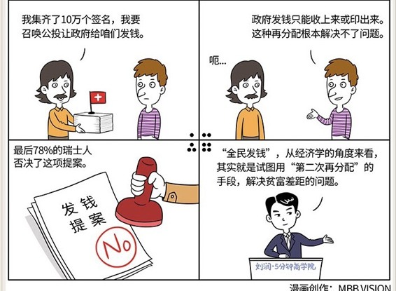

# 030｜你赞成给全中国人民无条件发钱吗？

### 概念：再分配

> 福利经济学中的“再分配”，是指在基础收入上，政府为了社会公平，通过各种方式，实现财富转移的一个的过程。

比如，你每月收入1万元，但你知道嘛，公司为你掏出的钱，其实是14410元，可到你手上，就剩7454元了。这中间差不多一半的钱，通过税收，和社会缴款（比如五险一金）这两种方式，被国家收走了，然后国家再把这些钱，分配给其他人。

凭什么啊？你可能会问。我努力赚的钱，凭什么要转移给别人啊。从社会公平的角度来说，你赚的钱不完全是因为你的努力，一部分是因为你拥有不公平的优势。比如，你出生在城市，他出生在农村；比如，你天生健康，他天生残疾。这些都是不公平。政府通过再分配的方式，来调节这种不公平。

### 调节社会不公平的手段：三次再分配。

> 第一次再分配，在你不知不觉中就完成了。比如最低工资标准，就是调高劳动和资本之间，劳动收入的比例。再比如保护农产品价格，就是调高农村和城市之间，农村收入的比例。

> 第二次再分配，则是通过税收、社会缴费等手段。比如个人所得税，有能力工作的人，交钱养没能力工作的人。比如社会缴费，五险一金等，年富力强的成年人交钱，养日渐黄昏的老年人。

> 第三次再分配，就是民众自发地做公益事业、慈善事业，实现对财富的再一次分配，进一步缩小现在的贫富差距，润滑社会矛盾。

### 公投：到底要不要全民发钱？

瑞士有800万人口。它有个政策，任何提案，只要能在18个月内集齐10万个签名，就能召唤公投。

于是，有人提出了一个提案：为了让瑞士人都能过上“体面的生活”，请政府向每个瑞士公民，每月发放2500瑞士法郎，相当于17000元人民币。

这个提案势如破竹地集齐了10万个签名，于是，要公投了。

为了推动公投，提案的支持者们，真是想尽了招啊。他们在联邦议会大厦广场上，倾倒了800万枚5分钱的硬币，代表800万瑞士人，都有钱拿。他们在火车站向民众发钱，每人10瑞士法郎。他们甚至在日内瓦市中心，拉起巨型宣传海报，创下吉尼斯世界纪录。

从经济学的角度来看，这个提案，其实就是试图用“第二次再分配”的手段，解决贫富差距的问题。

但是，既然是再分配，就要知道：第一，怎么收钱，第二，怎么发钱。怎么发钱，这个方案里讲得很清楚了，但怎么收钱，也就是说钱从哪里来呢？方案里并没有提。

这个钱的来源，简单来说，有两个：收上来，或者印出来。

如果提案获得通过，瑞士政府每年将为此支出2080亿瑞士法郎。其中，1530亿直接来自税收，另外550亿来自社会保险等。而瑞士今年的财政收入预计只有660多亿！政府本身并不创造财富，他们只能再分配财富。也就是说，政府必须把发下去的钱，再收回来。或者说，把发给一部分人的钱，从另外一部分人身上收回来。

这时候，800万人瑞士人就要做一个判断了：财富不会凭空创造，我最终是给出钱的人，还是拿到钱的人？

最后，你知道，78%的瑞士人否决了这项提案。这说明78%的瑞士人觉得，这不是一个发钱计划，这是一个抢钱计划。

那请央行印钱呢？央行印的钱，并不是财富，只是一种财富的记账符号。印的钱多，那每一块钱的购买力就会下降，所有人的财富都会缩水，但是相对来说，富人缩水的更多。所以，印钱的本质，也是从一部分人手上收钱，发给另一部分人。

### 小结：认识再分配

再分配就是政府通过某些手段，把财富从一部分人手中，转移到另一部人的手中，以求缓解社会不公平的问题。

再分配是一个很复杂的事情，做得不好，会带来更大的不公平。“全民发钱”，就是一种试图用简单的手段，解决复杂的再分配的一种想法。