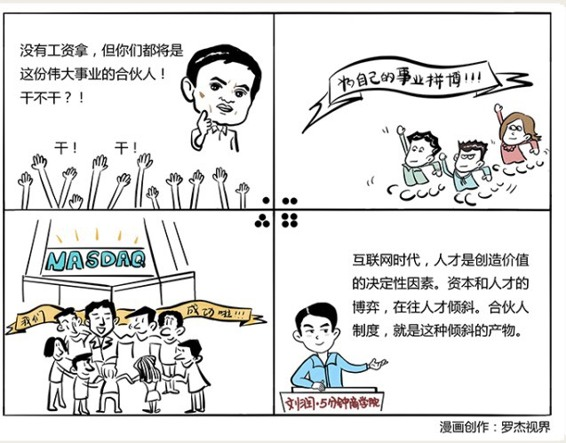

# 032｜资本和人才，哪一个更重要？

### 概念：合伙人制度

> 合伙人制度，就是分享而不是独享公司所有权和收益权的一种组织形式。

公司到底是资本的，还是人才的，一直是管理学界争论的话题。工业化时代，因为要买厂房，买流水线，买原材料等等生产资料，所以资本似乎更重要，甚至人才，也只是资本购买的一种特殊形式的生产资料而已。但是，到了信息时代，尤其是互联网时代，在价值创造中，人才越来越变成决定性因素。资本和人才的博弈，正在不断往人才倾斜。合伙人制度，就是这种倾斜的产物。

### 案例

> 在管理咨询界，有一家无人不知的公司叫麦肯锡。麦肯锡的江湖地位大到了什么程度呢？《科学》杂志戏称：“如果上帝决定要重新创造世界，他会聘请麦肯锡。”

> 但麦肯锡自己作为一家公司，也会面临管理问题。比如，我出钱买下麦肯锡所有股份，让这群优秀的顾问们都替我工作，这靠谱吗？

> 显然不靠谱。咨询公司、会计事务所、律师事务所这些行业里，相对于资本来说，人才创造的价值更大。所以常规公司里“资本雇佣人才”的逻辑，在这里，显然是不成立的。如何让优秀的人才聚合和自治，而不是为资本打工，变成了麦肯锡最重要的管理问题之一。

> 麦肯锡选择了形式上的“公司制”，运营上的“合伙人制”，来解决这个问题。你进了麦肯锡，就进了一个奔向合伙人的“不进则退”的晋升机制。成为合伙人，就是公司股东；成为高级合伙人，就是公司董事。然后高级合伙人再选出公司领导人。领导人3年1届，最多3届。麦肯锡用优秀的人才自治，而不是为资本打工的“合伙人制度”延续了将近100年的成功。

### 延伸：有限合伙人

有限合伙人，是一种特殊的合伙形式。

> 11世纪的欧洲，海上贸易盛行，但有钱人老了无法出海，能出海的年轻人又没钱。怎么办呢？“康孟达契约”出现了。有钱人买船、买货，交给年轻人出海通商。赚钱了，有钱人拿3/4利润。亏钱了呢，有钱人亏完有限的本金为止，所以叫“有限合伙人”。年轻人呢，不出钱，只出力，赚钱了，拿1/4利润，很可观。但如果亏钱了呢，有钱人用本金还。本金还不够呢？那年轻人就必须砸锅卖铁去还钱了。

> 这种出钱的人和出力的人的合伙制度，康孟达契约，成为了今天风险投资业的基本管理模式。

做投资，光有钱是不行的，还要有眼光。所以，有钱的人，做有限合伙人，也就是LP，出资99%，有眼光的人，做管理合伙人，也就是GP，出资1%。如果赚钱了，LP拿80%，GP拿20%。相当于GP用1%的出资，博取了20%的收益，但代价是，如果亏了，LP的钱赔完后，GP承担无限责任，要倾家荡产去还钱。

### 运用：面对想要离去的员工该怎么办

一位朋友要辞职去创业，很诚恳地来咨询我的意见。我有点尴尬。因为我认识这个朋友，也认识他的老板。我知道，我在帮助他和一个人合伙，也就是在帮助他和另一个人散伙。

合伙，是今天非常流行的一个词。其实，散伙也是。虽说聚散离合很正常，但你一定不希望你的团队，尤其是最优秀的那些员工离开。到底有什么办法，可以让大家像拴在一根绳子上的蚂蚱一样，生死与共呢？

### 他老板如果还想挽留他，也许只有：

第一，打心眼里承认，价值主要是他们创造的，而不是资本；

第二，用合伙人制度，出让公司股份，或者项目股份，与他共享收益，当然，也共担风险；

第三，如果他去意已决，那就投资他吧，不能成为他的“普通合伙人”，那就成为“有限合伙人”。

还记得我们讲的“激励相容”吗？不管是普通合伙人制度，还是有限合伙人制度，其实都是在资本和人才之间，找到通往“激励相容”的路径。

### 小结：如何利用“合伙人制度”平衡资本和人才的矛盾呢？

比如，你是一家房地产公司，那可以学学万科的“事业合伙人”制度。它让2500多名骨干员工持有了超过4%的股份，成为第二大股东，并用跟投制度，让员工参与公司项目。在这个“事业合伙人”制度下，只要有人揩了公司一点油，就会有人举报，你在占我便宜啊。

比如，你是一家零售企业，那可以学学永辉超市的“一线员工合伙人”制度。永辉让一线6万多名员工成为店铺、柜组的股东，分享利润。员工为自己干，货品轻拿轻放，损耗下降到最低，服务态度又好，业绩好了许多。