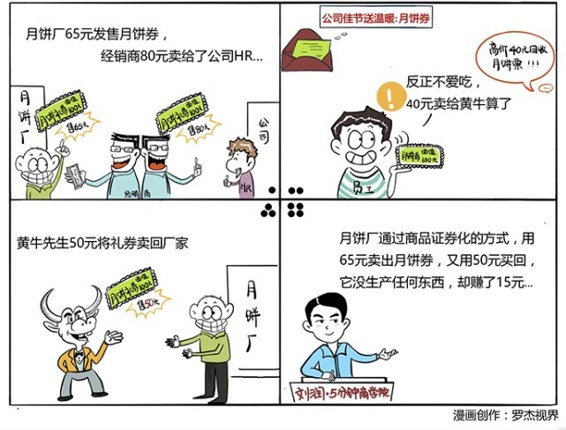

# 033｜可以只买LV两个字，不买包吗？

概念：商品证券化

> 商品证券化，就是把商品通过金融化包装，变成了有明确价格的权益凭证。比如月饼券，就是有价格的，可以兑换成实体月饼的凭证，是实体月饼的证券化。

### 案例

每年中秋节，网上都会流传一个段子。有一个月饼厂，生产了一张面值100元的月饼券，然后用65元把这张月饼券卖给经销商。接着，经销商用80元，把月饼券卖给某家公司的人力资源部。这家公司又把这张月饼券，作为中秋节福利，发给了员工。员工拿着月饼券，高高兴兴地回家了。

然而，故事到这里并没有结束。这个员工其实不喜欢吃月饼，于是，他用40元的价格，把月饼券卖给了黄牛，最善于发掘“规则之缝”的黄牛，转手又用50元的价格，把月饼券卖回给了那家月饼厂。这就出现了一个有趣的循环，月饼厂用65元把月饼券卖出去，然后又用50元把它买回来，它并没生产任何东西，却赚了15元钱。

为什么会出现这种情况呢？这是因为，月饼厂用月饼券的方式，对月饼进行了“商品证券化”，并用这张证券，代替月饼，完成了情感价值的流转和销售。

我们要把公司送给员工的月饼，从逻辑上分成两个部分。实体部分是可以吃的理性价值，也就是月饼本身；虚拟部分其实是只能体会的感性价值，是公司送给员工的一种节日关怀。月饼厂用“商品证券化”的方式，剥离了月饼的理性使用价值，然后让月饼券承载着感性的情感价值，这个节日关怀，流转了一圈，完成了虚拟产品的销售。最后，把完成历史价值的证券，回收销毁。而员工呢？收到价值100元的月饼和关怀后，转手把实体月饼用40元卖给了黄牛，把价值60元的虚拟关怀，收下了。

月饼券，提高了这个关怀的交易效率，并消除了不必要的生产浪费。这就是商品证券化。

### 运用：还能用在哪些行业呢？

### 场景1：礼品行业

> 你去拜访一个朋友，到他家附近想总不能空着手去，于是去超市看看能买点什么，你看中了一大盒的营养品。如果这个营养品的厂家使用商品证券化的逻辑，他就会让这个促销员讲完这个营养品的神奇功效之后，让你带去付款的，是一张精美的提货券。

> 你带着这张提货券去见朋友，朋友很高兴。当你走了之后，这个时候他有两个选择：如果他真的很需要这个保健品，他会去超市提货；如果其实并不真的需要，他就有可能去把提货券再兑换为现金。这个时候，他仅仅收下了你的关怀。

### 场景2：特殊的商品领域

> 比如黄金，黄金今天有一定的使用价值，但是更多的是虚拟价值。对于虚拟价值大于使用价值的黄金，一样可以用商品证券化的方法来提高流通率。于是金融机构发明了纸黄金，其实就是你拥有一定量的黄金的凭证。炒黄金的人，拥有这种证券之后，就无需扛着金子买进卖出了，极大提高了效率。

### 小结：如何运用？

1、哪些商品的类别可以使用商品证券化的方法？

那些虚拟价值大于使用价值的商品都可以，比如月饼，比如粽子，比如某些高档的烟酒，比如保健品营养品，比如黄金等等。

2、那如何实现商品证券化呢？

发行这种商品的提货券，并且设计最终回收的那个闭环。互联网时代，你甚至只要发行提货码，然后提供回收提货码的网址，可能就更高效了。