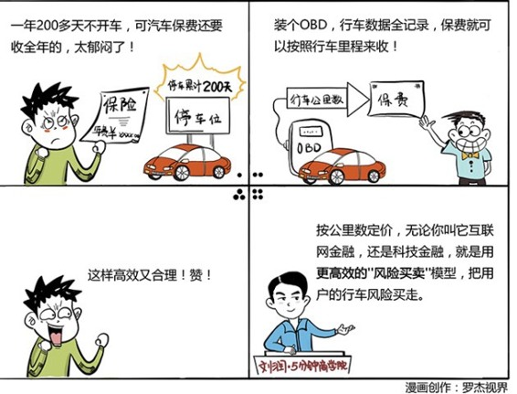

# 035｜金融的本质，是风险买卖

> 概念：互联网金融

互联网金融，就是拥有更高效的“风险买卖”模型的金融。金融的本质从来没有变过，只是自大到认为自己可以藐视本质的人越来越多。

### 案例

> 你在一家传统金融机构工作很久，很想出来创业。可是，做什么好呢？前段时间很流行一个词：互联网金融，这段时间，不火了，开始流行另一个名词：科技金融。但是，这听上都是那么地不靠谱。我到底应该选什么切入点，怎么开始创业呢？

你应该首先找到你的如意金箍棒，那就是：更高效的“风险买卖”模型，并以此为核心竞争力，一路西行。否则，别去创业。

> 运用：更有效的“风险管控机制”

### 场景1：假如微信要做P2P

假如，我是说假如，微信也要做P2P了。它可以怎么做呢？我今天想借1万元钱，愿意给出8%的年化利率，10天归还，按天计息。谁愿意借给我？年化利率8%，至少比放在银行好，但你很担心，万一刘润不还钱怎么办？

微信说，这样，那就拿刘润在微信里，和他沟通最多的20个朋友的沟通权利做抵押，你看行不行？

10天之后，不管什么原因，我没来得及还钱。这时候，既然我之前已经授权了，微信就可以给和我来来回回沟通最多的20个人发条消息：你们这个叫刘润的朋友啊，欠了人家1万元钱，到现在没还，你们不是他好朋友嘛，能不能帮忙提醒他一下？

这20个人，可能是我的家人，我的朋友，我的同事，或者我的商业伙伴，甚至是我的客户。他们也许会觉得，这个叫刘润的家伙，居然连1万元都还不起啊！本来要和我做生意的，都不做了。

什么叫做信用？这就是信用。他们才是我最怕失信的人啊。

那我会不会串通这20个人呢？如果我借的是1个亿，我可能半年前就和这20人说好了，谁都别聊，只和我聊。半年之后，1个亿拿到手，21个人集体消失。但是，我借的是1万元。1万元，我不会这么干。每一个风险，都有它的价格。

### 场景2：按公里数来买的汽车保险

以前的车险，每年到那个时候，就会有人给你打电话，盗抢险多少啊，第三者责任险多少啊，一秒钟就算出保费了。但是，比如我，一年要在天上飞100多次，200天不在上海，那辆车几乎不开的人，和你每天都开30公里上下班的人，交一样的保费，你觉得合理吗？我交的保费，显然贵了。这个“风险买卖”的模型有问题。

现在有一种设备，叫OBD，放在车里，监测你的行车数据。有了这个东西后，以后的保险就可以不按照年来卖了，而是按照公里数来卖。开车多的人，明显就应该多交钱。如果我的车一年都没开，我其实只应该交停车费，一分钱保费都不应该交。这就有意思了，那每公里交多少钱呢？按照你的行车习惯来定价。开车习惯好的人，就应该便宜。开车习惯差的人，到了路口，打着左转向灯，向右转的人，就应该多交钱。

按照公里数来买，按照行车习惯来定价，不管你叫他互联网金融，还是科技金融，你其实都是根据数据，用一套更有效的“风险买卖”模型，把我的行车风险给买走。我因此更省钱，而你因此更赚钱。

### 小结：金融的本质

金融的本质，是“风险买卖”。真正的互联网金融，或者科技金融，或者任何一种“新金融”，都应该基于更高效的“风险买卖”模型。否则，不管它叫什么，都是死路一条。