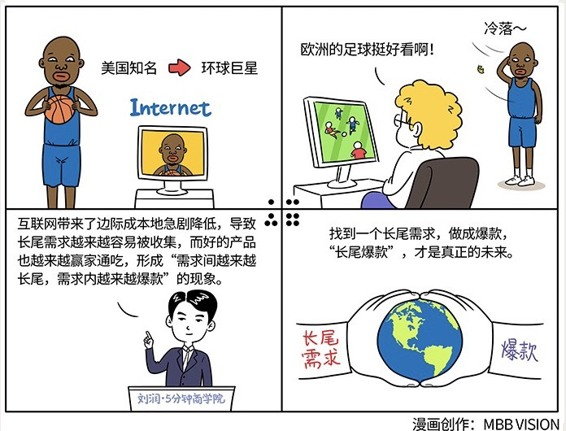

# 038｜长尾爆款，才是真正的未来

### 概念：爆款

> 爆款，就是一种用大比例资金，投注在小部分产品上，以期赢家通吃的策略。

为什么会出现爆款？是因为在互联网时代，产品的生产和销售的边际成本急剧降低，导致最优秀的头部产品，可以在它覆盖的市场里，赢家通吃。

### 案例

> 华纳兄弟总裁霍恩，每年把大比例的预算，都投在小部分他认为的爆款电影上。这种豪赌，当然是有风险的。赌对了，盆满钵满。赌错了，血本无归。

随着华纳兄弟出品了《哈利·波特》、《暗黑骑士》等系列，以及《盗梦空间》等超级大片，2011年，华纳兄弟创下了历史上唯一连续11年超过10亿美元全美票房的纪录。华纳兄弟获得了巨大成功。这种将大比例的资金，投注在小部分产品上的策略，就被称为“爆款策略”。

### 运用：长尾理论？还是爆款？

假如你是一家创业公司的CEO，手上有一项能保护眼睛的LED照明专利，所以一心想做好护眼台灯。这时候，你有两个选择，第一是尽可能覆盖，做各种价位、各种款式的护眼灯，几十款砸向市场，必有一款适合你。另一个，则是只做一款，并倾尽全力，把它打造成“爆款”。

也许你可以考虑的策略是，寻找过去满足大众需求的台灯市场，不能足够覆盖的长尾中，你认为你最擅长的一种，然后一头扎下去，做到最好，成为爆款。

### 延伸：

长尾理论和爆款，是“边际成本”这枚硬币的两面。互联网带来了边际成本地急剧降低，导致长尾需求越来越容易被收集，而好的产品也越来越容易赢家通吃，形成“需求间的越来越长尾，需求内的越来越爆款”的现象。

找到一个长尾需求，做成爆款，我称之为“长尾爆款”，才是真正的未来。

比如，虽然华纳兄弟因为互联网，作为头部资源，赢家通吃了电影市场，但是同样因为互联网，开始出现了网剧这种小人物拍大电影的长尾，出现了“Papi酱”，出现了《万万没想到》，出现了《谷阿莫讲电影》，让很多人根本不用走进电影院，就能享受娱乐。

再比如，过去“5分钟商学院”，太长尾，没人做，做了也没几个人会订，不赚钱，所以大家只能走进家门口的商学院，花巨额成本去学习。但是因为互联网，我们有机会在得到APP上，把长尾需求高效地收集起来，开创了一个本来根本就不存在的品类，并成为这个品类里的爆款。

### 小结：怎么才能利用爆款，做到赢家通吃呢？

第一，要找到足够细小的长尾。比如台灯，孩子用的，还是老人用的？放在书房的，还是放在床头的？插电的，还是电池的？不要希望能做成国民爆品。因为连以做爆款著称的小米公司，在小米手机后，都出了红米系列，Note系列，Max系列，以及C系列，S系列，青春系列等等无数型号，覆盖足够的长尾需求。

第二，满足最长尾的需求里，最大众的痛点。你要真正解决了一个问题，而且是解决得最好的。比如行李箱，我就是在所有能带上飞机的箱子中，最能科学收纳的，一寸空间不浪费，谁都没我能装。

第三，利用互联网，降低边际成本。借助电商平台，社交媒体，口碑宣传等等一切的手段，收集这部分你本来接触不到的长尾用户，把小需求，变成大市场。