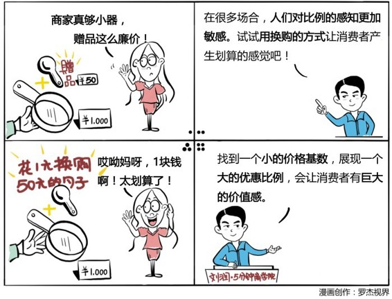

# 003｜贵和便宜，是相对的

消费心理学，贵和便宜是相对的。

了解个概念概念：比例偏见

比例偏见是指，在很多场合，本来应该考虑数值本身的变化，但是人们更加倾向于考虑比例或者倍率的变化，也就是说人们对比例的感知，比对数值本身的感知更加敏感。

案例：

同一款闹钟，A商店卖100元，B商店卖60元，很多人会选择花10分钟的时间，从A商店到B商店去购买闹钟，来节省这40元。同一款名表，C商店卖6600元，D商店卖6550元，同样10分钟的路程，而且可以省50元，但很多人仍然会在C商店购买名表。

运用：场景

场景1：

与1000元的锅、送50元勺子的方式相比，加1元换购50元勺子的方式，更容易打动消费者。

场景2：

200元的4G内存条，顾客单独购买的可能性很小，附加在电脑上，4G内存的电脑4800元，8G内存的电脑5000元，电脑性能提升一倍，只需要多加200元，消费者会觉得特别的划算。

小结：运用方法

第一，促销时，价格低的商品用打折的方式，可以让消费者感到更多的优惠感，而价格高的商品，可以用降价的方式让消费者感到优惠。

第二，用换购的方式，让消费者在心理上把注意力放在价钱变化比例很大的小商品上，这样会产生很划算的感觉。

第三，把廉价的配置品，搭配在一个非常贵的东西上面一起卖，那相对于单独卖这个廉价商品，会更容易让消费者感到价值感。

以上是你进入商学院的第三天，期待你的进步。

* * *

因为你刚好遇见我，留下足迹多美丽。