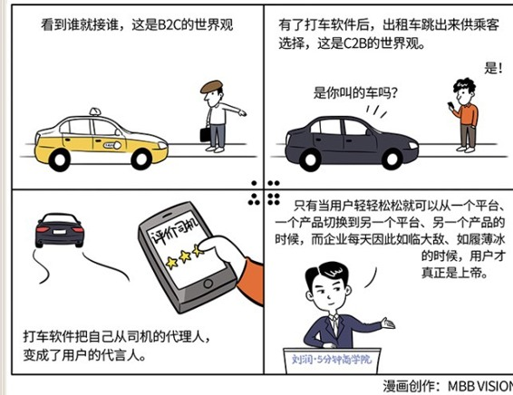

# 039｜转身，成为用户的代言人

### 概念：用户代言人

> 产品为王、渠道为王时代的远去，导致用户开始真正掌握对企业的生杀予夺大权。从B2C的思路，走向C2B，就是成为“用户代言人”。

在产品为王，渠道为王的时代，用户从来都不是上帝，他们只是被我们善待的“取款机”。善待你，是因为你吐钱。

当我们进入“用户为王”的时代，用户真正掌握选择权，动动手指头就能对企业生杀予夺的时候，他才是上帝。只有当用户轻轻松松就可以从一个平台、一个产品切换到另一个平台、另一个产品的时候，而企业每天因此如临大敌、如履薄冰的时候，用户才真正是上帝。

### 案例

> 我在《互联网+战略版：传统企业，互联网在踢门》这本书里写过，在过去，出租车开在路上，视野范围内看到谁就接谁，这是出租车司机B2C的世界观。有了打车软件后，你点“我要用车”，所有出租车就跳出来，供你选择，这是C2B的世界观。尤其是专车，你上车后，司机会问，你冷不冷啊，要不要喝水啊，车上有WIFI你要不要用啊，为什么这么体贴？因为你下车后可以给他评价，如果评价差的话，他接下一单就会变得困难。

滴滴打车今天这么火，其本质是把选择权从司机手上夺过来，交给了用户。它转身，把自己从司机的代理人，变成了用户的代言人。

### 运用：转身，从产品代理人，变成用户代言人

场景1：

> 比如上海有一个做生鲜水果的社群电商，叫虫妈邻里团。他们先让微信群里的用户们下单，然后带着用户的需求，再去一级批发市场，和商家谈判，帮助用户用低价采购他们想吃的优质水果。虫妈邻里团还曾尝试绕过批发市场，直接去农村包下草莓大棚，用户们因此吃到了又安全、又好吃、又便宜的草莓。

场景2：

> 又比如“必要商城”代言了愿意为品质买单、但不愿为品牌溢价买单的一群人，然后再去找中国一流的代工厂定制商品。必要与某品牌眼镜代工厂携手推出的运动眼镜售价259元，而相同配置的带有此品牌的眼镜，据说市场价约好几千元；某大品牌代工厂生产的男鞋在必要只卖三四百元，而据说相同品质的此品牌男鞋售价两三千元 ……

场景3：

这样的例子还有很多，比如支付宝。

> 淘宝成功的核心，是它开发了担保交易手段“支付宝”。支付宝的逻辑是，你一下单，货款就打到支付宝，锁死但并不支付给卖家，你确认收货后，卖家才能拿到钱。淘宝用支付宝，无条件倾向于买家，成为买家代言人，并获得了巨大成功。

### 小结：如何变成“用户代言人”呢？

第一，可以学习互联网公司，或者软件公司，设立“产品经理”职位。这个职位，本质是用户在你公司内的代表。你不应该考核产品经理的销售水平，你只应该考核他有多大程度上真的代表了用户，并据此和其它部门战斗。微软有个著名的三驾马车理论，产品经理、开发、测试，是三驾马车，开发代表产品，测试代表质量，产品经理代表用户，彼此制约，迭代前行。

第二，在某些条件具备的行业，从B2C的爆款思路，转变为C2B的大规模私人定制思路。“爆款”思维，还是工业时代的思维。在用户为王时代，基于工业化4.0的发展，我们可以考虑，如何为每一个用户都定制只为他生产的产品。不是第一，而是唯一，从而消灭爆款。这就是马云说的C2B，就像红领西服用柔性生产线，生产私人定制的西装；海尔用无灯工厂，生产私人定制的洗衣机一样。