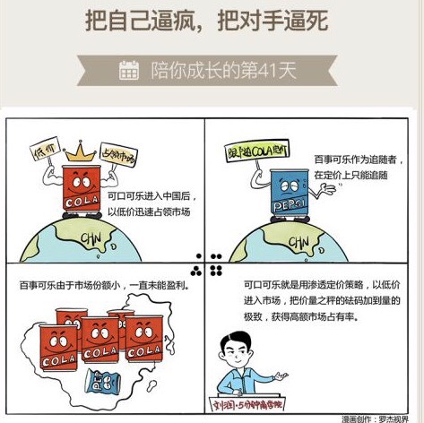

# 041｜把自己逼疯，把对手逼死

### 概念：渗透定价法

> 渗透定价法，就是以低价进入市场，把价量之秤的砝码，尽量加到量的极致，获得极高的销售和占有率，又导致成本降低，价格接着降的定价方法。

渗透价格的缺点，是企业只能获取极低的毛利。但是，也有两个显著优点：首先，低价可以使产品尽快为市场所接受，并借助大批量销售来降低成本，获得长期稳定的市场地位；其次，微利阻止了竞争者的进入，增强了自身的市场竞争力。

渗透定价法的极致，就是免费。雷军曾经说过：互联网公司从来不打价格战，我们直接免费。

### 案例

> 作者有个朋友叫叶国富，2013年，他创立了一个新的日用品零售品牌：名创优品。于是，这就涉及到定价的问题。日用品周转快，销量大，我们在第8期讲过“价量之秤”，量大，定倍率可以相对较低。这个行业平均定倍率大约是3倍。

> 那定多少呢？叶国富决定，使用渗透定价法：只定1倍定倍率。定倍率，就是零售价相对于出厂价的倍数。1倍，就是零售价等于出厂价。这太疯狂了吧，能做到吗？

> 叶国富用两年时间，开了1100多家名创优品的门店，然后聚合这些门店的订货量，去和工厂谈，别人都是二三十箱一次拿货，我要一万箱，你做不做？工厂估计高兴坏了。他说，但有一个条件，同品质情况下，你把价格打为原来一半，能做到吗？

过去，工厂很在乎毛利率，但在如此大单下，他更在乎利润绝对值。而且，他还可以用这个量，和上游的原材料企业谈判，压低进货价。所以，不少工厂是可以做到的。然后，名创优品在0.5元出厂价上，加8%～10%的毛利，覆盖总部运营成本，中国七大仓库运营成本等。再然后，直接供给1100家门店，用IT系统去掉一切中间代理。门店加32～38%的毛利，覆盖店员工资，租金水电，和最后一段物流。

别人是1块钱出厂价，卖3块钱。但名创优品，是5毛钱出厂，加10%，再加38%，最后到消费者手上的价格，还不到1块钱，不到别人的出厂价。那你能赚钱吗？关键是量。价量之秤拨到了极致，他说，只有周转率足够快，销量极其大，一年销售10亿以上，那就能赚钱。

名创优品2013年底创立，到2015年底，年收入已经近60亿。预计2016年的收入，会将近100亿。

### 运用：如何用渗透定价法呢？

场景1：

惠普公司研发了一款高科技打印机，很纠结，是凭借新技术优势，用250美元高价入市呢，还是保持185美元常规售价不变？

当时市场上打印机大约150美元，惠普的新打印机虽然技术领先，但如果定价250美元，暴利的诱惑，会吸引大批追随者进入，一窝蜂投入巨资研发，然后为了市场份额，必然是价格战，最后市场极度混乱，直接损害惠普优势。最后，惠普定价185美元不变，用这样的方法，吓退追随者。如果真有不长眼的追随者还是要进入，惠普就会立刻降价到160美元，让对手无法收回成本。

场景2：

可口可乐进入中国后，也一直采用渗透定价法，以相对的低价格迅速占领市场。后来百事可乐公司也进入中国，但是作为市场追随者，他们在定价上只能跟随。但由于市场份额小，还需要投入很多宣传吸引消费者，所以百事可乐在进入中国后的十几年，一直没能盈利。这就是可口可乐的“渗透定价”策略。

### 小结：使用渗透定价法时，需要注意几点

第一，这个市场必须足够大；

第二，消费者对价格敏感，而不是对品牌敏感；

第三，大量的生产，能降低成本；

第四，低价策略，能真的吓退现存及潜在的竞争对手。