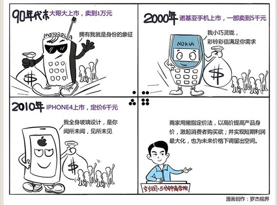

# 042｜为什么手机越卖越便宜？

### 概念：撇脂定价法

> 撇脂定价法指的是，当生产厂家把新产品推向市场时，利用一部分消费者的求新心理，定一个高价，像撇取牛奶中的脂肪层那样先从他们那里取得一部分高额利润，然后再把价格降下来，以适应大众的需求水平，这就是所谓的撇脂定价法。撇脂定价法，又常常被称为高价法，是一种与“渗透定价法”截然相反的定价策略。

### 它的特点是：

1、可以实现短期利润最大化；

2、可以用高价格提高产品身价，激起消费者购买欲；

3、可以用高价来控制市场的成长速度，使当时的生产能力足以应付需求，减缓供求矛盾；

4、为价格的下调留出空间。

### 案例1

> 有次，我在网上看到一个故事，觉得恍若隔世。一位网友回忆说，1988年，海飞丝的洗发水，是被当作奢侈品来卖的。当时她妈妈的工资一个月128元，而海飞丝卖28元一瓶，比他们家一个月买菜、买肉的钱加一起还多。所以她们全家都觉得，用海飞丝洗过的头，和别的头，就是不一样，她还常常向同学们炫耀：你闻闻，你闻闻，不一样吧。

为什么会这样？是因为当年宝洁公司进入中国时，选择了用一种叫做“撇脂定价法”的定价策略，切入市场。

### 案例2

> 二战结束后的第一个圣诞节，美国消费者很希望能买到一些新奇别致的商品，送给朋友家人和自己做礼物，度过这个来之不易的和平圣诞。一家叫“雷诺”的公司，看准了这个机遇。他们从阿根廷引入了一种叫“圆珠笔”的神奇产品。这个在今天再平常不过的东西，在二战的时候，美国人却从没见过。雷诺在美国量产了圆珠笔，成本只有0.5美元。雷诺决定，把成本0.5美元的圆珠笔，用10美元的价格批发给零售商，再用20美元的价格，卖给美国消费者。

你可能觉得雷诺公司疯了。但是，他们觉得，圆珠笔这东西在美国还是新鲜事物，大家没见过，奇货可居，而且又是圣诞节，卖多贵，估计都有人买。果然，这个成本价0.5美元，零售价20美元，定倍率高达40倍的产品，风靡全美国。

当然，后来自然是竞争对手蜂拥而至，圆珠笔的生产成本也从0.5美元，降到了0.1美元，而市场价也因为激烈的竞争，降到了0.7美元。但是，雷诺公司早已赚得盆满钵满。

> 雷诺公司使用的，就是著名的“撇脂定价法”。

### 运用：可以用在哪些行业？

在过去，使用撇脂定价法最多的行业，就是高科技行业。比如英特尔的芯片，诺基亚的手机，和索尼的彩电等等。这些行业，天然符合撇脂定价法能够成立的几个前提：

第一，因为高科技产品通常酷炫新奇，所以消费者愿意支付较高价格；

第二，高科技产品虽然贵，但还没有贵到像房产一样，大部分消费者是有能力支付的；

第三，没有采取较低定价的竞争对手存在。高科技产品通常有一定的技术先发优势，竞争对手跟进需要时间，所以给先入者一个“撇脂”的时间窗口。

当然，在高科技行业，也有小米这样的“渗透定价法”的高手，不按照行业规则出牌，对所有撇脂定价市场，发起攻击。今天中国的高科技市场，从定价策略角度看，本质上是在“价量之秤”战场上，“撇脂定价法”与“渗透定价法”之战。

### 小结：认识撇脂定价法的好与坏

撇脂定价法有什么好处和坏处？

好处是显而易见的，可以获得超额利润。坏处也是显而易见的，撇脂定价法，简直就是邀请竞争对手入场的镶着金边的邀请函。而且根据价量之秤的逻辑，撇脂定价法会牺牲一定的销量。

### 撇脂定价法和渗透定价法，哪一个更好？

没有哪种方法更好。撇脂定价法有个前提，就是你必须因为品牌、科技、创新、创意，而拥有定价权。撇脂定价法，是拥有定价权的产品，提款的手段，与没有定价权的产品基本无关。