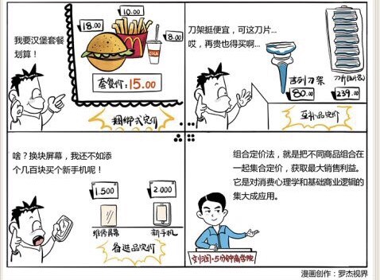

# 043｜自己装配汽车花的钱，能买12辆整车

### 概念：组合定价法

> 组合定价法，就是通过把不同商品组合在一起，集合定价，获取最大销售利益的定价方法。

### 案例

> 你去快餐店吃饭，看见一个新出的汉堡，售价18元；一份薯条，10元；一杯可乐，售价8元。觉得挺贵。再往下看，一份超级套餐，包含上述的汉堡、薯条、可乐，加一起15元。你怀疑自己看错了，包含汉堡的套餐，居然比单独的汉堡还便宜。你赶紧购买，觉得占了便宜。

我想，这时你一定想起了“价格锚点”，并且立刻明白，那只汉堡被标价18元，就是为了让你觉得那15元的套餐便宜得逆天。你的决定，从“要不要吃”，就变为了“吃汉堡还是吃套餐”的选择。而且，你当然会在这两者之间，毫不犹豫地选择了套餐。汉堡店通过组合的方式，实现了有效的定价。

### 运用：组合定价的七招拳法

#### 第一招，产品线定价。

比如电视，30寸、40寸、50寸、60寸，一直到120寸，甚至在每个尺寸里，再区分低、中、高配，仔细平衡消费者对价格的承受力，产品差异带来的价值感，和生产成本之间的关系，最大化消费者的购买。即便在“爆品”时代，这依然是在大多数情况下有效的商业策略。

这种定价策略，还可以用在服装上，高中低档；用在杂志图书上，平装版、精装版、收藏版等等。

#### 第二招，备选品定价。

比如，你的手机一不小心摔坏了，去修，发现换个屏幕的价格居然接近整只手机的价格。某国际大牌轿车，你把配件买回来，自己组装一辆车，价格是整车的12倍。成品便宜，把备选品，也就是配件的价格，定得远高于成本，就是所谓备选品定价。

这种定价策略，还可以用在餐饮业，比如烧烤便宜，啤酒贵。吃烧烤口干，啤酒成为烧烤的利润点。

#### 第三招，互补品定价。

这个例子就太多了。最著名的例子，就是吉列剃须刀和惠普打印机。吉列的剃须刀架和惠普的喷墨打印机，都很便宜。他们这么定价的原因，是想通过与之互补的，需要不断消耗的刀片，以及打印机墨盒赚钱。还记得我们在“互联网五大基础逻辑”里讲到的“免费，都是二段收费”吗？互联网领域的免费，尤其是游戏，基本都是互补品定价。

这种定价策略，还可以用在空气净化器、净水器、胶囊咖啡机等需要持续购买耗材的领域。

#### 第四招，副产品定价。

如果你去买一条胖头鱼，鱼贩一刀把鱼头剁下来，鱼身的价格可以便宜很多，因为鱼头更有价值。所以，为了鱼头这个更有价值的“副产品”，鱼贩可以把鱼的其他部分的价格定得更便宜。

这种定价策略，还可以用在肉类、石油、化工等行业，因为它们常常伴有副产品。假如副产品的价值高，就可以将主产品定低价，从而占领更多的市场份额，而将副产品定一个高价，从而获得利润。

#### 第五招，捆绑式定价。

比如，一开始我们说到的快餐厅，利用价格锚点的心理，推销套餐，就是一种捆绑式定价。再比如电影院销售的年票，健身房销售的年卡等等，都是其捆绑价格比单次购买便宜得多的捆绑式定价。

这种捆绑式定价，可以用在几乎所有零售行业，超市门口的水果礼盒，情人节花束，帮你配好的文具盒、书包，搭配了语音、短信、上网时长的电信套餐等等。

#### 第六招，分部式定价。

进公园时，先买门票，然后一些特殊项目，再额外收费，就是典型的分部式定价。以前装电话时，先交“入网费”，然后打电话时，按分钟收费。后来变成每月交“月租费”，然后再按分钟收费。

这种定价策略，可以用在自助餐厅，一口价之外，特别菜品，单独收费。廉价航空公司，除了机票之外，飞机上的每一样东西，包括水，行李空间等等，都要额外收费。

#### 第七招，单一价定价。

这是一种特殊的“组合定价法”，它把价值接近的商品组合放在一起，浮动毛利率，让零售价保持一致，比如美国的99美分商店，中国的名创优品，很多商品都是10元钱。这种定价法，让消费者避免对价格思考和比较，只需在心理价位内，选择价值感。

这种定价策略，还可以用在回转寿司店，麻辣烫，二手书店等等场景。

### 小结：认识组合定价法

> 组合定价法，是对价格锚点等消费心理学、二段收费等基础商业逻辑的集大成应用。我们今天介绍了从站桩到出拳的七套组合定价拳法，它们是：产品线定价、备选品定价、互补品定价、副产品定价、捆绑式定价、分部式定价，和单一价定价。