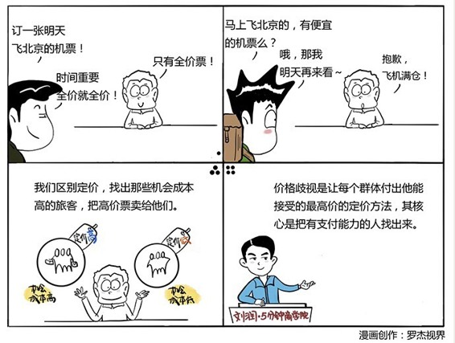

# 044｜让有钱人为同一件商品多付钱

### 概念：价格歧视

在理解“价格歧视”之前，我们要先理解另一个概念：消费者剩余。

一件商品成本10元，你最多愿意付30元，结果15元成交。那么成交价，到你的心理价位之间的差价，15元，就是消费者剩余。但同一件商品，B的心理价位20元，如果也是15元成交，那么这个B的消费者剩余，就是5元。

> 价格歧视，就是研究如何尽量吃掉消费者剩余，同一件商品，如何让A付出30元，让B付出20元。

### 核心在于：区隔消费者。

#### 案例

> 软件公司为了区隔付费能力低的家庭，和付费能力高的企业，把边际成本明明一样的软件，自残掉很多功能，成为家庭版，让企业办公场景无法降级使用，并藉此，向支付能力更强的企业用户，收取更多费用。软件公司，用自残软件的方式，区隔消费者。

> 航空公司规定，打折机票需要提前两周预定，并且不能退改签，并且有的航班还要经停。他们知道，商务旅行常常突发，无法提前两周确定；而且还会变动，不能退改签很麻烦；他们时间宝贵，经停难以接受。这样，他们就可以把打折机票卖给个人旅客，把全价机票卖给商务旅客了。航空公司用制造麻烦的手段，区隔消费者。

看到这里，你可能张大了嘴：真是无奸不商啊。但是，经济学认为，合法的价格歧视，其实有助于资源的有效配置。

### 运用：价格歧视的三个级别

第一级，个体歧视，让每个人付出他能付出的最高价格。这种方式极其少见，通常通过讨价还价，拍卖等方式完成。比如电信公司拍卖手机靓号，腾讯公司拍卖QQ靓号，都属于此类。

第二级，销量歧视，买得越多越便宜。这种方式相反，极其常见，我们以前说的第二件半价，也属于此类。

> 我今天关键说说第三级：区隔歧视。这种特殊的价格歧视，充满套路。请允许我来介绍几种。

比如，地域歧视。鞋子，衣服，甚至汽车业，常在商品上做记号，给不同区域，用不同价格，发不同的货，然后督查，发现“串货”，也就是特供欠发达区域的便宜商品，被卖到发达区域，就对相关代理商严厉惩罚。

再比如，人群歧视。老人票、儿童票，是一种典型的人群歧视，本质是向掌握支配权的成年人收取更多费用。优惠券也是，让低收入阶层通过收集、保存、携带、使用优惠券这些复杂动作，让低收入人群付出低价格，而让高收入人群因为怕麻烦，付出高价。

再比如，时间成本、机会成本的歧视。电影院的上午场、夜场就便宜，下午场和晚场贵，就是把贵的票卖给时间成本高的人，时间成本低的，你可以早起或者熬夜。持有“青年机票”的旅客，可以等候即将起飞的航班，如果有空座位就能飞，没有就回去。给机会成本低的人低价，给机会成本高的旅客定高价。

### 小结：认识价格歧视

价格歧视是一种让每个群体，甚至个体，付出他能接受的最高价的定价方法。它有三个等级：个体歧视，销量歧视，和区隔歧视，其核心在于如何把有支付能力的人找出来。